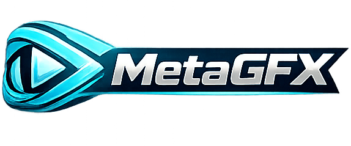

<p align="center">
  
</p>

<h1 align="center">MetaGFX — Esports Tournament &amp; Broadcast Suite</h1>

<p align="center">
  <b>Run your whole esports broadcast from one web panel.</b><br>
  Teams, schedule, groups, brackets and prize pool in one place — driving live, always-in-sync OBS/vMix graphics with no manual re-entry.
</p>

<p align="center">
  <i>Self-hosted · Node.js · real-time · no build step · built for League of Legends (extensible)</i>
</p>

---

MetaGFX is a self-hosted control room for community esports productions. You manage the tournament once — rosters, schedule, draft, results — and every overlay (player intros, head-to-head, draft board, brackets, win screens, lower thirds and more) updates itself in real time across OBS or vMix. An operator view, a read-only caster dashboard, Stream Deck/Companion control, and live on-air detection round it out.

> [!IMPORTANT]
> **MetaGFX is built for community and grassroots tournaments — not paid or commercial productions.**
> The built-in sponsor tools are for crediting sponsors who contribute to the players'/competitors' prize pool — not for selling commercial ad space or funding staff/operator pay.

<!-- Screenshots go well here: control panel, a couple of overlays, the draft board. -->

## Highlights

**🎬 Graphics (browser sources for OBS/vMix, 1920×1080)**
- 12+ overlays: Player Intro, Player Spotlight, Head-to-Head, Draft board, Win Screen (10 styles incl. full-screen stingers), Break Screen (PIP), Pre-show, Lower Third, Bracket (single/double elim), Group Stage, Tournament Structure, Prizepool, animated backgrounds.
- **Everything stays in sync** — change a score or a pick once and every overlay reflects it instantly via WebSockets.
- **GFX Bus system** — route many graphics through 3–4 shared browser sources instead of one per graphic (big RAM/VRAM saving); switch live from the operator routing matrix.
- **Theming & Looks** — palette, accents, background and animation easing/speed, saved as reusable named "Looks" applied over any event.

**🎛️ Control & operation**
- Full **control panel** for setup + live control, and a streamlined **operator view** with drag-reorderable panels.
- A **GFX ctrl-bar** on every graphics page for instant show/hide, position and per-graphic options.
- **Bo1/Bo3/Bo5** series tracking with per-game draft snapshots; **schedule ↔ bracket linking** that fills results automatically.

**👥 Crew-friendly**
- **Multi-user**: live presence, soft page-claiming, last-action attribution, a system log, and a superadmin/admin/operator role hierarchy.
- **Caster view** — a read-only, token-authed dashboard with roster intel, live draft board, series history and fearless pool.

**🔌 Integrations**
- **Bitfocus Companion / Stream Deck** profile generator + action API.
- **Live on-air detection** (OBS/vMix) — LIVE/OFF-AIR + per-graphic PGM/PVW tags.
- **op.gg / Riot API** — solo-queue ranks, champion pools, draft stats.

---

## ⚠️ Before you start — required reading

A few things will save you a broken broadcast. Please read these:

| # | What | Why it matters |
|---|---|---|
| 1 | **Node.js 18+** | Runtime requirement. |
| 2 | **Change the default admin password** | First run seeds `admin` / `admin` (superadmin). Change it immediately in **Settings → Accounts**. |
| 3 | **Champion images are NOT in the repo** | They're downloaded on demand to keep the repo small. **After cloning, run the asset sync** (below) or **Settings → Champion Assets** — otherwise champion art is blank. |
| 4 | **Riot API key must be a *persistent* key** | Rank lookups need `RIOT_API_KEY`. **Do not use the 24-hour Development key** — it expires mid-event. Register a persistent product key at [developer.riotgames.com](https://developer.riotgames.com). It's optional, but ranks won't fetch without it. |
| 5 | **Graphics need the token** | Every overlay/caster URL needs `?token=XXXX`. Copy the ready-made URLs from **Settings → Output URLs** into OBS/vMix (browser source, 1920×1080). |
| 6 | **Sharing to a remote OBS?** | Set `EXTERNAL_URL` in `.env` to your machine's LAN IP so a **Local / External** toggle appears in **Settings → Output URLs**. |

## Quick start

```bash
npm install
npm start                       # serves on http://localhost:3000
node scripts/sync-assets.js     # download champion images (first run / after clone)
```

Then open:

- **Control panel:** `http://localhost:3000/control` (login required)
- **Operator view:** `http://localhost:3000/operator`
- **Caster view:** `http://localhost:3000/caster?token=XXXX`

Default login on first run: **`admin` / `admin`** — change it in **Settings → Accounts**.

### Environment variables (`.env`, optional)

```
RIOT_API_KEY=your_persistent_key_here
PORT=3000
EXTERNAL_URL=http://YOUR_LAN_IP:3000
```

| Variable | Required | Description |
|---|---|---|
| `RIOT_API_KEY` | No | Persistent Riot key for Solo Queue rank lookups. **Not** the 24-hour dev key (see above). |
| `PORT` | No | Server port, defaults to `3000`. |
| `EXTERNAL_URL` | No | LAN IP/hostname for sharing output URLs to a remote OBS on the same network. |

### Champion asset sync

Champion tiles, centered images and splash art are pulled from the [DDragon mirror](https://github.com/noxelisdev/LoL_DDragon) on demand (they're git-ignored). Only missing files are fetched.

```bash
node scripts/sync-assets.js              # download all missing files
node scripts/sync-assets.js --check      # report what's missing, download nothing
node scripts/sync-assets.js --force-roles # re-download role icons (resolution upgrade)
```

Admins can also run this from **Settings → Champion Assets** with a live progress bar. (Small role icons *do* ship with the app.)

### Development (auto-reload)

```bash
npm run dev
```

---

## Views

| View | URL | Who | What |
|---|---|---|---|
| **Control panel** | `/control` | admin | Full tournament setup, match management, all graphic control, settings. |
| **Operator view** | `/operator` | operator/admin | Streamlined live production: graphic toggles + ctrl-bar, score/series tracker, lower-third builder, drag-reorderable panels, on-air indicator. |
| **Caster view** | `/caster?token=XXXX` | token | Read-only caster dashboard: roster, series, live draft, standings, bracket, schedule. |

## Graphics outputs

All graphics are browser sources for OBS/vMix at **1920×1080**, each needing `?token=XXXX` (grab the full URLs from **Settings → Output URLs**).

| Graphic | Path | Notes |
|---|---|---|
| Player Intro | `/graphics/player-intro/` | 3 layouts: Panel, Stack, Champion Showcase |
| Player Spotlight | `/graphics/player-spotlight/` | 1–2 players; Fullscreen + Lower Third; 4 designs; champion art + stats with op.gg/tournament sources |
| Head to Head | `/graphics/head2head/` | Spotlight + lineup modes, champion stats strip |
| Draft Overlay | `/graphics/draft/` | Pick/ban board with timer |
| Win Screen | `/graphics/win-screen/` | 10 styles incl. 3 full-screen stingers + COMP (winning picks) |
| Break Screen | `/graphics/break-screen/` | PIP mode supported |
| Pre-show | `/graphics/pre-show/` | Countdown, sponsors, ticker |
| Lower Third | `/graphics/lower-third/` | |
| Bracket | `/graphics/bracket/` | Single + double elimination |
| Group Stage | `/graphics/group-stage/` | |
| Tournament Structure | `/graphics/tournament-structure/` | |
| Prizepool | `/graphics/prizepool/` | |
| BG Output | `/graphics/bg-output/` | Background animations only |

**GFX Bus** outputs (`/bus/:id`) are shared sources that auto-display whichever assigned graphic is currently live — configure under **Routing**.

---

## Documentation

Deep-dive guides live in [`docs/`](docs/):

- [Player Spotlight](docs/player-spotlight.md)
- [Live Switcher (OBS/vMix on-air detection)](docs/live-switcher.md)
- [Bitfocus Companion / Stream Deck](docs/companion.md)
- [Theming &amp; Looks](docs/theming.md)
- [Control-surface theming](docs/ui-theming.md)

*(More feature guides are being added — this is an actively growing wiki.)*

## Control panel sections

**Tournament:** Profiles · Tournament Setup · Teams Database · Schedule · Groups · Playoffs
**Game:** Game Setup · Players / Rosters · Draft · Match Intel
**Graphics:** Broadcast Theme · BG Output · Lower Third · Head to Head · Pre-show · Ticker · Draft · Bracket · Group Stage · Tournament Structure · Prizepool · Break Screen · Win Screen · Player Intro · Player Spotlight
**System:** Routing (GFX bus) · Settings (users, token, output URLs, logos, Appearance, Live Switcher) · Log

## User roles

| Role | Access |
|---|---|
| `superadmin` | Full control panel + full user management. |
| `admin` | Full control panel; manages operators + own password only. |
| `operator` | Simplified operator view (toggles, score, lower third). |
| Graphics token | Read-only access to all graphics outputs + caster view — no account. |

The seeded `admin` account is `superadmin`. Create more users in **Settings → Accounts**.

## Tech

- **Server:** Node.js 18+ · Express · Socket.io (real-time state to every page)
- **Auth:** session login for the panel; token access for graphics + caster
- **Data:** JSON files in `data/` (auto-created, git-ignored)
- **No build step** — plain HTML/CSS/JS throughout

The `data/` directory is created on first run and is not in git:

| File | Contents |
|---|---|
| `state.json` | Live broadcast state (restored on restart) |
| `users.json` | Accounts (hashed passwords) |
| `teams.json` | Teams database |
| `profiles.json` | Saved tournament profiles |
| `session-secret.txt` | Auto-generated session signing key |
