<p align="center">
  
</p>

<h1 align="center">MetaGFX — Esports Tournament &amp; Broadcast Suite</h1>

<p align="center">
  <b>Run your whole esports broadcast from one web panel.</b><br>
  Teams, schedule, groups, brackets and prize pool in one place — driving live, always-in-sync OBS/vMix graphics with no manual re-entry.
</p>

<p align="center">
  <i>Self-hosted · Node.js · real-time · no build step · <b>League of Legends · Counter-Strike 2 · Dota 2 · Valorant</b></i>
</p>

---

MetaGFX is a self-hosted control room for community esports productions across **League of Legends, Counter-Strike 2, Dota 2 and VALORANT**. You manage the tournament once — rosters, schedule, draft/veto, results — and every overlay (player intros, head-to-head, draft & veto boards, brackets, win screens, post-game scoreboards, lower thirds and more) updates itself in real time across OBS or vMix. Set your event's game and the whole panel adapts — you only see the tabs and graphics that game uses. An operator view, a read-only caster dashboard, Stream Deck/Companion control, and live on-air detection round it out.

> [!IMPORTANT]
> **MetaGFX is built for community and grassroots tournaments — not paid or commercial productions.**
> The built-in sponsor tools are for crediting sponsors who contribute to the players'/competitors' prize pool — not for selling commercial ad space or funding staff/operator pay.

<table>
  <tr>
    <td width="50%">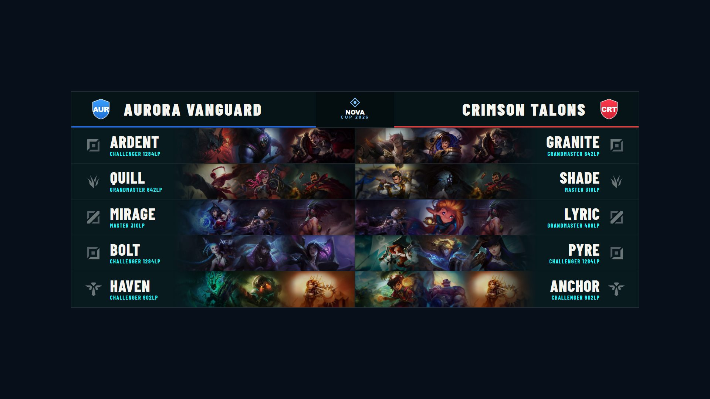</td>
    <td width="50%">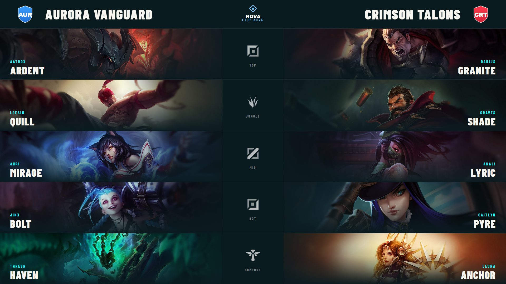</td>
  </tr>
  <tr>
    <td>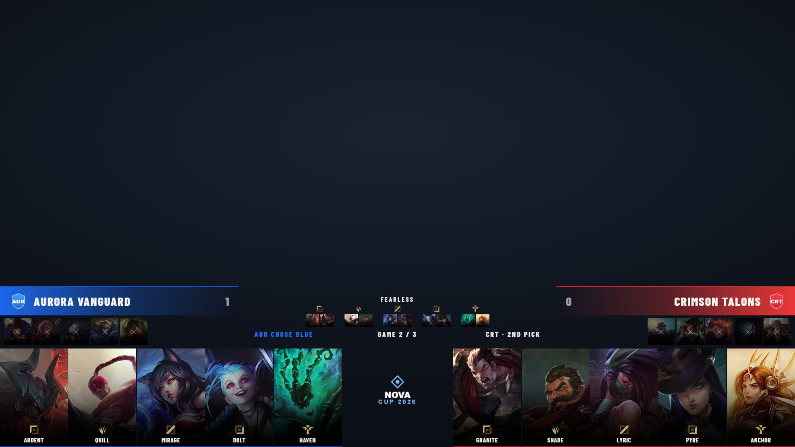</td>
    <td>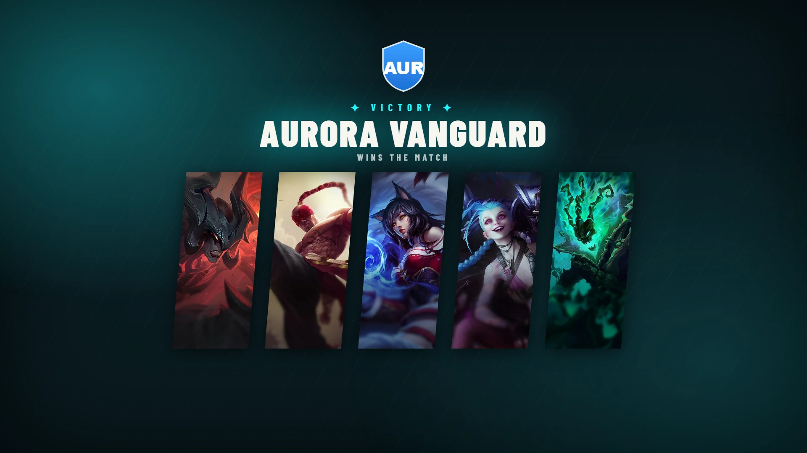</td>
  </tr>
</table>

<p align="center"><i>League of Legends overlays shown above — <b>Counter-Strike 2 and Dota 2</b> bring their own:</i></p>

<table>
  <tr>
    <td width="50%">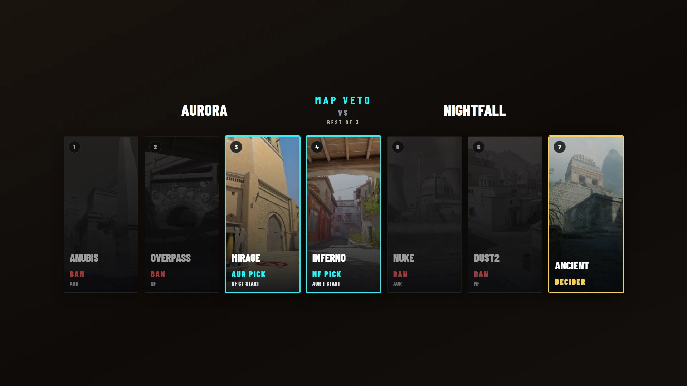<br><sub><b>CS2</b> — Map Veto board</sub></td>
    <td width="50%">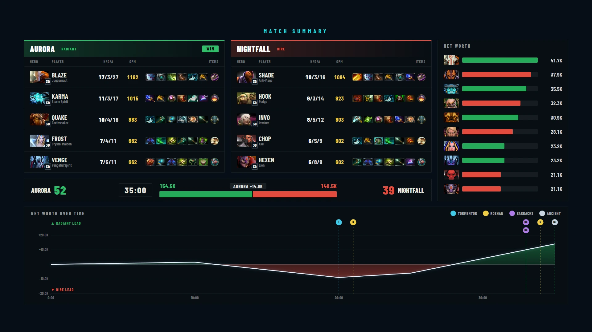<br><sub><b>Dota 2</b> — Match Summary</sub></td>
  </tr>
  <tr>
    <td>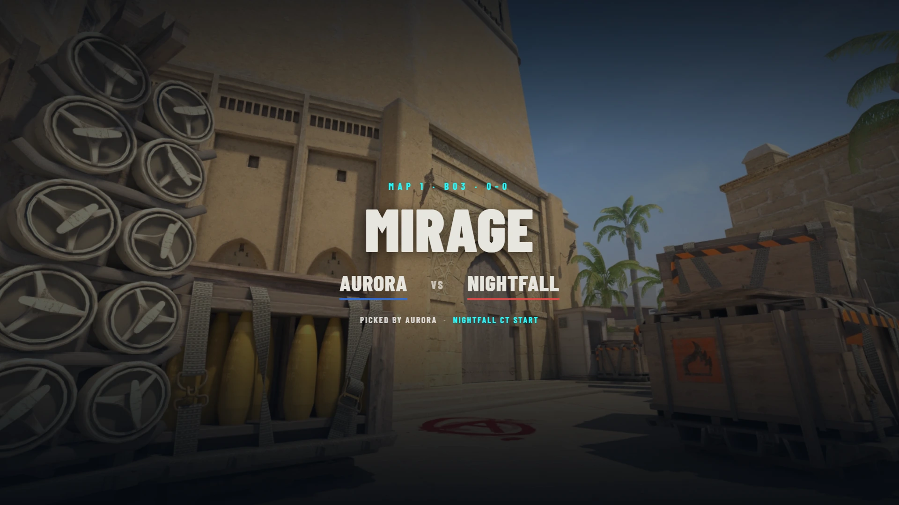<br><sub><b>CS2</b> — cinematic Map Intro</sub></td>
    <td><br><sub><b>Dota 2</b> — Post-Game Scoreboard</sub></td>
  </tr>
</table>

<p align="center"><b>One control panel runs the whole show — change something once and every overlay updates live.</b></p>

<p align="center">
  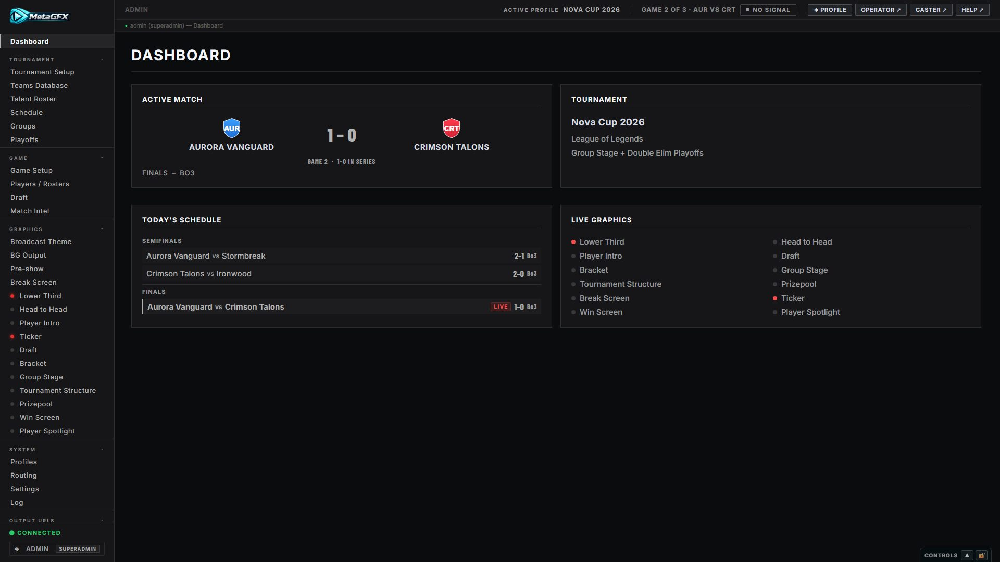
</p>

## Highlights

**🎮 Multi-game**
- One suite for **League of Legends, Counter-Strike 2, Dota 2 and VALORANT** *(alpha)*. Pick the game per tournament and the control panel, graphics and data integrations adapt to it — shared graphics (brackets, lower thirds, win screens, pre-show…) work everywhere, and each game adds its own draft/veto, live-data and analysis overlays.

**🎬 Graphics (browser sources for OBS/vMix, 1920×1080)**
- **Shared overlays:** Player Intro, Win Screen (10 styles incl. full-screen stingers), Break Screen (PIP), Pre-show, Lower Third, Bracket (single/double elim), Group Stage, Tournament Structure, Prizepool, Ticker, animated backgrounds.
- **League of Legends:** Draft pick/ban board, Player Spotlight, Head-to-Head — with champion splash art and op.gg/tournament stats.
- **Counter-Strike 2:** Map Veto board, cinematic Map Intro (lineups + flyby), and a live-data Post-Game Scoreboard.
- **Dota 2:** Captains Mode Hero Draft board, Post-Game Scoreboard, and a full Match Summary (scoreboards, items, net-worth graph with event markers).
- **VALORANT** *(alpha)*: Map Veto board + Map Intro (shared with CS2), per-player **agents** across the Player Intro (incl. a full-screen Agent Cards layout) and Win Screen — manual data entry, no live feed.
- **Everything stays in sync** — change a score or a pick once and every overlay reflects it instantly via WebSockets.
- **GFX Bus system** — route many graphics through 3–4 shared browser sources instead of one per graphic (big RAM/VRAM saving); switch live from the operator routing matrix.
- **Theming & Looks** — palette, accents, background, animation easing/speed, **broadcast typography** (primary display + secondary label fonts, 13 bundled families plus your own custom font uploads), and **structural style** (panel corner-radius slider, glass/solid/outline surface, UPPERCASE/Normal text case) — all saved as reusable named "Looks" you can apply over any event and **export/import** to carry between installs.

**🎛️ Control & operation**
- Full **control panel** for setup + live control, and a streamlined **operator view** with drag-reorderable panels.
- A **GFX ctrl-bar** on every graphics page for instant show/hide, position and per-graphic options.
- **Bo1/Bo3/Bo5** series tracking with per-game draft/veto snapshots; **schedule ↔ bracket linking** that fills results automatically.

<p align="center">
  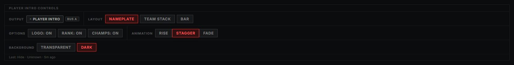
</p>
<p align="center"><i>The <b>GFX ctrl-bar</b> sits on every graphics page (Player Intro shown) — instant show/hide, layout, per-graphic options and animation.</i></p>

**👥 Crew-friendly**
- **Multi-user**: live presence, soft page-claiming, last-action attribution, a system log, and a superadmin/admin/operator role hierarchy.
- **Caster view** — a read-only, token-authed dashboard with roster intel, live draft/veto board, series history, hero/champion pools and (Dota) OpenDota hero intel.

**🔌 Integrations**
- **Live game data** — auto-fill scores, drafts and player stats from **CS2 GSI / MatchZy**, **Dota 2 GSI**, and **OpenDota** hero pools. LoL rank & champion-pool intel via **op.gg / Riot API**.
- **Bitfocus Companion / Stream Deck** — generates a ready-to-import, page-navigable Companion profile covering every graphic (per game), plus a per-user keybind action API.
- **Live on-air detection** (OBS/vMix) — LIVE/OFF-AIR + per-graphic PGM/PVW tags.
- **OMT output (beta)** — send graphics out as native OMT video with alpha, skipping browser sources entirely.

---

## ⚠️ Before you start — required reading

A few things will save you a broken broadcast. Please read these:

| # | What | Why it matters |
|---|---|---|
| 1 | **Node.js 18+** | Runtime requirement. |
| 2 | **Change the default admin password** | First run seeds `admin` / `admin` (superadmin). Change it immediately in **Settings → Accounts**. |
| 3 | **Game art is NOT in the repo** | Champion / hero / item / map images are downloaded on demand to keep the repo small. **After cloning, sync your game's art** from **Settings → Broadcast Assets** (LoL also via `node scripts/sync-assets.js`) — otherwise that art is blank. |
| 4 | **Live-data / API keys are optional** | Each game has its own optional feed: **LoL** ranks need a *persistent* `RIOT_API_KEY` (**not** the 24-hour dev key — it expires mid-event; register at [developer.riotgames.com](https://developer.riotgames.com)); **CS2** uses GSI / MatchZy; **Dota 2** uses GSI + OpenDota. Everything else works without them. |
| 5 | **Graphics need the token** | Every overlay/caster URL needs `?token=XXXX`. Copy the ready-made URLs from **Settings → Output URLs** into OBS/vMix (browser source, 1920×1080). |
| 6 | **Sharing to a remote OBS?** | Set `EXTERNAL_URL` in `.env` to your machine's LAN IP so a **Local / External** toggle appears in **Settings → Output URLs**. |

## Quick start

```bash
npm install
npm start                       # serves on http://localhost:3000
```

Then sync your game's art from **Settings → Broadcast Assets** (champion / hero / item / map images — see [Game art](#game-art)).

Then open:

- **Control panel:** `http://localhost:3000/control` (login required)
- **Operator view:** `http://localhost:3000/operator`
- **Caster view:** `http://localhost:3000/caster?token=XXXX`

Default login on first run: **`admin` / `admin`** — change it in **Settings → Accounts**.

### Environment variables (`.env`, optional)

```
RIOT_API_KEY=your_persistent_key_here
PORT=3000
EXTERNAL_URL=http://YOUR_LAN_IP:3000
```

| Variable | Required | Description |
|---|---|---|
| `RIOT_API_KEY` | No | *(League of Legends)* Persistent Riot key for Solo Queue rank lookups. **Not** the 24-hour dev key (see above). |
| `PORT` | No | Server port, defaults to `3000`. |
| `EXTERNAL_URL` | No | LAN IP/hostname for sharing output URLs to a remote OBS on the same network. |

### Game art

Game images are downloaded on demand (git-ignored) so the repo stays small — sync your tournament's game from **Settings → Broadcast Assets**:

- **League of Legends** — champion tiles, centered portraits and splash art, from the [DDragon mirror](https://github.com/noxelisdev/LoL_DDragon). Also scriptable:
  ```bash
  node scripts/sync-assets.js              # download all missing files
  node scripts/sync-assets.js --check      # report what's missing, download nothing
  node scripts/sync-assets.js --force-roles # re-download role icons (resolution upgrade)
  ```
- **Counter-Strike 2** — map art for your map pool (Map Assets card).
- **Dota 2** — hero and item art (Hero Assets + Item Assets cards).

Only missing files are fetched. (Small role/position icons *do* ship with the app.) See the [Getting started → game-specific setup](docs/getting-started.md#game-specific-setup) guide for each game.

### Development (auto-reload)

```bash
npm run dev
```

---

## Views

| View | URL | Who | What |
|---|---|---|---|
| **Control panel** | `/control` | admin | Full tournament setup, match management, all graphic control, settings. |
| **Operator view** | `/operator` | operator/admin | Streamlined live production: graphic toggles + ctrl-bar, score/series tracker, lower-third builder, drag-reorderable panels, on-air indicator. |
| **Caster view** | `/caster?token=XXXX` | token | Read-only caster dashboard: roster, teams, series, live draft, standings, bracket, schedule. |

<table>
  <tr>
    <td width="50%">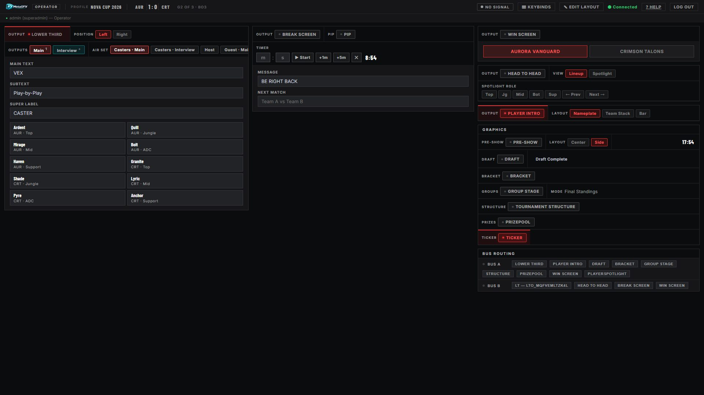</td>
    <td width="50%">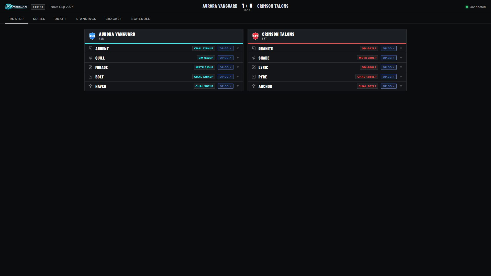</td>
  </tr>
  <tr>
    <td align="center"><i>Operator view — streamlined live production with drag-reorderable panels.</i></td>
    <td align="center"><i>Caster view — read-only roster, ranks &amp; live draft (token, no login).</i></td>
  </tr>
</table>

## Graphics outputs

All graphics are browser sources for OBS/vMix at **1920×1080**, each needing `?token=XXXX` (grab the full URLs from **Settings → Output URLs**). Shared graphics work in every game; the game sections show only for the tournament's current game.

**Shared (all games)**

| Graphic | Path | Notes |
|---|---|---|
| Player Intro | `/graphics/player-intro/` | 3 layouts: Panel, Team Stack, Bar — with optional top-3 champion/hero strips |
| Win Screen | `/graphics/win-screen/` | 10 styles incl. 3 full-screen stingers + COMP (winning draft) |
| Break Screen | `/graphics/break-screen/` | PIP mode supported |
| Pre-show | `/graphics/pre-show/` | Countdown, sponsors, ticker |
| Lower Third | `/graphics/lower-third/` | Set-driven, multi-output: 4 designs, free X/Y positioning, exclusive/freeform per-scene outputs |
| Bracket | `/graphics/bracket/` | Single + double elimination |
| Group Stage | `/graphics/group-stage/` | |
| Tournament Structure | `/graphics/tournament-structure/` | |
| Prizepool | `/graphics/prizepool/` | |
| BG Output | `/graphics/bg-output/` | Background animations only |

**League of Legends**

| Graphic | Path | Notes |
|---|---|---|
| Draft Overlay | `/graphics/draft/` | Pick/ban board with timer |
| Player Spotlight | `/graphics/player-spotlight/` | 1–2 players; Fullscreen + Lower Third; 4 designs; champion art + stats with op.gg/tournament sources |
| Head to Head | `/graphics/head2head/` | Spotlight + lineup modes, champion stats strip |

**Counter-Strike 2** *(live data in beta)*

| Graphic | Path | Notes |
|---|---|---|
| Map Veto | `/graphics/map-veto/` | Ban/pick sequence board with accordion reveal |
| Map Intro | `/graphics/map-intro/` | Cinematic map card — lineups + flyby |
| Post-Game Scoreboard | `/graphics/post-game/` | End-of-game player stats, fed by GSI / MatchZy |

**Dota 2**

| Graphic | Path | Notes |
|---|---|---|
| Hero Draft | `/graphics/hero-draft/` | Captains Mode pick/ban board, two-tier timer, auto-fill from live game |
| Post-Game Scoreboard | `/graphics/post-game/` | End-of-game player stats, fed by GSI |
| Match Summary | `/graphics/match-summary/` | Scoreboards, items, net-worth graph with event markers |

**GFX Bus** outputs (`/bus/:id`) are shared sources that auto-display whichever assigned graphic is currently live — configure under **Routing**.

<table>
  <tr>
    <td width="33%">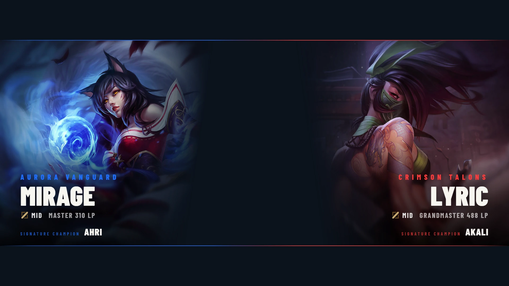<br><sub><b>Player Spotlight</b></sub></td>
    <td width="33%">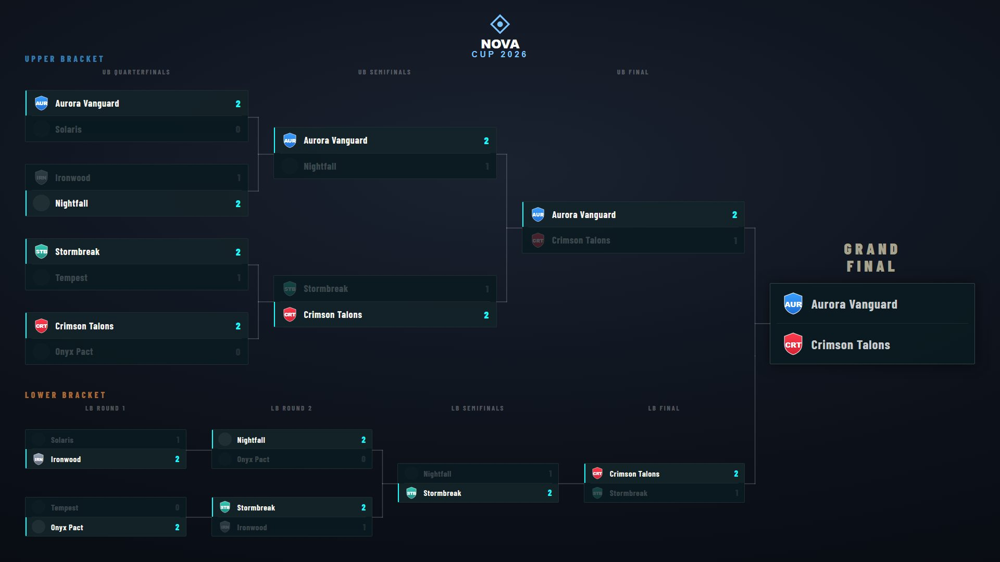<br><sub><b>Bracket</b> (single/double elim)</sub></td>
    <td width="33%">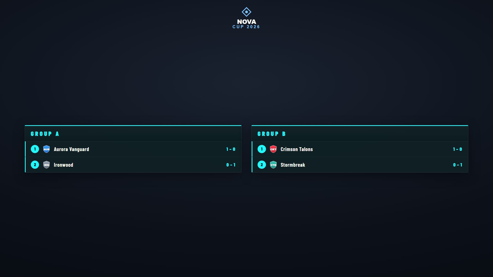<br><sub><b>Group Stage</b></sub></td>
  </tr>
  <tr>
    <td>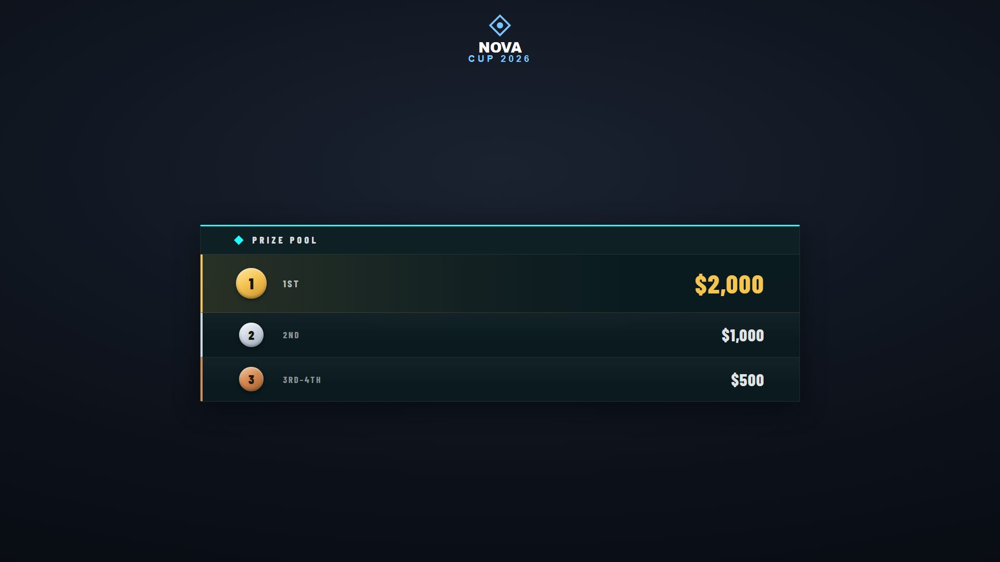<br><sub><b>Prizepool</b></sub></td>
    <td>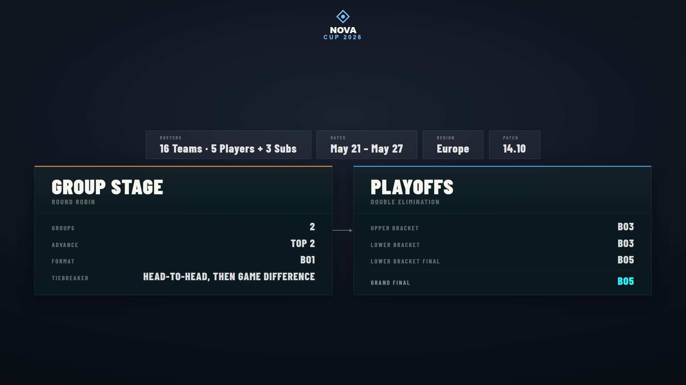<br><sub><b>Tournament Structure</b></sub></td>
    <td>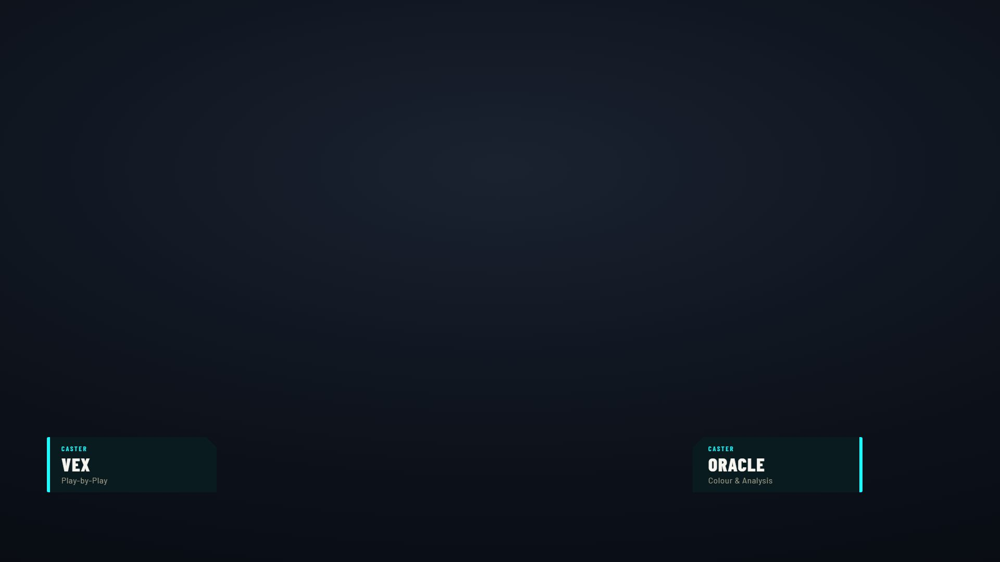<br><sub><b>Lower Third</b> (set-driven, multi-output)</sub></td>
  </tr>
  <tr>
    <td>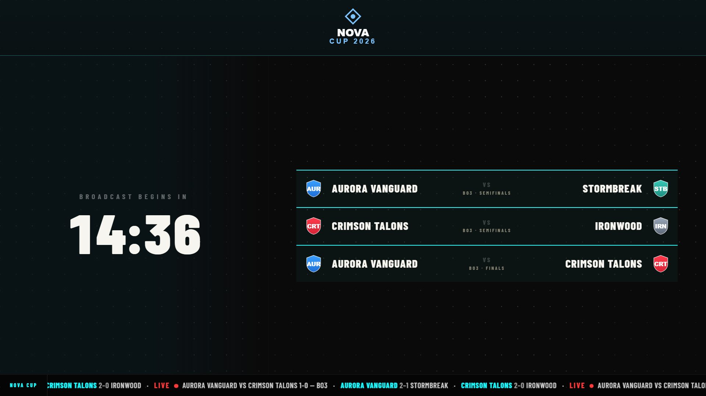<br><sub><b>Pre-show</b> (countdown, ticker)</sub></td>
    <td>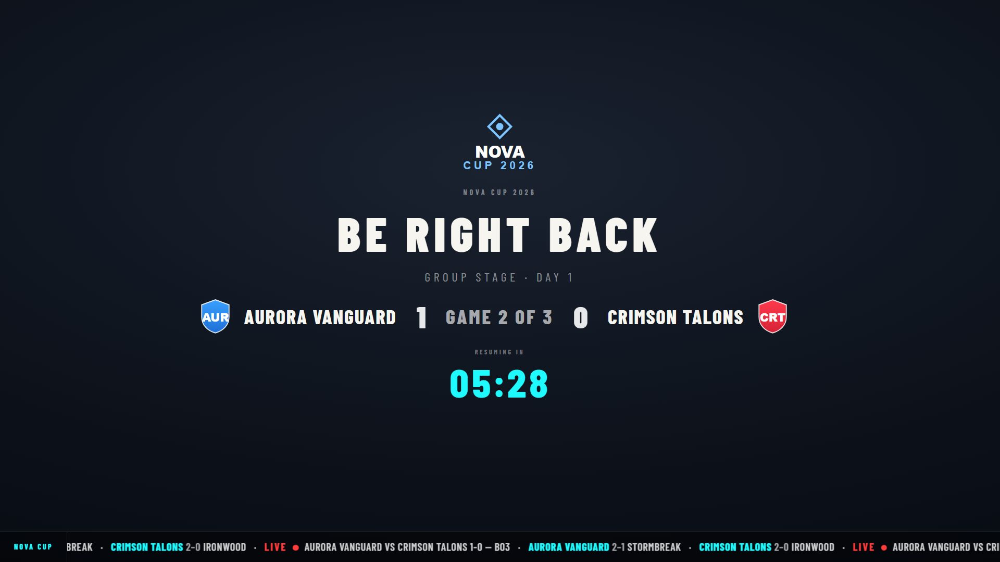<br><sub><b>Break Screen</b> (PIP)</sub></td>
    <td></td>
  </tr>
</table>

All overlay URLs (with the token baked in) are one click away in **Settings → Output URLs** — drop them straight into OBS/vMix browser sources.

---

## Documentation

The full guide lives in [`docs/`](docs/README.md) — start there for the complete index.

**Setup & workflow**
- [Getting started](docs/getting-started.md)
- [Tournament setup](docs/tournament-setup.md) (incl. Teams Database)
- [Schedule](docs/schedule.md) (incl. bracket linking)
- [Match &amp; draft control](docs/match-and-draft.md)

**Per game**
- **League of Legends:** [Draft Overlay](docs/draft.md) · [Player Spotlight](docs/player-spotlight.md) · [Head to Head](docs/head-to-head.md) · [Champion assets](docs/champion-assets.md)
- **Counter-Strike 2:** [Map Veto](docs/map-veto.md) · [Map Intro](docs/map-intro.md) · [Live Data (CS2)](docs/live-data.md)
- **Dota 2:** [Hero Draft](docs/hero-draft.md) · [Match Summary](docs/match-summary.md) · [Live Data (Dota 2)](docs/dota-live-data.md)

**Systems & integrations**
- [Lower Third](docs/lower-third.md) (set-driven, multi-output)
- [GFX Bus](docs/gfx-bus.md) · [OMT Output](docs/omt-output.md) (beta)
- [Live Switcher (OBS/vMix on-air detection)](docs/live-switcher.md)
- [Bitfocus Companion / Stream Deck](docs/companion.md)
- [Caster view](docs/caster-view.md)
- [Theming &amp; Looks](docs/theming.md) · [Control-surface theming](docs/ui-theming.md)

Per-graphic guides and more live in the [full docs index](docs/README.md).

The panel adapts to the tournament's game — you only see the tabs that game uses.

| Section | Features |
|---|---|
|`Tournament` | Profiles, Tournament Setup, Teams Database, Schedule, Groups, Playoffs |
|`Game` | Game Setup, Players / Rosters, Draft / Veto, Match Intel *(game-dependent)* |
|`Graphics` | Broadcast Theme, BG Output, Lower Third, Pre-show, Ticker, Bracket, Group Stage, Tournament Structure, Prizepool, Break Screen, Win Screen, Player Intro |
|`Graphics (game-specific)` | LoL — Draft, Head to Head, Player Spotlight · CS2 — Map Veto, Map Intro, Post-Game · Dota 2 — Hero Draft, Post-Game, Match Summary |
|`System` | Routing (GFX bus), Settings (users, token, output URLs, logos, Appearance, Live Switcher, Broadcast Assets), Log |

## User roles

| Role | Access |
|---|---|
| `superadmin` | Full control panel + full user management. |
| `admin` | Full control panel; manages operators + own password only. |
| `operator` | Simplified operator view (toggles, score, lower third). |
| Graphics token | Read-only access to all graphics outputs + caster view — no account. |

The seeded `admin` account is `superadmin`. Create more users in **Settings → Accounts**.

## Tech

- **Server:** Node.js 18+ · Express · Socket.io (real-time state to every page)
- **Auth:** session login for the panel; token access for graphics + caster
- **Data:** JSON files in `data/` (auto-created, git-ignored)
- **Image uploads auto-optimised** — every uploaded logo/image is downscaled (max 1920 px long edge) and re-encoded to WebP (transparency + animation preserved) via [sharp](https://sharp.pixelplumbing.com/), so files stay small regardless of source. See [Theming → Image uploads](docs/theming.md#image-uploads).
- **No build step** — plain HTML/CSS/JS throughout

The `data/` directory is created on first run and is not in git:

| File | Contents |
|---|---|
| `state.json` | Live broadcast state (restored on restart) |
| `users.json` | Accounts (hashed passwords) |
| `teams.json` | Teams database |
| `profiles.json` | Saved tournament profiles |
| `session-secret.txt` | Auto-generated session signing key |

---

## License

MetaGFX is released under the **[PolyForm Noncommercial License 1.0.0](LICENSE)** — free to use, modify and share **for any non-commercial purpose**, including by individuals, community/grassroots organisers, charities, schools and other non-profits.

In keeping with the project's intent (see the note near the top of this README), **commercial use is not granted** — for example, paid or commercial broadcast productions, or selling commercial ad space.

See the full terms at [polyformproject.org/licenses/noncommercial/1.0.0](https://polyformproject.org/licenses/noncommercial/1.0.0).
