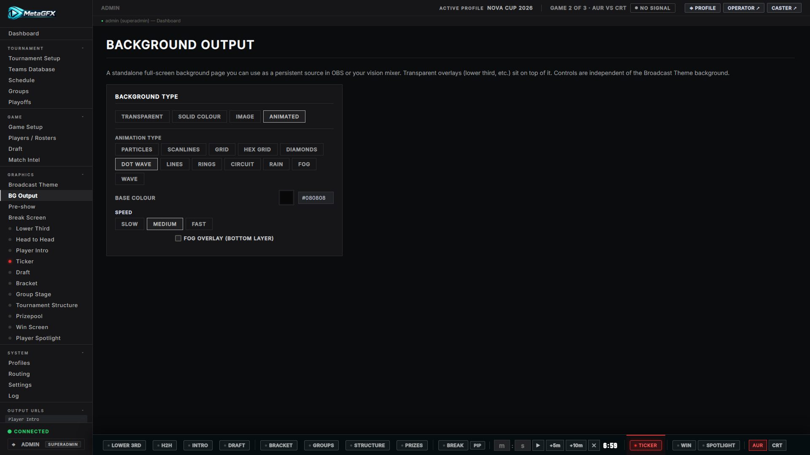

# BG Output

A standalone animated background layer. Because every other overlay is **transparent**, BG Output is the source you put *underneath* them to give the broadcast a coloured or animated backdrop — without baking a canvas into every graphic (which would make each source expensive). Output at `/graphics/bg-output/`.

## Why it's separate

Graphic overlays composite over your scene transparently. For a designed backdrop behind your panels, add **one** BG Output browser source as its own layer at the bottom of your stack, and lay the other graphics on top. This keeps each overlay source cheap and lets you change the whole look in one place.

## Controls

From **Graphics → BG Output**:

- **Type** — animation, solid colour, or a background image.
- **Animation** — pick the animated style (e.g. a drifting dot field) and its speed.
- **Colour** — base/background colour.
- **Fog layer** — optional atmospheric fog with adjustable intensity.

These tie into the broadcast [theme](theming.md) palette, so the backdrop matches your colours.

## Notes

- BG Output has no show/hide toggle in the same sense as the overlays — it's a continuous background layer; just add or remove the source in OBS/vMix.
- It is **not** behind the graphics automatically — you place it as a separate, lower layer in your switcher.
