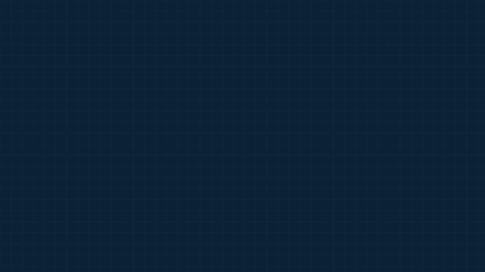
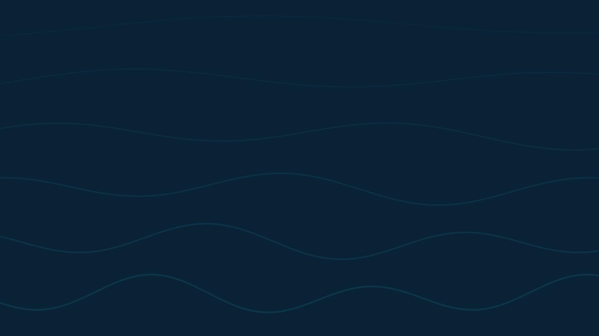

# BG Output

A standalone animated background layer. Because every other overlay is **transparent**, BG Output is the source you put *underneath* them to give the broadcast a coloured or animated backdrop — without baking a canvas into every graphic (which would make each source expensive). Output at `/graphics/bg-output/`.

A few of the animated styles (all share the broadcast theme palette):

<table>
<tr>
<td width="50%"> <b>Grid</b></td>
<td width="50%"> <b>Wave</b></td>
</tr>
<tr>
<td width="50%"> <b>Dot field</b></td>
<td width="50%"> <b>Fog</b></td>
</tr>
</table>

## Why it's separate

Graphic overlays composite over your scene transparently. For a designed backdrop behind your panels, add **one** BG Output browser source as its own layer at the bottom of your stack, and lay the other graphics on top. This keeps each overlay source cheap and lets you change the whole look in one place.

## Controls

From **Graphics → BG Output**:

- **Type** — animation, solid colour, or a background image.
- **Animation** — pick the animated style (e.g. a drifting dot field).
- **Colour** — base/background colour.
- **Speed** — animation speed (slow / medium / fast).
- **Renderer** — **GPU (shader)** or **Canvas**. GPU draws the animation as a shader on the graphics card — far lighter when you're live — and is the default. Styles that don't have a shader yet fall back to Canvas automatically, so this never breaks a background.
- **Frame Rate** — **Smooth 60** or **Performance 30**. The animated backgrounds are slow, ambient motion, so 30 fps looks essentially identical while halving their per-frame cost. Default is 60.
- **Wave Style** (Wave animation only) — **Clean** draws flowing accent-coloured lines; **Image** ripples a background image you upload (scaled to fill the frame).
- **Fog layer** — optional atmospheric fog with adjustable intensity.

These tie into the broadcast [theme](theming.md) palette, so the backdrop matches your colours.

## Performance

The animated background is the one graphic that redraws every frame, so BG Output is built to stay light — especially at 1440p:

- The **GPU (shader)** renderer (default) computes the whole frame in a single pass on the graphics card, instead of drawing thousands of shapes on a 2D canvas. It's dramatically cheaper — in live testing the animated background costs only a few percent of the GPU's render engine.
- Switch to **Performance 30** fps to trim it further; on the slow ambient styles there's no visible difference.
- Keep BG Output as **one** source underneath your graphics rather than baking a background into multiple overlays — that's the whole reason it's a separate layer.

> Most styles render on the GPU; a few (particle/rings/circuit/fog) use the optimised Canvas path automatically. Either way the look is the same — the toggle only changes *how* it's drawn.

## Notes

- BG Output has no show/hide toggle in the same sense as the overlays — it's a continuous background layer; just add or remove the source in OBS/vMix.
- It is **not** behind the graphics automatically — you place it as a separate, lower layer in your switcher.
