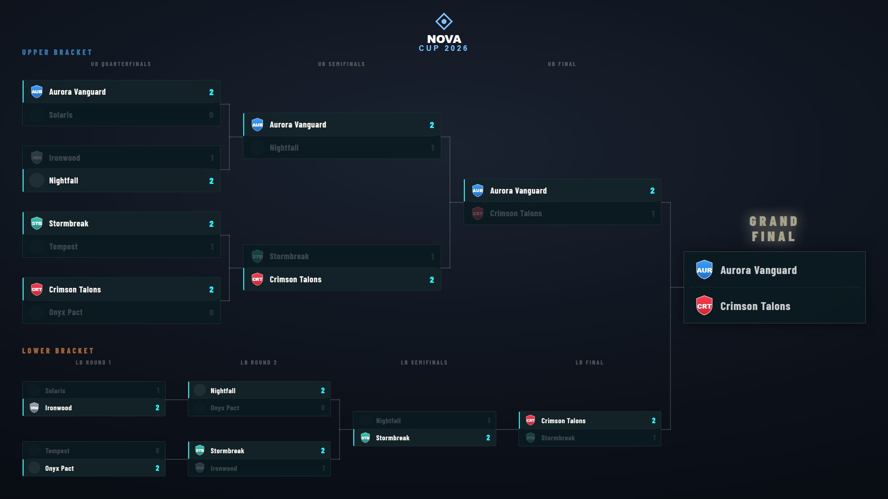
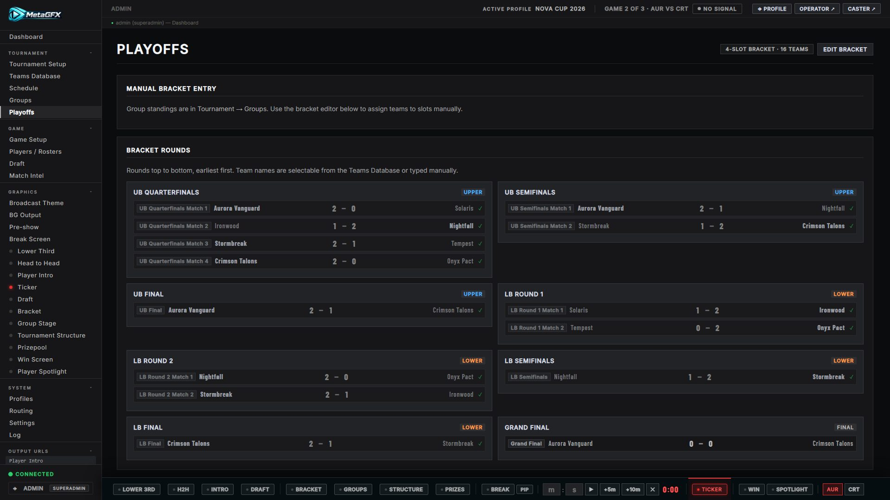
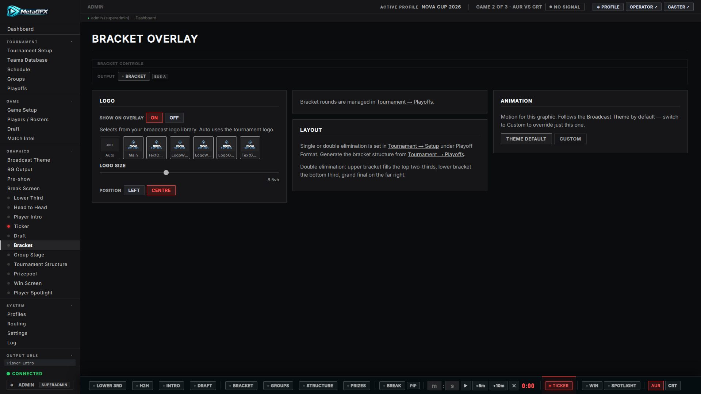

# Bracket

The playoff bracket — single or double elimination — as a broadcast overlay. Output at `/graphics/bracket/`.

*Double elimination: an upper and lower bracket feeding the grand final. Single elimination shows one progression of rounds instead.*

## Building the bracket

The bracket **structure and results** are managed in **[Tournament → Playoffs](tournament-setup.md#generating-the-bracket)**, not on the graphics tab:

- Generate the round/match slots from **Tournament Setup → Tournament Structure** (single/double elim, 3rd-place option), then assign teams to slots in **Playoffs → Bracket Rounds**.

- If you link [schedule](schedule.md#bracket-linking) games to bracket matches, results flow in automatically — teams forward-fill as they qualify and scores push back when a series completes.

## Display options

From the Bracket graphics tab / ctrl-bar:

- **Show / hide**.
- **Title** (e.g. "Nova Cup 2026 — Playoffs").
- **Type** — single or double elimination (double shows upper/lower tracks).
- **Logo** — toggle and scale the broadcast/tournament logo.

## Notes

- Team names and logos resolve from the [Teams Database](tournament-setup.md#teams-database); "Winner of…" placeholders show until a slot resolves.
- For round-robin standings rather than a bracket, see [Group Stage](group-stage.md); for a one-screen overview of the whole format, [Tournament Structure](tournament-structure.md).
