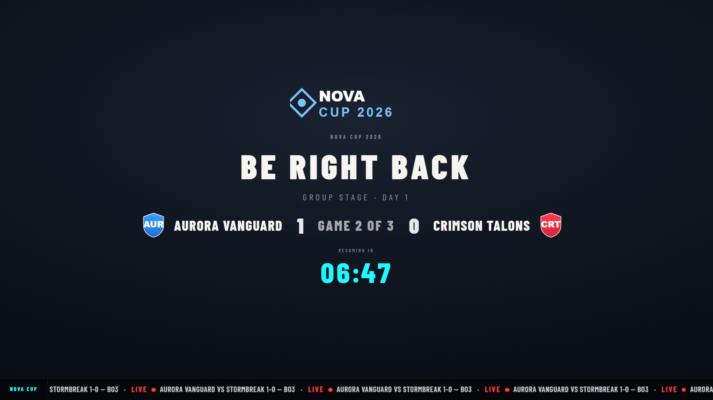
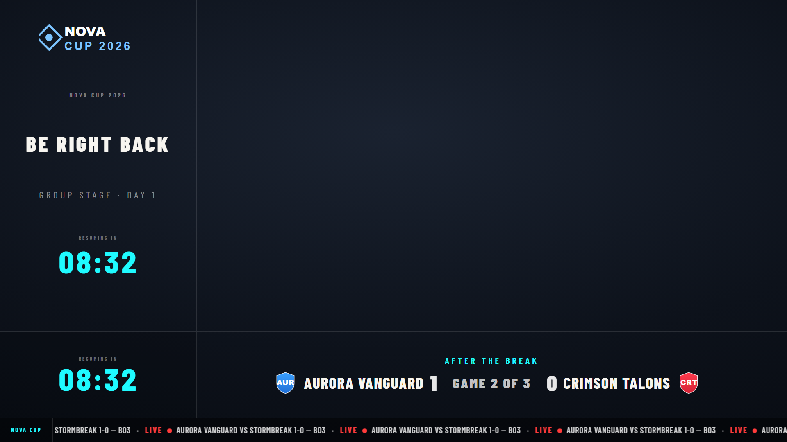

# Break Screen

A "back soon" holding card for between matches or during downtime — message, countdown, the upcoming matchup, and an optional **picture-in-picture** zone for a camera or holding shot. Driven from **Graphics → Break Screen**, output at `/graphics/break-screen/`.

### Standard

### Picture-in-picture

Reserves a large area for a camera/gameplay feed composited behind the source, with the break info pinned to the side.

## Controls

From the Break Screen ctrl-bar:

- **Show / hide**.
- **Message** (e.g. "BE RIGHT BACK") and **subtext** (e.g. "Group Stage · Day 1").
- **Countdown** — set a target time and a "back in" timer counts down.
- **PIP mode** — toggle the picture-in-picture layout.
- **Show tournament name** and the centre logo scale.
- The **upcoming matchup** ("After the break") is drawn from the current match / series so it stays accurate.

## Notes

- In PIP mode the reserved zone is transparent — place your camera or game-capture source *behind* the break-screen source in OBS/vMix so it shows through.
- For a pre-stream countdown with sponsors and a ticker, use the [Pre-show](pre-show.md) instead.
