# Caster view

A read-only dashboard for casters and analysts — team rosters, the live draft, series history, group standings, the playoff bracket and the schedule — all in one page that updates in real time. It needs no account, just the graphics token, so you can share it with on-air talent who shouldn't touch the controls.

Open at **`/caster?token=XXXX`** (grab the full link from **Settings → Output URLs**).

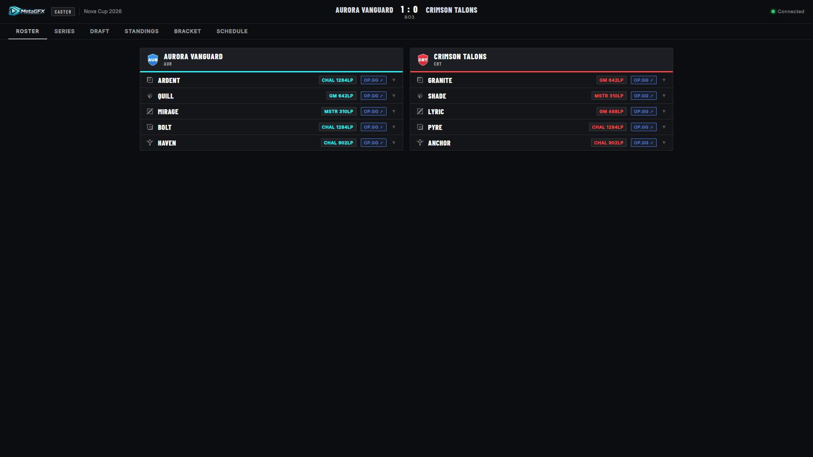

### Time-to-live countdown

When a [pre-show](pre-show.md) or [break](break-screen.md) countdown is running on air, a banner appears under the header — on **every tab** — so casters always know the time to air, or the time until the broadcast is back from a break:

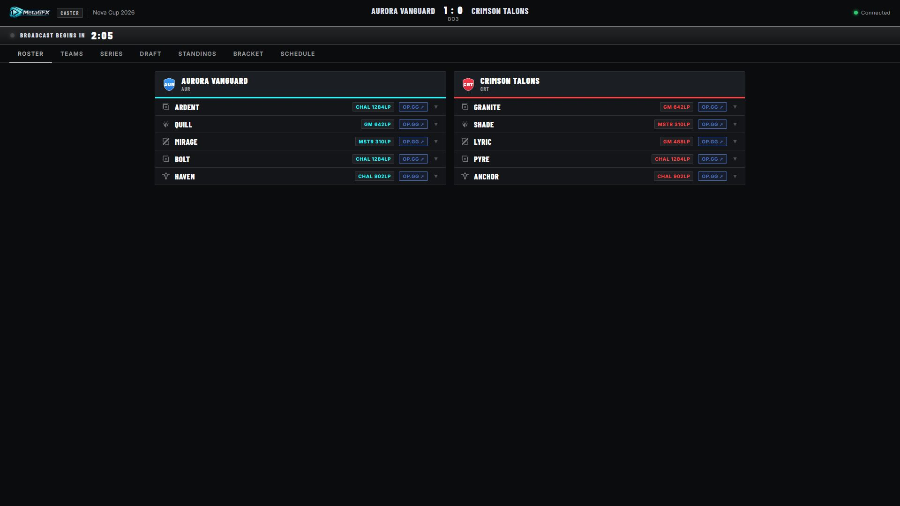

Click any player to expand full prep detail — Riot ID, this-game draft pick with KDA/CS/KP stats, and their champion pool:

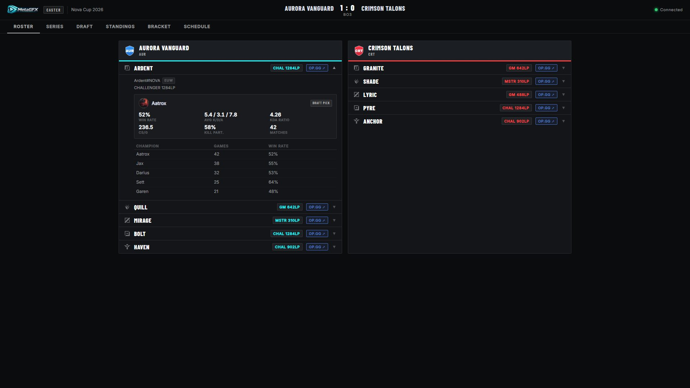

## Tabs

| Tab | What's there |
|---|---|
| **Roster** | The two teams on air, with each player's role, rank, Riot ID and champion pool — plus **op.gg** deep links for prep. |
| **Teams** | Every team in the tournament — not just the two on air — with full rosters and substitutes, so casters can pull up any team on demand. |
| **Series** | The current series: score, format, per-game results and draft history (incl. the **fearless** champion pool used so far). |
| **Draft** | A live pick/ban board mirroring the [draft](draft.md) as it happens. |
| **Live** | *(CS2 / Dota 2, with [live data](dota-live-data.md) connected)* — live in-game scores and player stats. |
| **Standings** | Group-stage standings, with advancing positions and the qualification cut-off marked. |
| **Bracket** | The playoff bracket — single- or double-elimination, with scores and winners. |
| **Schedule** | The broadcast schedule. |

The tabs adapt to the tournament's game — the table above describes a League of Legends event; see [Dota 2](#dota-2) below for how the Draft, Live and Series tabs change.

### Teams

The **Teams** tab lists the whole competing-team pool with rosters and subs — handy for previewing an upcoming opponent who isn't on air yet. The two teams currently on broadcast are flagged **ON AIR**:

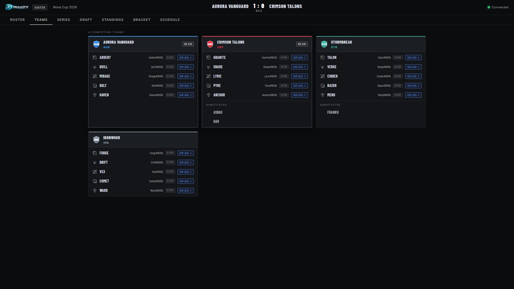

### Live draft

The **Draft** tab mirrors the pick/ban board in real time, with the fearless pool and series history below — ideal for casters following the draft live:

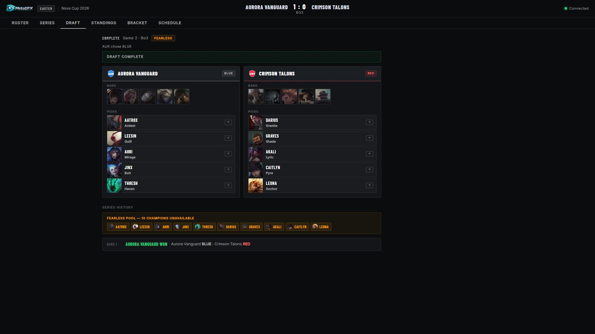

### Series, standings, bracket & schedule

The remaining tabs give the casters the full tournament context without leaving the page:

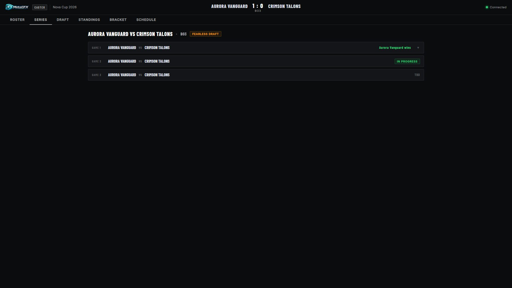

Standings show each group with numbered positions; advancing slots are highlighted and a cut-off line marks where qualification ends:

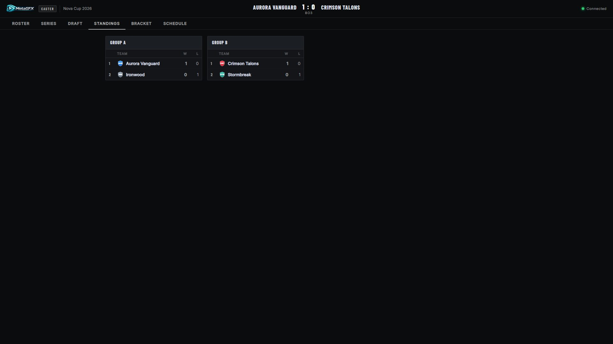

The bracket splits into **Upper / Lower / Grand Final** for double-elimination, with team logos, scores and the winner of each match highlighted:

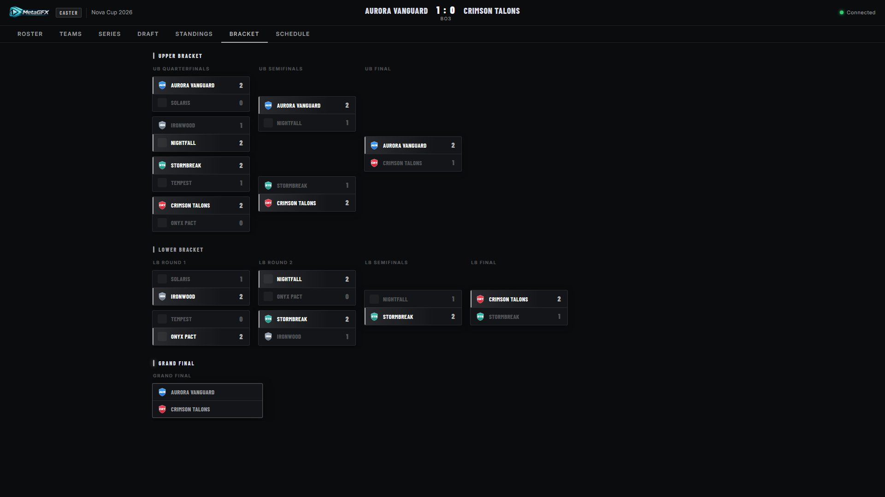

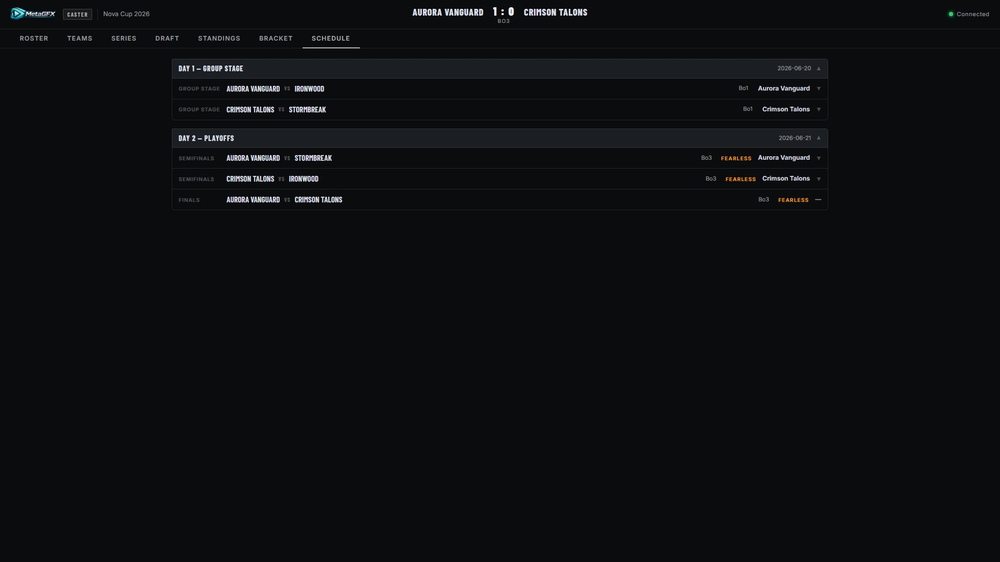

## Dota 2

On a Dota 2 tournament with [live data](dota-live-data.md) connected, three tabs give casters live match reference — all at the observer's delay, which matches what viewers see:

- **Live** — the game as it stands: clock, kill score, the net-worth split bar with the gold lead, both team scoreboards (hero + level, roster name, K/D/A, net worth, GPM, items) and a compact net-worth-over-time graph with event markers. It refreshes every few seconds while open.

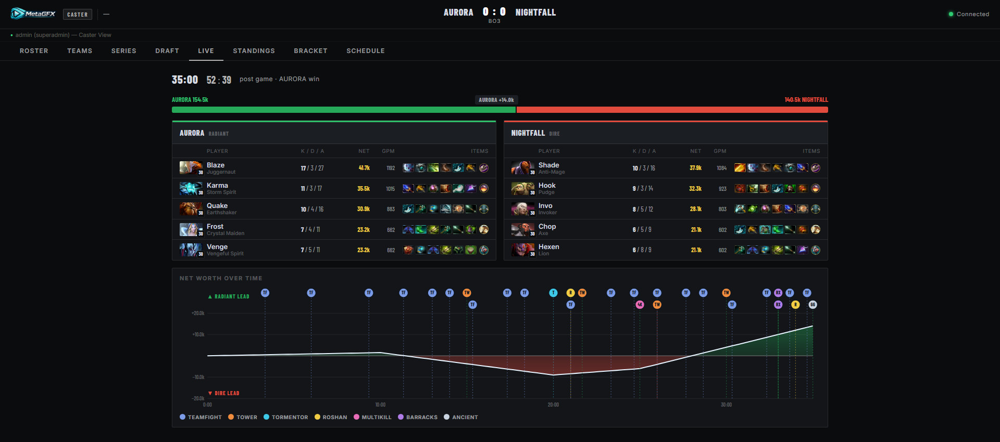

- **Draft** — the Captains Mode draft in real time: who's on the clock, the two-tier timer (free time, then each team's reserve pool), the full pick/ban sequence, and each team's picks with hero art and position tags.

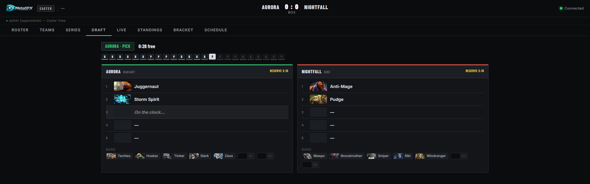

- **Series** — per-game cards with the picks/bans, kill score, duration and expandable player stat lines for every recorded game of the series.

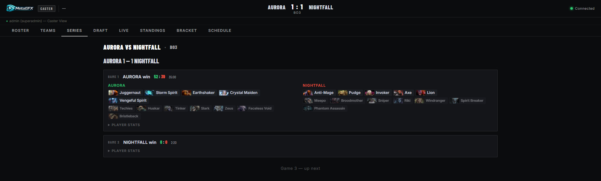

## How to use it

- It's **read-only** — casters can read everything but change nothing, so there's no risk of them altering the broadcast.
- It updates **live** over the same WebSocket state as everything else, so the draft board, scores and standings move in real time during the show.
- Share the `/caster?token=XXXX` link (and nothing else) with talent — the token grants caster + graphics read access but not the control panel.

## Notes

- Ranks and champion pools come from the [Riot API and op.gg](match-and-draft.md#league-of-legends--ranks-and-champion-pools); refresh them from the control panel so casters see current data.
- For driving graphics, that's the [operator view](operator-and-multiuser.md); the caster view is purely for reading.
