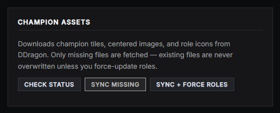

# Champion assets

The champion images used across the graphics — tile icons, centered portraits and full splash art — are **not bundled in the repo** (they'd bloat it). They're downloaded on demand from a public Data Dragon mirror and kept out of git. **After cloning (or any fresh install) you must sync them**, or champion art will be blank on the draft board, head-to-head, win screen, player intro and player spotlight.

> Small **role icons** (top/jungle/mid/bot/support) *do* ship with the app — only the champion artwork is downloaded.

## What gets downloaded

| Asset | Used by |
|---|---|
| **Tiles** (`/champions/…`) | Draft board, win screen, small champion icons. |
| **Centered portraits** (head-to-head) | [Head to Head](head-to-head.md) splash columns. |
| **Splash art** (head-to-head splash) | Large [Player Spotlight](player-spotlight.md) / win-screen backdrops. |

Source: the [DDragon mirror](https://github.com/noxelisdev/LoL_DDragon). Only **missing** files are fetched, so re-running is cheap.

## Syncing from the app (admins)

**Settings → Broadcast Assets** — the **Champion Assets · League of Legends** card (each game's art card lives here; only the active game's shows — Dota 2 tournaments get Hero + Item Assets cards ([Hero Draft](hero-draft.md) / [Match Summary](match-summary.md)), CS2 gets [Map Assets](map-intro.md)):



- **Sync Missing** — download everything that's absent, with a live progress bar.
- **Sync + Force Roles** — also re-download the role icons (use after a resolution upgrade).

## Syncing from the command line

```bash
node scripts/sync-assets.js               # download all missing files
node scripts/sync-assets.js --check       # report what's missing, download nothing
node scripts/sync-assets.js --force-roles # re-download role icons
```

## Notes

- The art folders are git-ignored, so they never get committed and your repo stays small.
- If champion images are blank in a graphic, this is almost always the fix — run the sync.
- The sync lists the full champion set from the mirror's Git tree, so newly released champions are picked up when you re-run it.
