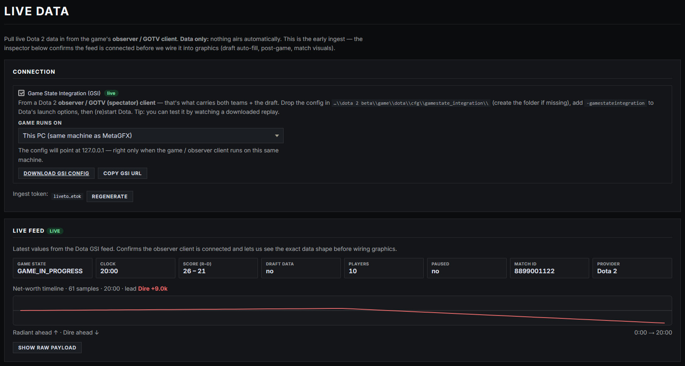
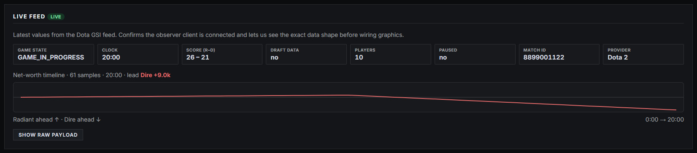

# Live Data — Dota 2 GSI

MetaGFX can pull **live Dota 2 data** from the game itself — the draft, scores, per-player stats, items and a full match timeline — so the draft board, post-game scoreboard and [Match Summary](match-summary.md) fill themselves instead of being typed by hand.

It uses Valve's **Game State Integration (GSI)**, running on a Dota 2 **observer / GOTV (spectator) client** — that's the client that sees both teams and the draft.

> **Data-only, by design.** Live Data only **records and suggests** — it never triggers a graphic. You still bring every overlay on and off air yourself. Automation belongs in OBS/vMix.

> Dota 2 is a recent addition to MetaGFX and is flagged accordingly in the game picker; the live-data features below have been validated against full professional replays.

## Quick start

1. Open the **Live Data** tab (admin) and enable **Game State Integration (GSI)**.
2. Under **Game runs on**, say where the spectator client runs (see below), then click **Download GSI config**.
3. Drop the config into the Dota machine's
   `…\dota 2 beta\game\dota\cfg\gamestate_integration\` folder (create the folder if it doesn't exist).
4. Add **`-gamestateintegration`** to Dota 2's launch options, then (re)start Dota.
5. Spectate a game — the **Live feed** card lights up as data arrives.

**Test it any time:** GSI also fires while watching a **downloaded replay**, so you can verify the whole pipeline — draft auto-fill, scoreboards, the timeline graph — without a live match.

### Where does the game run?

The GSI config tells Dota where to send data, so the address inside it must be reachable **from the Dota machine**. The **Game runs on** selector writes the right address into the config for you:

- **This PC** — Dota and MetaGFX on the same machine (`127.0.0.1`). Typical for replay-driven workflows.
- **Another PC on this network (LAN)** — a separate observer PC; the config uses this machine's LAN address (prefilled, editable).
- **A remote PC (over the internet)** — the observer is somewhere else entirely. MetaGFX must be reachable from the internet: a public address / `EXTERNAL_URL`, or a tunnel/VPS if your connection is behind CGNAT (most home connections are).

If you change the selection, re-download the config.

### The ingest token

GSI authenticates with the **ingest token** shown on the Live Data tab — a separate secret from the graphics token, embedded in the config automatically. **Regenerate** rotates it; after rotating, re-download the config or the feed stops.

## The live feed inspector

Once data flows, the **Live feed** card on the Live Data tab shows the parsed state — match ID, game state (hero select, in progress, post game…), clock, kill score, draft status — plus a compact **net-worth sparkline** that confirms the match timeline is recording.

**Show raw payload** displays exactly what the game is sending, which is the first thing to check if something doesn't look right.

## What the feed fills in

With GSI connected, the following work automatically (each is still operator-triggered on air):

| Surface | What it gets |
|---|---|
| [Hero Draft](hero-draft.md) | Picks & bans auto-fill (Suggest / Live / Delayed modes), first-pick orientation, hero→position assignment. |
| [Post-Game Scoreboard](post-game.md) | Per-player hero, K/D/A, net worth, GPM and the end-game items row. |
| [Match Summary](match-summary.md) | Both scoreboards, the ranked net-worth list, and the net-worth-over-time graph with event markers (Roshan, Tormentor, buildings, multikills, teamfights). |
| [Caster view](caster-view.md) | Live tab (scoreboards + graph), Draft tab (live pick/ban with timer), Series tab (per-game results). |
| [Series tracker](match-and-draft.md) | Recording a game winner snapshots the draft and the match stats onto that game, and accumulates per-player hero lines for the tournament. |

## Names on air — the roster rule

**The name you enter on the roster is the only name that ever appears on a graphic.** Players often queue with joke or smurf names — those must not leak to broadcast, so the in-game name from GSI is used for matching only, never for display.

Matching works like this:

1. **Steam ID** — the roster's Steam ID column (on the Players panel and in the Teams Database player editor) is the precise match key. Fill it in once per player and matching is exact.
2. **In-game name** — the fallback when no Steam ID is set: if a player's in-game name matches their roster handle, that works too.
3. **No match?** Graphics show the **hero name** in place of a player name — never the raw in-game name.

You can edit Steam IDs live on the **Players** panel during a broadcast; the next payload re-matches immediately.

## Game archive — "Game shown"

Every game is snapshotted as it happens, keyed by match ID, and kept for the length of a series (up to 7 games). That means:

- **Nothing is lost when the next game starts.** The live feed always shows the newest game, but earlier games stay available.
- The **Game shown** picker (on the [Match Summary](match-summary.md) tab) lets you put **any archived game** on the analysis board — e.g. reviewing game 1 during the game 2 draft — even while live data for the new game keeps arriving. An amber notice reminds you you're showing an archived game.
- **Post-game data survives the lobby.** After a game ends, the observer client usually sits in the menu sending empty heartbeats — MetaGFX keeps the finished game's data on all surfaces until a *new* match actually starts.

## Notes & limitations

- **A spectator client is required** — a player's own client only sees its own hero. Use an observer slot or GOTV.
- **Observer delay applies.** Data arrives as the observer sees it, so on a live match everything runs at the standard spectator delay — fine for broadcast, since your video feed has the same delay.
- **The ingest token is admin-only** and stripped from state sent to operators, casters and graphics clients.
- **Data-only, always** — no graphic ever shows, hides or changes on air because of the feed. The operator does that.
- CS2 has its own live-data pipeline (GSI + MatchZy) — see [Live Data (CS2)](live-data.md).
