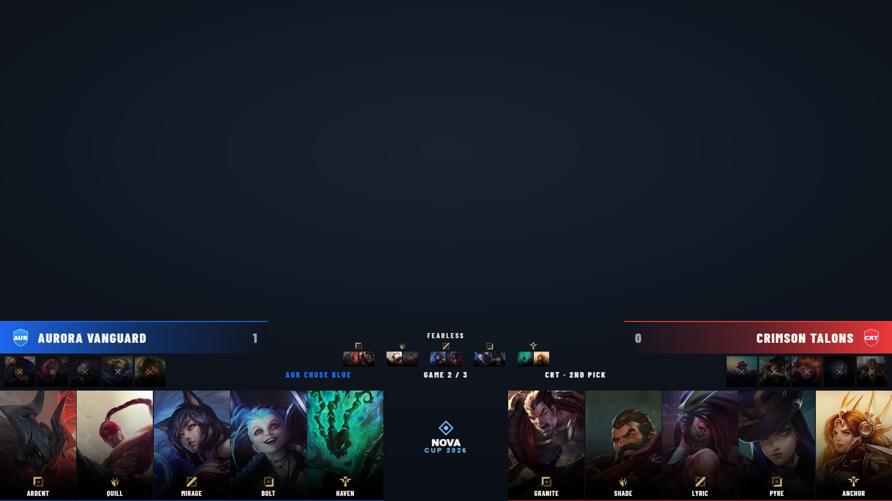

# Draft Overlay

The live League of Legends pick/ban board — both teams' picks and bans, side assignment, series context and an optional per-step countdown. Output at `/graphics/draft/`.

The overlay updates in real time as you drive the draft. **Operating the draft** (side assignment, starting it, filling picks in order, the timer, role mapping, committing to the series) is covered in **[Match & draft control → Draft](match-and-draft.md#draft)** — this page is about the overlay itself.

The Draft control tab — assign sides/timer, then fill picks and bans in order:

## What it shows

- Each team's **five picks** with champion art and the player on that champion.
- The **bans** for both sides.
- **Side** (blue/red) and series context — team names, series score, game number, fearless flag, who chose side, and whose pick/ban it is.
- An optional **timer** bar counting down the current pick/ban step.

## Display options

From the [Draft control tab](match-and-draft.md#draft):

- **Use pick/ban timer** + **Seconds per step** — show and set the countdown.
- **↺ Replay Intro** — re-trigger the overlay's entrance animation without changing any draft data (handy if you bring the source on screen after the draft already started).
- The board reflects **Blue/Red side**, **bans-first** and **side-chosen-by** exactly as set in the control tab.

## Notes

- Champion art is local — run the [champion asset sync](champion-assets.md) so picks/bans aren't blank.
- The draft state feeds other graphics: [Head to Head](head-to-head.md) maps picks to roles, and the [Win Screen](win-screen.md) COMP style shows the winning team's picks.
- Fearless series: champions used in earlier games are tracked once you **Push Picks to Series Tracker** — see [series & fearless](match-and-draft.md#series-tracker).
