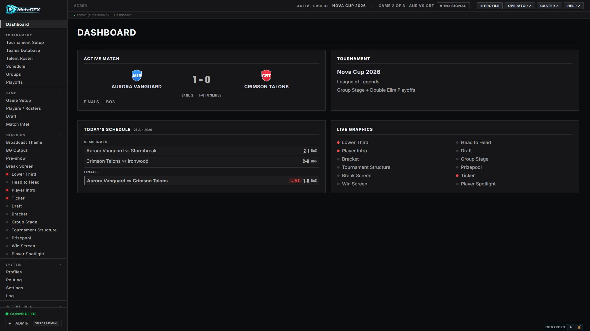
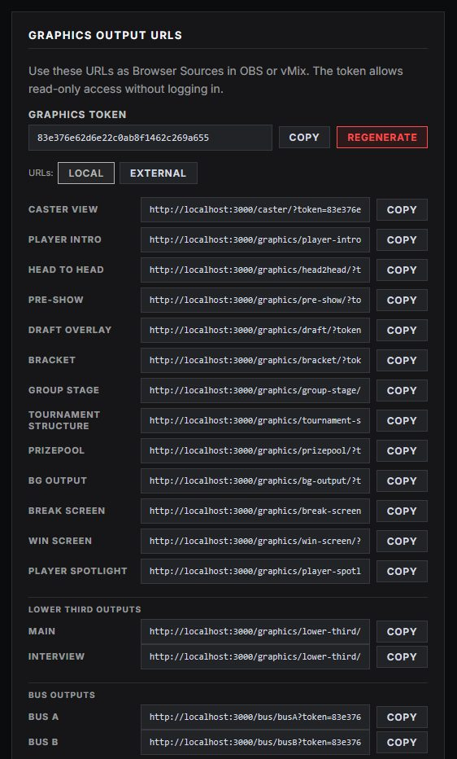

# Getting started

This page gets MetaGFX running and points you at the few things that will save you a broken broadcast. Once you're in, follow the Tournament & data guides in order — **[Tournament setup](tournament-setup.md) → [Schedule](schedule.md) → [Match & draft control](match-and-draft.md)** — then pick up the extras for your game under [Game-specific setup](#game-specific-setup).

## Requirements

- **Node.js 18+**
- **OBS or vMix** with a browser-source capable scene (overlays are resolution-independent — 1920×1080 or 2560×1440 both work, see below)

## Install & first run

```bash
npm install
npm start                    # serves on http://localhost:3000
```

For auto-reload while developing, use `npm run dev` instead of `npm start`.

Then open the **control panel** at `http://localhost:3000/control` and log in.

> **First login:** `admin` / `admin` (a `superadmin` account seeded on first run).



The **Dashboard** is your landing page: the active match and series score, the tournament summary, today's schedule, and a live readout of which graphics are currently on air. The left sidebar groups everything into **Tournament**, **Game**, **Graphics** and **System** sections — and the whole panel adapts to the game your tournament is set to, so you only see the tabs your game uses.

## ⚠️ Before you go live — required reading

A handful of things bite people the first time. Read these once.

| # | What | Why it matters |
|---|---|---|
| 1 | **Change the default admin password** | First run seeds `admin` / `admin`. Change it immediately in **Settings → Accounts**, or anyone on your network can drive your broadcast. |
| 2 | **Game art is NOT in the repo** | Champion/hero/item/map images are downloaded on demand to keep the repo small. After cloning, sync your game's art from **Settings → Broadcast Assets** — otherwise that art is blank. See [Game-specific setup](#game-specific-setup). |
| 3 | **Graphics need the token** | Every overlay/caster URL needs `?token=XXXX`. Copy the ready-made URLs from **Settings → Output URLs** into OBS/vMix. |
| 4 | **Remote OBS?** | If OBS runs on a different machine, set `EXTERNAL_URL` (see [below](#environment-variables)) so a **Local / External** toggle appears in **Settings → Output URLs**. |

## Adding the graphics to OBS / vMix

**Settings → Output URLs** lists a ready-made, token-bearing URL for every graphic, caster view and GFX bus. Toggle **Local / External** at the top to switch between `localhost` and your `EXTERNAL_URL` for a remote OBS.



1. In MetaGFX, open **Settings → Output URLs** and copy the URL for the graphic you want (each already includes `?token=XXXX`).
2. In OBS/vMix add a **Browser Source** and paste the URL.
3. Set the source resolution to match your canvas — **1920 × 1080** for 1080p, or **2560 × 1440** for 1440p. The overlays are built on viewport units and scale to fill whatever size the browser source is, so there's nothing to reconfigure in MetaGFX when you switch; for crisp 1440p output just create the browser sources at 2560 × 1440 (and set the OBS canvas to match).
4. Leave the background transparent — overlays are transparent by design; composite them over your scene. For a coloured/animated backdrop use the separate [BG Output](bg-output.md) source as its own layer underneath.

A few graphics expose **more than one output** — e.g. the [Lower Third](lower-third.md) lists a **Main** URL plus a `?out=<id>` URL per extra output, so you can run independent lower thirds on different scenes at once.

To run many graphics through a handful of shared browser sources (big RAM/VRAM saving), see [GFX Bus](gfx-bus.md). And if you'd rather skip browser sources entirely, graphics can also leave the app as **native OMT video with alpha** — see [OMT Output](omt-output.md) (beta).

## Game-specific setup

Everything above applies to every tournament. Each game then has its own art sync (one time) and optional data integrations — set the tournament's **Game** in [Tournament setup](tournament-setup.md) first, then do the matching section below.

### League of Legends

- **Champion art** — sync tiles, centered portraits and splash art from **Settings → Broadcast Assets → Champion Assets** (or `node scripts/sync-assets.js`). Without it, champion art is blank on the draft board, head-to-head, win screen, player intro and spotlight. See [Champion assets](champion-assets.md).
- **Riot API key (optional)** — Solo Queue rank lookups need `RIOT_API_KEY` in your `.env`. Register a **persistent product key** at [developer.riotgames.com](https://developer.riotgames.com) — **don't use the 24-hour Development key**, it expires mid-event. Without a key everything else works; ranks just won't fetch.
- **Champion pools** come from op.gg per player (no Riot key needed) — see [Match & draft control](match-and-draft.md#league-of-legends--ranks-and-champion-pools).
- *1440p note:* champion **splash backgrounds** (Head-to-Head / Player Spotlight) come from Riot at a fixed ~1215 px and upscale slightly at 1440p — all text and vector chrome stays sharp.

### Counter-Strike 2

- **Map art** — download art for your tournament's map pool from **Settings → Broadcast Assets → Map Assets** (see [Map Intro](map-intro.md)).
- **Live data (optional, beta)** — GSI and/or MatchZy can auto-fill map/series scores and player stats: [Live Data (CS2)](live-data.md).
- Add **Steam IDs** to rosters for exact player↔stats matching ([Tournament setup](tournament-setup.md#creating--editing-a-team)).

### Dota 2

- **Hero + item art** — sync both from **Settings → Broadcast Assets** (Hero Assets and Item Assets cards). Heroes drive the draft board and every scoreboard; items drive the post-game and match-summary item rows.
- **Live data (optional)** — GSI from an observer/GOTV client fills the draft, scoreboards and the match-summary graph: [Live Data (Dota 2)](dota-live-data.md).
- Add **Steam IDs** to rosters — for Dota this is also what keeps players' real handles (not their in-game smurf names) on air: [names on air](dota-live-data.md#names-on-air--the-roster-rule).

### VALORANT *(alpha)*

- **Agent + map art** — sync both from **Settings → Broadcast Assets → Agent & Map Assets · VALORANT** (or `node scripts/sync-valorant.js`). Agents drive the player intro and win screen; maps drive the veto and map intro.
- **Assign agents** per player on **Game Setup → Players / Rosters** once they lock — there's no public draft in VALORANT.
- **Riot IDs** — validate them (and store PUUIDs) with the Players-page button; uses the standard `RIOT_API_KEY`.
- **Post-map data (optional, beta)** — with a free `HENRIKDEV_API_KEY`, fetch each finished map's score, agents and stats as a one-click suggestion (feeds the Series Tracker, roster agents and the Post-Game Scoreboard): [VALORANT guide](valorant.md#post-map-data-beta). No key = manual entry, which always works.

## Environment variables

All optional. Create a `.env` file in the project root:

```
RIOT_API_KEY=your_persistent_key_here
PORT=3000
EXTERNAL_URL=http://YOUR_LAN_IP:3000
```

| Variable | Required | Description |
|---|---|---|
| `RIOT_API_KEY` | No | *(League of Legends)* Persistent Riot key for Solo Queue rank lookups. **Not** the 24-hour dev key. |
| `PORT` | No | Server port, defaults to `3000`. |
| `EXTERNAL_URL` | No | LAN IP/hostname for sharing output URLs to a remote OBS on the same network. |
| `HENRIKDEV_API_KEY` | No | *(VALORANT, beta)* Free community key for post-map data & agent pools — [VALORANT guide](valorant.md#post-map-data-beta). |

## The views

| View | URL | Who | What |
|---|---|---|---|
| **Control panel** | `/control` | admin | Full tournament setup, match management, all graphic control, settings. |
| **Operator view** | `/operator` | operator/admin | Streamlined live production. See [Operator & multi-user](operator-and-multiuser.md). |
| **Caster view** | `/caster?token=XXXX` | token | Read-only caster dashboard. See [Caster view](caster-view.md). |

## Where data lives

The `data/` directory is created on first run and is **not** in git (it's yours, and machine-specific):

| File | Contents |
|---|---|
| `state.json` | Live broadcast state (restored on restart). |
| `users.json` | Accounts (hashed passwords). |
| `teams.json` | Teams Database. |
| `profiles.json` | Saved tournament [profiles](tournament-setup.md#profiles). |
| `session-secret.txt` | Auto-generated session signing key. |

## Next steps

- **[Tournament setup](tournament-setup.md)** — create the event, pick its game, add competing teams, define the structure.
- **[Schedule](schedule.md)** — lay out broadcast days and matches.
- **[Match & draft control](match-and-draft.md)** — load a match and drive the live graphics.
- **[Broadcast Theming](theming.md)** — give the whole overlay set your event's visual identity.
