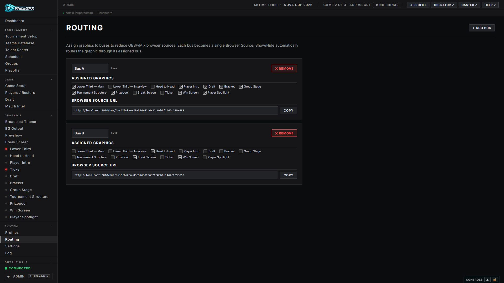

# GFX Bus

The GFX Bus system lets you drive **many graphics through a handful of shared browser sources** instead of adding one source per graphic in OBS/vMix. Each bus is a single Browser Source that automatically displays whichever graphic is currently live on it — a big saving in RAM/VRAM and scene clutter. Configured under **System → Routing**.

## Why use it

Without buses you'd add ~14 browser sources to OBS (one per overlay), each running its own page. With buses you add, say, **3–4** sources and route graphics to them. Because only one graphic is live on a bus at a time in most workflows, a few buses cover a whole show.

## How it works

- A **bus** has an output URL `/bus/<id>` — add this as a Browser Source (1920×1080, `?token=XXXX`) like any graphic.
- In **Routing**, assign each graphic to a bus.
- When you **Show** a graphic (from its ctrl-bar, the live bar, the operator view, or Companion), it's automatically routed onto its assigned bus and that bus goes live. **Hide** clears it. No manual switching of sources.
- The [Live Switcher](live-switcher.md) understands buses too: a `/bus/<id>` source resolves to whichever graphic is currently live on it for PGM/PVW tagging.

## Setting it up

1. **System → Routing** — add the number of buses you want and assign graphics to each.
2. In OBS/vMix, add one Browser Source per bus pointing at its `/bus/<id>?token=XXXX` URL (grab them from **Settings → Output URLs**, which lists the bus URLs alongside the graphics).
3. Arrange the bus sources in your scene; from then on, just Show/Hide graphics as normal.

## Graphics with multiple outputs

Most graphics are a single assignable entry. A few expose **more than one output** — notably the [Lower Third](lower-third.md), which can drive several independent browser sources. Each of those outputs appears in Routing as its **own entry** (*Lower Third — Main*, *Lower Third — Interview*, …), so you can route each onto a different bus (or leave some direct). Assigning and clearing work exactly as for any other graphic; the bus simply follows whichever of that output's sets is live.

## Notes

- Group graphics that are never on screen at the same time onto the same bus; put things that *do* overlap (e.g. a lower third over a bracket) on different buses.
- You can still use direct per-graphic source URLs for anything you'd rather keep separate — buses are opt-in per graphic.
- A bus shows nothing when none of its assigned graphics are live, so it's safe to leave in your scene.
