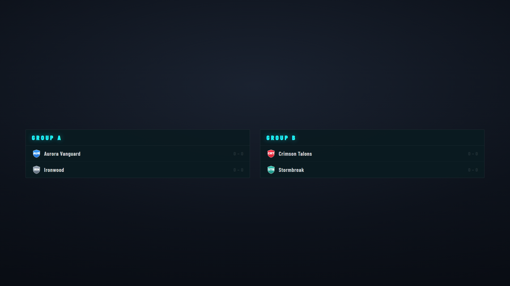

# Group Stage

Round-robin group standings as a broadcast overlay — one card per group, teams ranked by record. Output at `/graphics/group-stage/`.

## Setting up groups

Groups are configured in **[Tournament Setup → Tournament Structure](tournament-setup.md#group-stage-optional)**:

1. Tick **This tournament has a Group Stage**, set the number of groups and teams advancing, then **Generate Groups**.
2. Assign teams to each group in **[Tournament → Groups](tournament-setup.md)**.

**Standings update automatically** as group-stage matches complete — wins/losses are tallied from results, so you don't maintain the table by hand.

## Display options

From the Group Stage graphics tab / ctrl-bar:

- **Show / hide**.
- **Mode** — live standings.
- **Logo** — toggle and scale the broadcast/tournament logo.

## Notes

- Teams advancing (per [qualifiers-per-group](tournament-setup.md#group-stage-optional)) are highlighted.
- Empty groups show "No teams assigned" until you populate them.
- For the playoff picture, see [Bracket](bracket.md); for the overall format, [Tournament Structure](tournament-structure.md).
