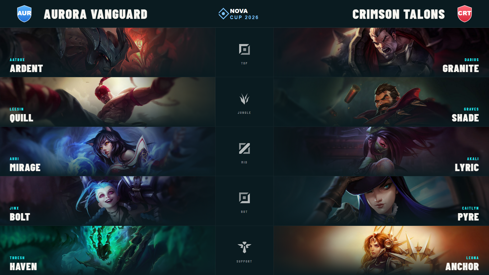
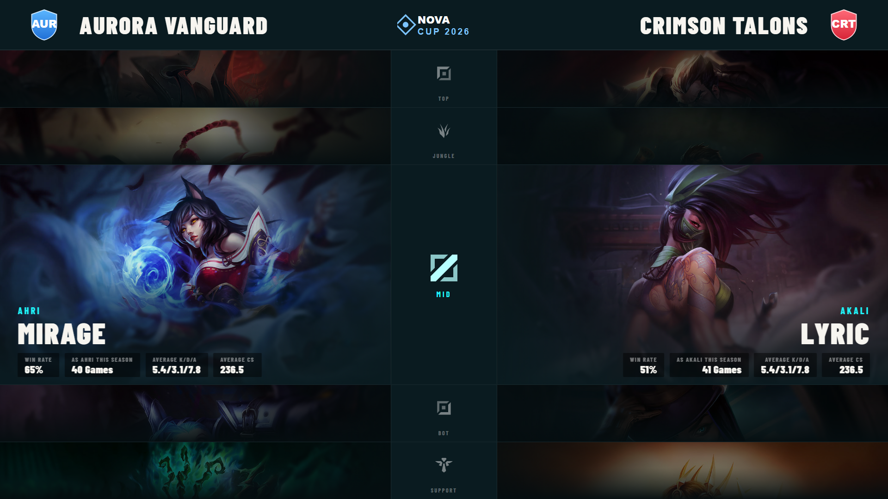

# Head to Head

A role-by-role comparison of the two teams, with champion splash art and per-player Solo Queue stats. Driven from **Graphics → Head to Head**, output at `/graphics/head2head/`.

It pairs players by role (Top, Jungle, Mid, Bot, Support) and shows each one's champion for the game plus their stats on it.

## Modes

### Lineup

The full five-role comparison — both teams down the screen, role icons in the centre column.

### Spotlight

Focuses a single role (e.g. the mid-lane matchup), enlarging that pairing and surfacing the stat pills while dimming the rest. Great for a "key matchup" beat.

## Controls

From the Head to Head ctrl-bar:

- **Show / hide** the graphic.
- **Mode** — Lineup or Spotlight.
- **Spotlight role** — in Spotlight mode, which role (Top → Support) is featured. Step through roles live as the casters move down the map.
- **Animation style** — the entrance feel (standard / impact / drop).

## Where the data comes from

- **Champion per role** comes from the current game's draft picks (mapped to roles) — run the [Draft](draft.md) or commit picks so the right champions appear.
- **Stats** (win rate, games, KDA, CS…) come from each player's Solo Queue data on that champion. If there's no data for a champion this season, the row shows *"No Solo Queue data… this season"* rather than guessing.
- Champion **splash art** is served locally — make sure you've run the [champion asset sync](champion-assets.md).

## Notes

- Pairing is by role, so make sure each player's **role** is set in the [Teams Database](tournament-setup.md#creating--editing-a-team).
- For a one- or two-player spotlight with design options, see [Player Spotlight](player-spotlight.md); for the whole roster, [Player Intro](player-intro.md).
