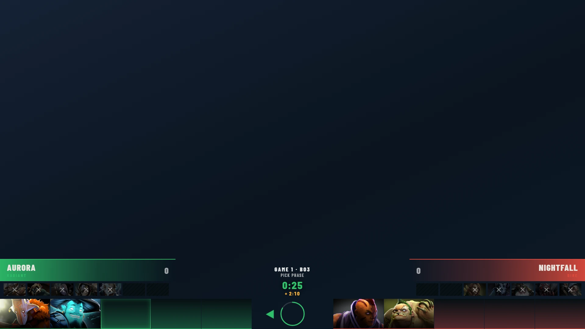
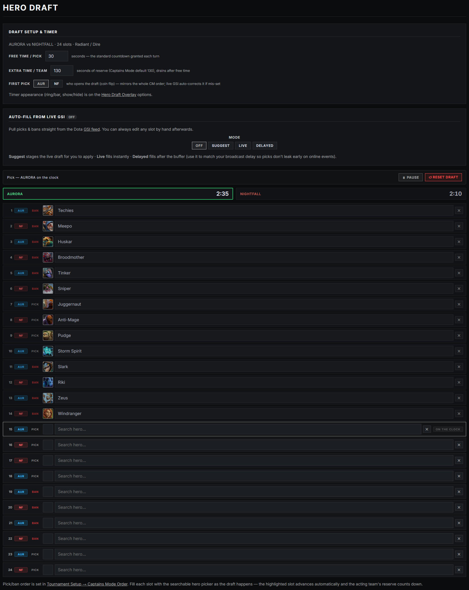
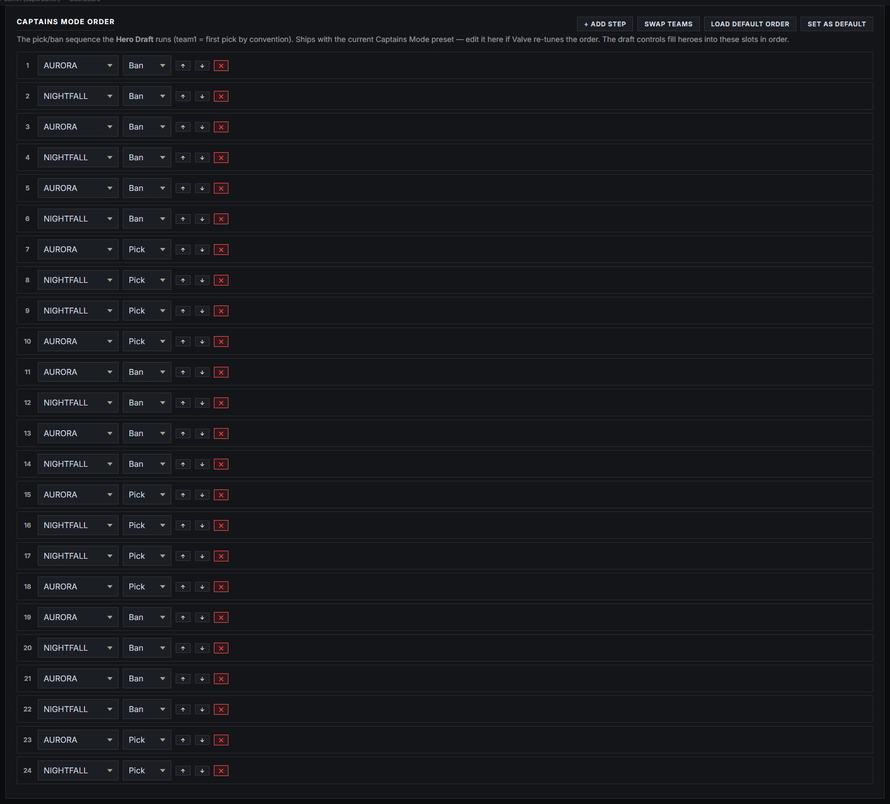
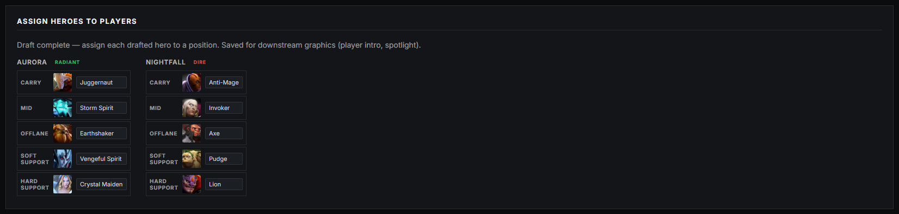

# Hero Draft — Dota 2 pick/ban

The Captains Mode pick/ban board for Dota 2 tournaments — **Radiant** (Team 1, green) vs **Dire** (Team 2, red), with the full ban/pick sequence, a two-tier draft timer, and optional auto-fill straight from the live game.

You drive it from two places:

- **Game → Hero Draft** — the working board: fill heroes as they're drafted, run the timer, assign heroes to positions.
- **Graphics → Hero Draft Overlay** — the on-air output: show/hide the graphic and set its look (timer style, hero names, gradient).

> **Before your first draft:** sync the hero art once from **Settings → Broadcast Assets → Hero Assets · Dota 2** (Check Status / Sync Missing). Portraits and icons download from Valve's CDN; without them the board shows names only.

## Quick start

1. Check the pick/ban sequence in **Tournament Setup → Captains Mode Order** (it ships with the current Captains Mode preset — you rarely need to touch it).
2. On **Game → Hero Draft**, set **First pick** to whichever team won the coin flip.
3. Click **▶ Start Draft** when the in-game draft begins — the clock starts on the first team.
4. Fill each slot with the searchable hero picker as heroes are locked in — the highlighted slot advances automatically. (Or let [live data](dota-live-data.md) fill it for you — see [Auto-fill](#auto-fill-from-the-live-game).)
5. Show the overlay from the **HERO DRAFT** button on the Hero Draft Overlay tab, the live bar, or the operator view.

## The draft board

The board lists every step of the Captains Mode order — bans and picks, in sequence, each tagged with the acting team. Click a slot and type to search heroes; picking one advances the highlight to the next step. You can go back and edit any slot at any time (auto-fill never fights a manual edit).

### The pick/ban order

The sequence itself lives in **Tournament Setup → Captains Mode Order**, so it's set once per tournament:

- **Load default order** — restores the saved default (ships with the current Captains Mode sequence).
- **Set as default** — saves your edited order as the default for new Dota 2 tournaments (useful when Valve re-tunes the order in a patch).
- **Swap teams** — flips which team acts on every step, e.g. if the other team won first pick. You won't normally need this: the **First pick** buttons on the Hero Draft page do the same thing from the draft side.
- **+ Add Step** — appends a custom step if you're running a non-standard format.

## First pick

Who drafts first is a coin flip, so it changes every game. Set it with the **First pick → Team 1 / Team 2** buttons on the Draft Setup card before the draft starts — this mirrors the whole Captains Mode order in one click.

If you forget, and GSI [auto-fill](#auto-fill-from-the-live-game) is on, the live feed detects who is actually on the clock and corrects the board orientation automatically. A manual First pick setting always stands — the auto-correction only fixes a board that doesn't match the real draft.

## The draft timer

Captains Mode has two clocks, and the overlay shows both:

- **Free time per pick** — the standard countdown granted each turn (default 30s).
- **Extra time per team** — each team's reserve pool (default 130s, the Captains Mode standard). It only drains once a team's free time runs out.

Click **▶ Start Draft** to start the clock on the first team. While the draft runs, the status bar shows who's on the clock, with **⏸ Pause** and **↺ Reset Draft** beside it, and a live readout of each team's remaining reserve.

On the overlay, the timer shows free time in the acting team's colour, then switches to **amber** once the team is into reserve time. Two styles are available on the **Hero Draft Overlay** tab:

- **Ring** — wraps the centre logo.
- **Bar** — a horizontal bar between the bans and the pick strip.

You can also hide the timer entirely (e.g. when you're tracking a delayed broadcast and the real clock would be ahead of what viewers see).

## Overlay options

On **Graphics → Hero Draft Overlay**:

| Option | What it does |
|---|---|
| **Show the draft timer** | Timer on/off on the overlay. |
| **Timer style** | Ring (around the centre logo) or Bar. |
| **Show hero names** | Name labels on the pick images. |
| **Gradient over the pick images** | A dark gradient that helps the names pop against bright hero art. |
| **Centre Logo** | The mark between the two clocks, picked from [Broadcast Logos](theming.md#broadcast-logos) (**Auto** = the event logo). |

## Auto-fill from the live game

With [Dota live data](dota-live-data.md) connected, the **Auto-fill from live GSI** card on the Hero Draft page fills picks and bans straight from the real draft — no typing during the pick/ban phase. Four modes:

- **Off** — fully manual.
- **Suggest** — the live draft is staged with a note (*Live draft detected: N picks · N bans*) and an **Apply to board now** button; nothing changes until you click.
- **Live** — every pick/ban lands on the board the moment GSI reports it.
- **Delayed** — picks land after a buffer you set (in seconds). Match it to your broadcast delay on online events so picks don't leak on the overlay before viewers see them in game.

Whatever the mode, **you can always edit any slot by hand afterwards** — auto-fill never overwrites a manual change.

## Assigning heroes to positions

Once the draft completes, an **Assign Heroes to Players** card appears under the board: one dropdown per position (Carry, Mid, Offlane, Soft Support, Hard Support) per team, each choosing from that team's five drafted heroes. These assignments feed downstream graphics such as the [Player Intro](player-intro.md).

With auto-fill on, this card also fills itself: GSI reports which player is on which hero, the player is matched to your roster (by Steam ID, then name), and the hero lands on that player's position. Review it, correct anything odd, done.

## Notes

- The overlay is a standard graphic — 1920×1080 browser source, works on the [GFX Bus](gfx-bus.md), and appears in the live bar and [operator view](operator-and-multiuser.md).
- Casters get their own live draft board (timer included) on the [caster view](caster-view.md)'s Draft tab.
- The recorded draft is snapshotted onto each series game when you record a winner — see [Match & draft control](match-and-draft.md).
- Colours, fonts and animation follow your overlay [theme and Looks](theming.md) like every other graphic.
