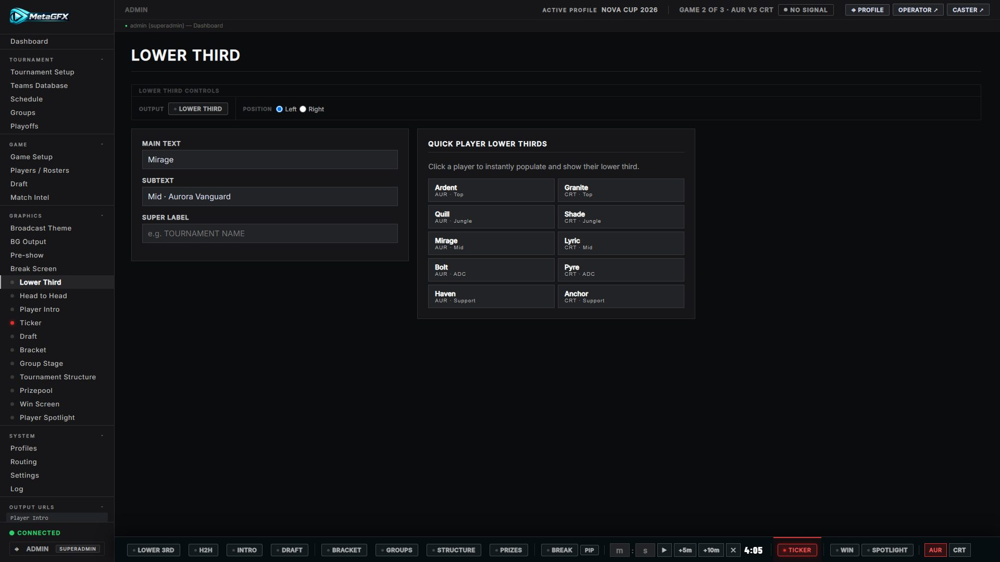

# Lower Third

A compact name/title strip for casters, players or guests. Driven from **Graphics → Lower Third**, output at `/graphics/lower-third/`.

## Controls

From the Lower Third ctrl-bar:

- **Show / hide**.
- **Main text** (e.g. a player handle or caster name), **subtext** (e.g. "Mid · Aurora Vanguard") and an optional **supertext** line above.
- **Side** — anchor it bottom-left or bottom-right.
- **Accent colour** — set per lower third (e.g. a team colour).

There's also a quick **player grid** in the control tab: click a player from either loaded roster to fill the lower third with their handle, role and team in one tap.

## Notes

- It's a single, reusable strip — change the text and re-show it for each new name.
- Anchored low so it clears the rest of your scene; transparent like all overlays.
