# Lower Third

Name/title strips for casters, hosts, players and guests — the most flexible graphic in MetaGFX. Rather than one hardcoded strip, the Lower Third is **set-driven and multi-output**: you build reusable **sets** of freely-positioned strips, then air them on one or more **outputs** (independent browser sources) so a solo-cam scene and a duo-desk scene can each show their own lower thirds at the same time.

Output URL: `/graphics/lower-third/` for the main output, or `/graphics/lower-third/?out=<id>` for any extra output (every URL also needs `?token=XXXX`, as with all graphics).

## How it fits together

Three concepts, from content to air:

- **Item** — a single lower third: a name, an optional super label and subtext, a [design](#designs), a side, an accent colour, free X/Y position, scale and an optional logo.
- **Set** — a named group of items (e.g. *Casters*, *Host*, *Guest*). Airing a set brings **all** its items on at once. A two-caster desk is one set with two items.
- **Output** — an independent browser source (a "bus for sets"). Each set is assigned to one or more outputs; each output is either **Exclusive** (one set at a time) or **Freeform** (stack several). Triggering a set animates it in/out on whichever output(s) it's assigned to.

Everything below maps onto those three. All editing lives on the **Lower Third** control tab:

## Designs

Each item picks one of four designs. They share the broadcast palette and fonts, so they stay on-brand automatically.

| Design | Look | Example |
|---|---|---|
| **Bar** | Accent bar + angled glass box. The default; great for caster/player desks. | shown above (two-up) |
| **Box** | Clean solid card with square corners and a soft drop shadow. | below |
| **Underline** | Minimal — no box, just a name with an accent rule beneath. Reads over busy footage. | below |
| **Interview** | A larger card for a call-in or solo guest. | below |

**Box** — here with a logo beside the text:

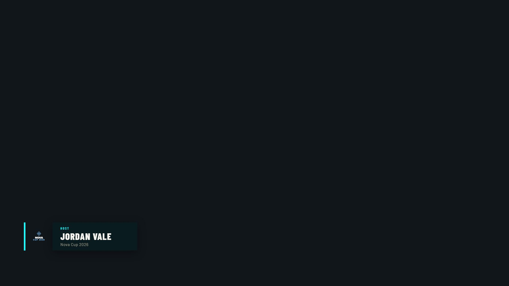

**Underline** — minimal, sits straight over the feed:

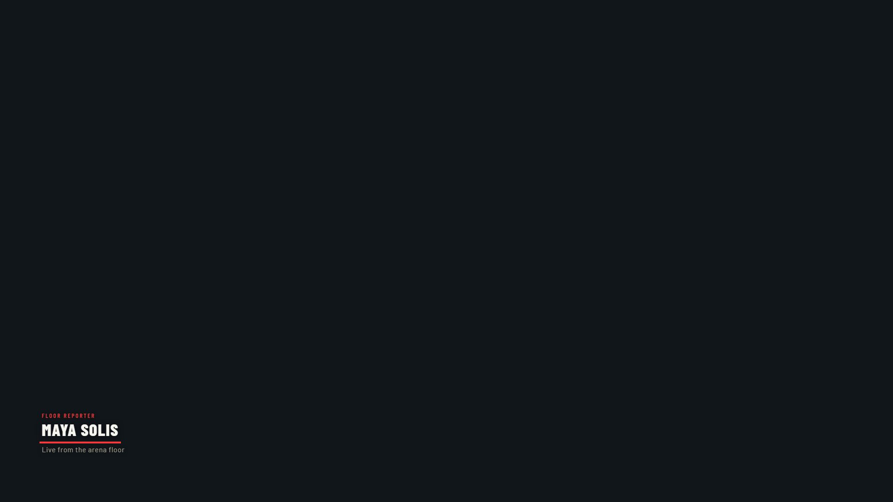

**Interview** — bigger, for a single guest or call-in:

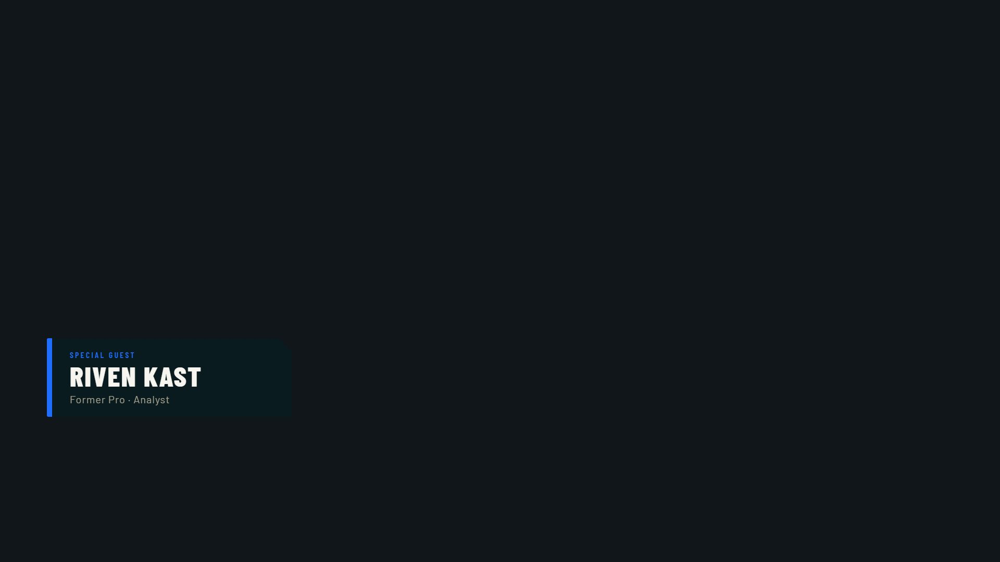

## Building a set

The **Sets** card (left column) lists every set. Use **+ Add Set** to create one, **Edit** to make it the set you're editing, the name field to rename it, and **×** to delete it. The badges tell you the **item count** and whether a set is **ON AIR**.

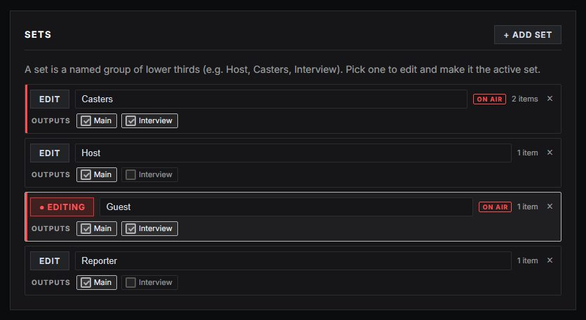

With a set selected, the **Lower Thirds** editor below it shows that set's items (**+ Add** for more). Each item exposes every field:

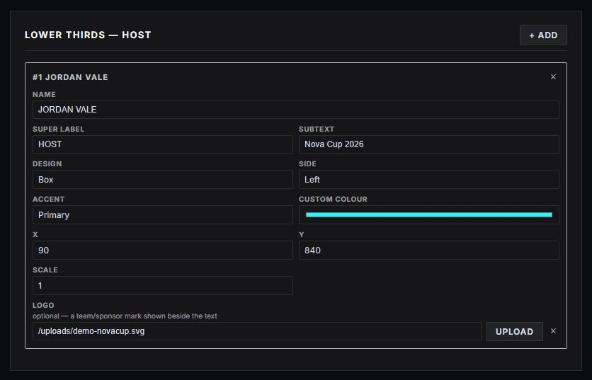

| Field | What it does |
|---|---|
| **Name** | The main line (e.g. a handle or person's name). |
| **Super label** | A small uppercase line above the name (e.g. *CASTER*, *HOST*). Optional. |
| **Subtext** | A line below the name (e.g. *Play-by-Play* or *Mid · Aurora Vanguard*). Optional. |
| **Design** | Bar / Box / Underline / Interview (see [Designs](#designs)). |
| **Side** | Anchor the strip / its accent to the **Left** or **Right**. |
| **Accent** | **Primary** (theme), **Blue side**, **Red side** or **Custom** (the colour picker). |
| **X / Y** | Free position on the 1920×1080 frame — type values or drag (below). |
| **Scale** | Size multiplier (0.4–2.5). |
| **Logo** | Optional team/sponsor mark beside the text — paste a URL or **Upload**. |

### Free positioning

Lower thirds aren't locked to the bottom corners — place each one anywhere on the frame. Drag an item in the **Position Preview** (the frame is the full 1920×1080 output) or type exact **X/Y** values in the editor. This is what lets a single set hold, say, a caster bottom-left **and** a co-caster bottom-right (the desk in the hero shot), or a guest banner stacked above a desk.

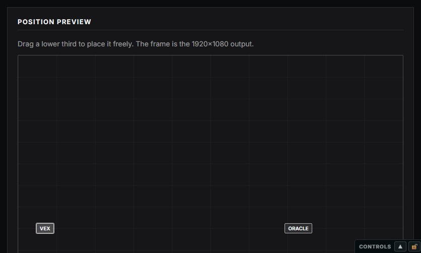

> **Quick fill:** select an item, then click a player in **Quick Player Fill** or a person in **Talent Roster** to drop their name/role into it in one tap. Manage your saved hosts, casters and guests on the **Talent Roster** page (under *Tournament* in the control panel).

## Outputs — buses for sets

Each output is its own browser source for a different scene. The **Outputs** card configures them; **Main** always exists, and **+ Add Output** makes more.

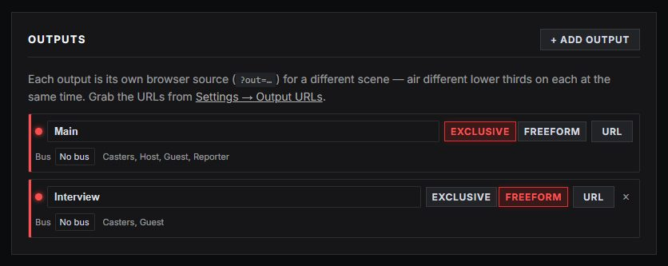

For each output you set:

- **Name** — shown on the control surface and in the URL list.
- **Mode** — **Exclusive** (airing a set replaces whatever was up — one lower third at a time) or **Freeform** (sets stack, so a guest banner and a caster desk can be up together).
- **Bus** — optionally route the output onto a [GFX bus](gfx-bus.md) (see [Bus routing](#bus-routing)).
- **URL** — copy this output's browser-source URL.

Each output also shows which sets are assigned to it. **Assignment happens on the set**, in the Sets card: the **Outputs** checkboxes on a set's row send that set to one *or more* outputs. A set assigned to two outputs draws on both.

### Multiple outputs at once

This is the core of the feature: different scenes show different lower thirds **simultaneously**. With *Host* on the Main output and the caster desk on an *Interview* output:

| `?out=main` (Exclusive) | `?out=interview` (Freeform) |
|---|---|
|  | 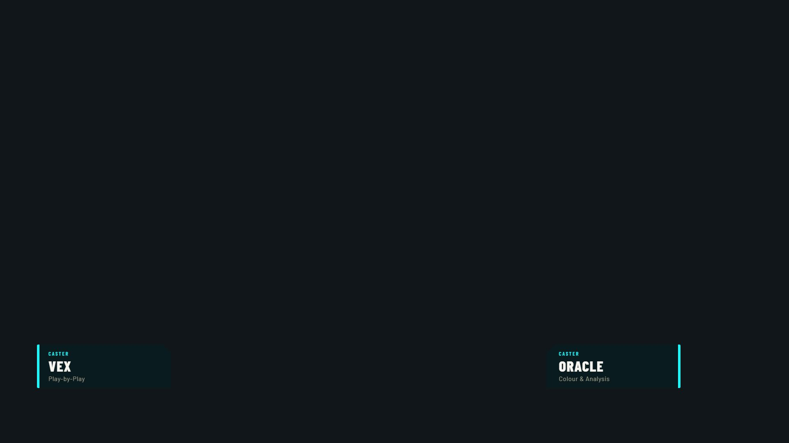 |

Because the *Interview* output is **Freeform**, it can stack several sets — here a guest banner above the caster desk, all composited on one source:

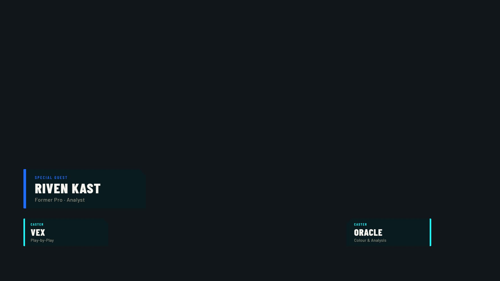

## Going live

The lower third is **trigger-only** on the live surfaces (all the content/config above lives on the tab). The control surface is a flat list:

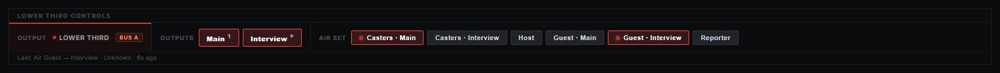

- **LOWER THIRD** (with the red dot) is a **status label**, not a button — it lights when any output is live.
- **Outputs** — one button per output (Exclusive marked `¹`, Freeform `⁺`). Pressing one airs/clears **everything** on that output (a freeform output airs all its sets; an exclusive output airs the first).
- **Air Set** — one button per *(set, output)*. A set on a single output is just its name; a set on several outputs gets one button each (*Set · Output*) so you can drive each output independently. Live buttons glow red.

The same buttons appear on the bottom **live bar** (expandable — drag the handle, or lock it open):

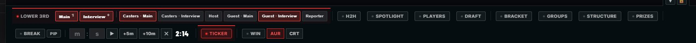

…and in the **Operator** view, alongside quick text fields and the player grid:

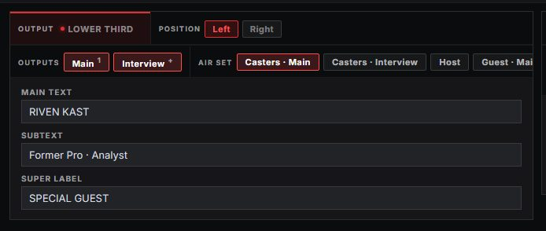

Generic show/hide (the master button, Companion, keybinds) seeds the Main output / clears everything.

### Output URLs

Each output is its own browser source. The Main output is the bare `/graphics/lower-third/`; every extra output gets its own `?out=<id>` URL, all listed under **Lower Third Outputs** in **Settings → Output URLs** — see [Adding the graphics to OBS/vMix](getting-started.md#adding-the-graphics-to-obs--vmix).

### Bus routing

Any output can also feed a [GFX bus](gfx-bus.md) — a shared source that shows whichever assigned graphic is live. Each lower-third output appears on the **Routing** tab as its own assignable entry (*Lower Third — Main*, *Lower Third — Interview*, …), so you can mix them into buses like any other graphic. See [GFX Bus](gfx-bus.md#graphics-with-multiple-outputs).

### Companion / Stream Deck & keybinds

The set list is mirrored to [Bitfocus Companion](companion.md) (a **Lower Third Sets** page with per-set Air buttons and the exclusive/freeform toggle) and to per-user **keybinds** (one action per set, plus a "hide all"). Both regenerate as you add or rename sets.

## Animation

Entrance / exit / move easing and speed follow the shared animation tokens — tune them per-graphic from the **Animation** card on the tab, or theme-wide on the Broadcast Theme page (see [Theming](theming.md)). Each item enters from its own side and animates out independently, so clearing one set never cuts the others.

## Notes

- Graphics control is manual at all times; the overlay only ever shows what you've aired.
- Sets and output config are saved with the **profile**; nothing live persists across a profile load.
- Every output is transparent and scales to fit its source, so bottom-anchored strips never clip.
