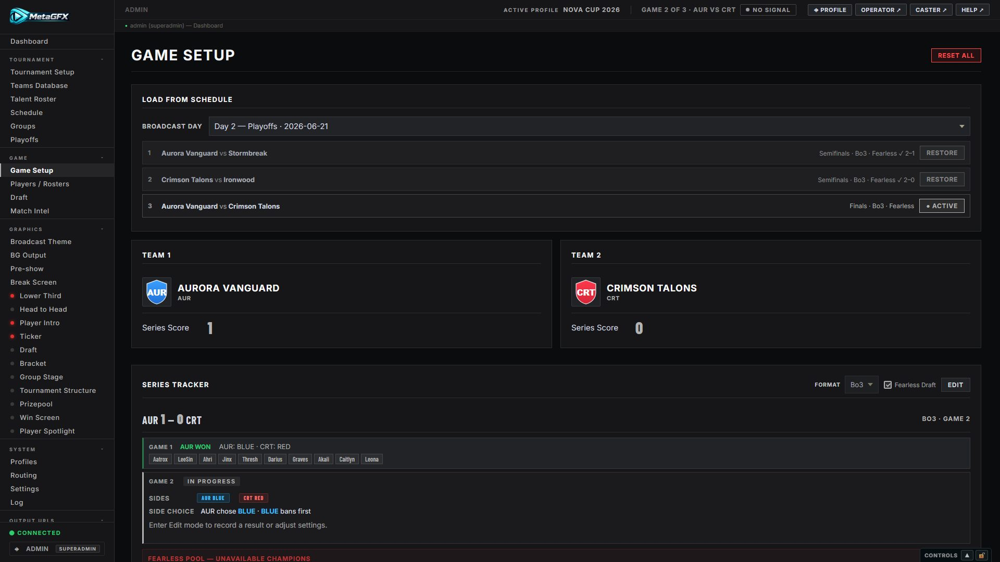
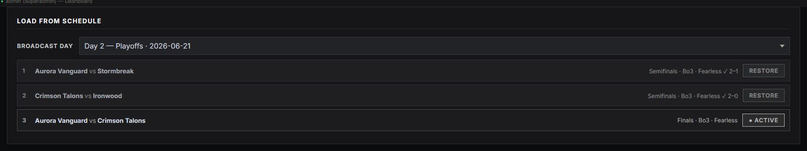
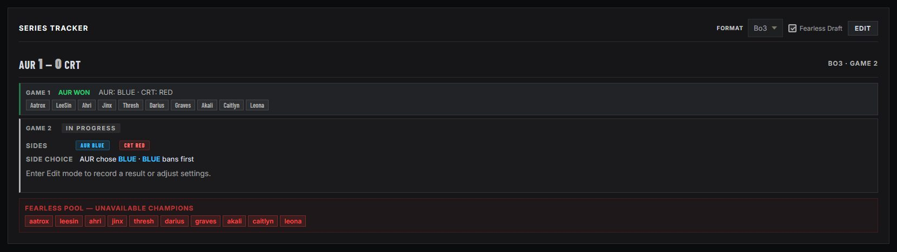
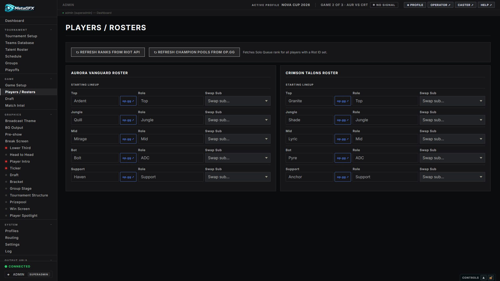
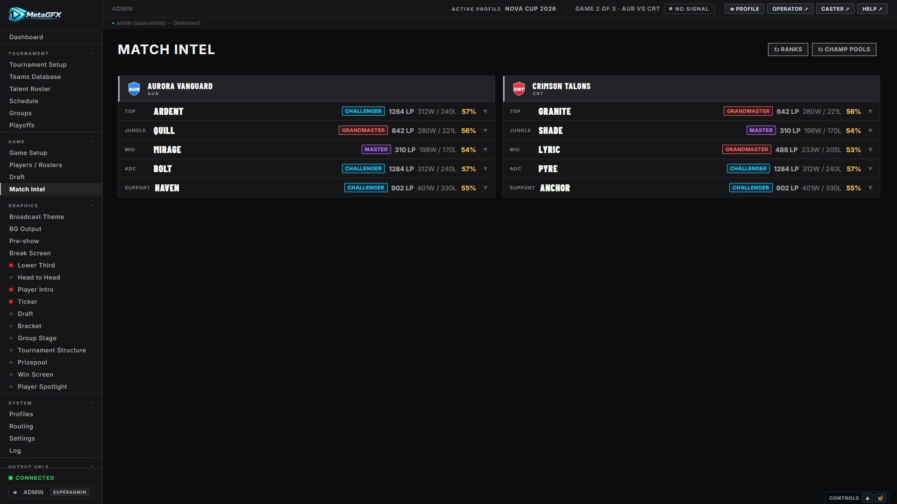
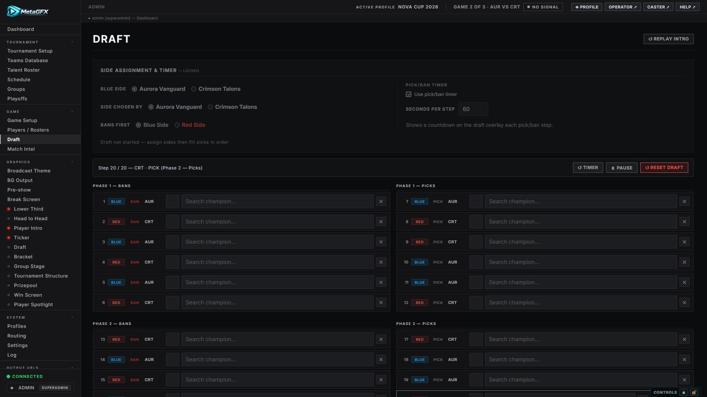

# Match & draft control

This is show-day driving: load the match that's on air, manage rosters and ranks, run the pick/ban draft, and track the series. It spans three control tabs — **Game Setup**, **Players / Rosters** and **Draft** — under the **GAME** section.

The live match state these tabs produce is what every team/draft/win graphic reads, so this is the hub once the [tournament](tournament-setup.md) and [schedule](schedule.md) exist.

## Game Setup

**Game → Game Setup** is where you put a match on air and track its series.

### Loading a scheduled match

1. **Load from Schedule** card → pick a **Broadcast Day** (it auto-selects today's date if a day matches).
2. Each game in that day shows its teams, stage, format and status, with a button:
   - **Set Active** — load a fresh match (replaces current teams, resets the series).
   - **Resume** — an in-progress series; reloads it with the games played so far.
   - **Restore** — a completed game; brings back its saved teams/scores/draft to review or edit.
3. The active game is highlighted, and a banner at the top of Game Setup shows which scheduled game is live.

Loading pulls the teams and rosters from the schedule entry, so you usually don't touch the team cards by hand.

### Teams & score

The two team cards show the loaded **Team 1 / Team 2** (logo, name, tag) and the **series score**. If you're not loading from the schedule you can **Load Team ▾** to pick a team from the pool directly.

> **Team naming:** internally the live match uses `team1`/`team2`; per-game snapshots use abbreviated `t1*`/`t2*` keys. You won't see this in the UI, but it's worth knowing if you script against the API. See the naming-convention note in `server.js`.

### Series Tracker

Click **Edit** to unlock the series controls:

- **Format** — Bo1 / Bo3 / Bo5.
- **Fearless Draft** — when on, champions used earlier in the series are flagged as unavailable in later games' drafts.
- **Reset Series** — clears the series scores and per-game history (confirm prompt).

The tracker lists each game in the series with its result and draft snapshot. Series progress is **persisted onto the linked schedule game** automatically, so switching matches or restarting the server doesn't lose where you were — and a completed series pushes its result back to the [bracket](schedule.md#bracket-linking).

**Reset All** (top right) wipes the current match state back to empty — use between unrelated matches if you're not loading from the schedule.

## Players / Rosters

**Game → Players / Rosters** shows the two loaded rosters side by side for last-minute edits, and is where you pull live data.

### Ranks and champion pools

Two refresh buttons sit at the top:

- **↻ Refresh Ranks from Riot API** — fetches Solo Queue rank for every player who has a **Riot ID** set. Needs a persistent `RIOT_API_KEY` (see [Getting started](getting-started.md#riot-api-key)).
- **↻ Refresh Champion Pools from op.gg** — pulls recent champion pools from op.gg (no Riot key needed).

Riot IDs (`Name#TAG`) and **op.gg region** are set per player in the [Teams Database](tournament-setup.md#creating--editing-a-team) team editor; they also power op.gg links in [Match Intel](#match-intel) and the [Caster view](caster-view.md). Without a Riot ID a player simply shows no rank.

Ranks and pools feed graphics like [Player Intro](player-intro.md), [Player Spotlight](player-spotlight.md) and [Head to Head](head-to-head.md).

### Match Intel

**Game → Match Intel** is a denser read-only view of both rosters — ranks, Riot IDs and champion pools with op.gg deep links — handy to keep open for the casters. It has its own **↻ Ranks** / **↻ Champ Pools** buttons.

## Draft

**Game → Draft** runs the live League of Legends pick/ban draft that drives the [Draft Overlay](draft.md) graphic. (This section covers *operating* the draft; the overlay's look/animation options live in the [Draft graphic guide](draft.md).)

### Set up the draft

The **Side Assignment & Timer** card:

- **Blue Side** — which team (Team 1/2) is on blue.
- **Side Chosen By** — which team picked side (shown on the overlay).
- **Bans First** — Blue or Red bans first.
- **Pick/Ban Timer** — tick **Use pick/ban timer** and set **Seconds per step** to show a per-step countdown on the overlay.

### Run it

1. **▶ Start Draft** begins the sequence. A status bar shows the current step ("Blue Ban 1", etc.).
2. Fill picks/bans **in order** on the draft board; the overlay updates live each step.
3. The status bar has **↺ Timer** (restart the step timer), **⏸ Pause** and **↺ Reset Draft**.
4. **↺ Replay Intro** (top right) re-triggers the overlay's intro animation without changing any draft data.

### Roles & committing

- A **role-assignment** block lets you map each pick to a role (Top → Support) for graphics that show role.
- **Commit to Series Tracker → Push Picks to Series Tracker** pushes this game's picks into the series' fearless pool, so a [fearless](#series-tracker) series knows which champions are now used up.

## See also

- [Schedule](schedule.md) — where matches are planned and loaded from.
- [Draft Overlay](draft.md) — the draft *graphic* and its styling.
- [Win Screen](win-screen.md) — uses the series result and (in COMP style) the winning team's picks.
- [Caster view](caster-view.md) — read-only roster/draft/series dashboard for the casters.
