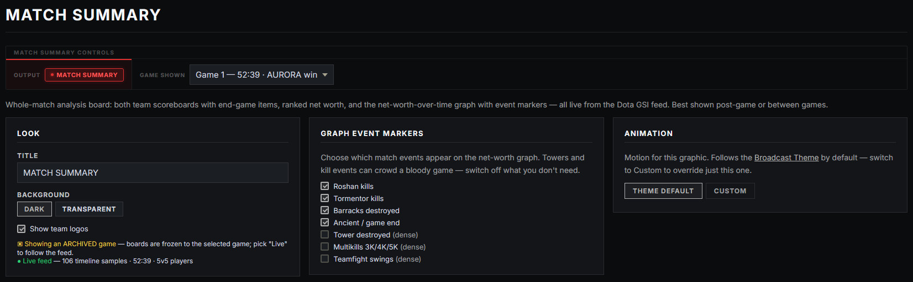
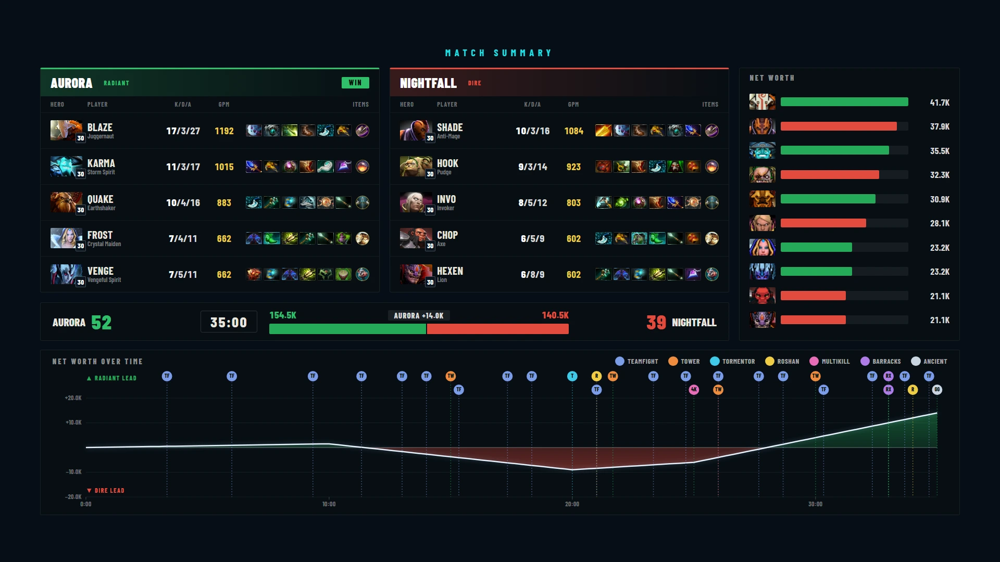

# Match Summary — Dota 2 analysis board

A full-screen, whole-match analysis board for Dota 2 — both team scoreboards with end-game items, every player's net worth ranked, and a **net-worth-over-time graph** with match event markers. Everything on it comes live from the [Dota GSI feed](dota-live-data.md); there is nothing to type.

Best shown **post-game or between games** — it's the "what just happened" board for your analysis segment.

## What's on the board

- **Two team scoreboards** — per player: hero portrait with level badge, roster name, K/D/A, GPM, and the end-game **items row** (including the neutral item).
- **Ranked net worth** — all ten players down the right side, hero icons with team-coloured bars, richest first.
- **Score strip** — the kill score, game timer, and a net-worth **distribution bar** showing the gold split with the lead ("+N.Nk").
- **Net-worth-over-time graph** — the full match story across the bottom: the gold lead swinging between the teams, shaded by who's ahead, with event markers along it.

> **Sync item icons first (one time):** **Settings → Broadcast Assets → Item Assets · Dota 2** downloads the item icons the board uses. Hero portraits come from the Hero Assets sync on the same page.

## Quick start

1. Connect [Dota live data](dota-live-data.md) and spectate the match (or a replay).
2. Open **Graphics → Match Summary** — the feed status on the Look card confirms data is arriving.
3. When the game ends (or whenever you want the story so far), bring it on air with the **MATCH SUMMARY** button — from this tab, the live bar, or the operator view.

## Graph event markers

Match events are drawn as chips along the graph, each type in its own colour. Seven types, each with its own toggle, so the graph stays as clean or as detailed as you like:

| Marker | Default |
|---|---|
| Roshan kills | **On** |
| Tormentor kills | **On** |
| Barracks destroyed | **On** |
| Ancient / game end | **On** |
| Tower destroyed | Off *(dense)* |
| Multikills 3K/4K/5K | Off *(dense)* |
| Teamfight swings | Off *(dense)* |

The high-signal moments are on by default. Towers, multikills and teamfights are off because a bloody game produces a *lot* of them — switch them on when the story needs them.

## Look options

| Option | What it does |
|---|---|
| **Title** | The board's header text (defaults to *MATCH SUMMARY*). |
| **Background** | **Dark** (self-contained) or **Transparent** (your scene shows through). |
| **Show team logos** | Logos on/off in the team headers. |

## Showing an earlier game — "Game shown"

The **Game shown** picker in the control bar switches the board to any archived game of the series (see [game archive](dota-live-data.md#game-archive--game-shown)). Use it to review game 1 during the game 2 draft — the board shows the archived game even while live data for the new one keeps arriving, and an amber notice on the tab reminds you which game is up.

## Notes

- Player names follow the [roster rule](dota-live-data.md#names-on-air--the-roster-rule) — the roster handle, matched by Steam ID, is what appears on air; with no match the hero name is shown.
- It's a standard 1920×1080 browser-source graphic: grab its URL from **Settings → Output URLs**, or route it over the [GFX Bus](gfx-bus.md).
- Casters get a live version of the same data (scoreboards + graph) on the [caster view](caster-view.md)'s **Live** tab throughout the game.
- For a simpler end-of-game lower board that also works for CS2, see the [Post-Game Scoreboard](post-game.md).
