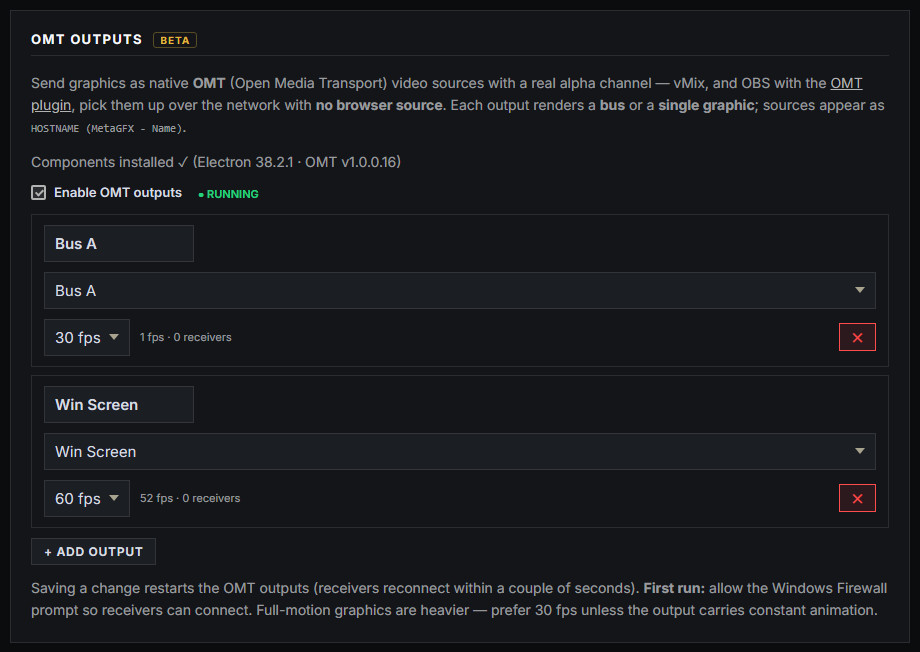

# OMT Output (beta)

Send graphics out of MetaGFX as **native video sources with a real alpha channel**, using [OMT (Open Media Transport)](https://github.com/openmediatransport) — the open, royalty-free NDI alternative. Receivers pick the sources up over the network as key+fill video, with **no browser source involved**.

Use it when browser sources aren't ideal: production software with weak built-in browser rendering, workflows that want graphics as normal video inputs, or moving the rendering load off the broadcast machine entirely (see [render node](#running-the-renderer-on-another-pc-render-node) below).

- **vMix** receives OMT natively (with alpha).
- **OBS** receives it via the official [OMT plugin](https://github.com/openmediatransport/omtplugin/releases).

Everything lives on the **Routing** page, under **OMT Outputs** — one page for how graphics leave the app, whether by browser source, [bus](gfx-bus.md) or OMT.



## One-time install

The renderer needs two components that don't ship with MetaGFX (about 120 MB total — the Electron runtime and the official OMT libraries, both MIT-licensed). Click **Install OMT components** on the Routing page; a progress bar tracks the download and it's ready in under a minute on a decent connection. Windows only for now.

> **First run:** Windows will show a **Firewall prompt** for the renderer — allow it, or receivers on other machines won't be able to connect.

## Adding outputs

Each OMT output renders one thing, at 1920×1080:

- **A bus** — the usual few-sources workflow: whatever the [GFX Bus](gfx-bus.md) is showing goes out over OMT. This is the recommended shape for a full show.
- **A single graphic** — one dedicated feed, e.g. just the win screen for a replay/highlight machine.

Give each output a **name** — that's how it appears on the network: `YOUR-PC (MetaGFX - Name)`. Add up to **4 outputs** (a performance guardrail), tick **Enable OMT outputs**, and the sources appear in vMix / OBS within a few seconds.

While running, each row shows a live readout — frame rate, connected receivers, and bandwidth — and the pill next to the enable toggle reports the renderer's health.

### 30 or 60 fps?

- **30 fps** (default) is right for almost every overlay — and when nothing on the page is moving, the output automatically idles at ~1 frame per second, costing almost nothing.
- **60 fps** is worth it for outputs carrying constant motion — the animated [BG Output](bg-output.md), or a bus that often shows the COMP win screen.

Bandwidth per feed is LAN-friendly (roughly 15–75 Mbps depending on motion), so a gigabit network carries several outputs comfortably.

## Good to know

- **Saving any change restarts the OMT outputs** — receivers reconnect within a couple of seconds, so make changes between segments, not mid-graphic.
- OMT is **an addition, not a replacement**: browser-source URLs and buses keep working exactly as before. Run both at once if you like.
- The renderer is watched by the app — if it ever crashes it restarts itself, and problems are reported on the Routing page and in the System Log.
- Alpha is premultiplied and flagged in the stream; vMix and the OBS plugin composite it correctly with no settings on the receive side.
- Troubleshooting: the OMT libraries write logs to `C:\ProgramData\OMT\logs`.

## Running the renderer on another PC (render node)

The renderer doesn't have to run on the MetaGFX machine. To move the rendering + encoding load onto a separate PC:

1. Copy your MetaGFX folder to the render PC (including `omt-renderer\vendor` — or run the app there once and use the install button), and run `npm install` in it.
2. Make sure the render PC can reach the main MetaGFX server (set **`EXTERNAL_URL`** on the main install — see [Getting started](getting-started.md#environment-variables)).
3. On the render PC, from the MetaGFX folder:

```powershell
omt-renderer\vendor\electron\electron.exe omt-renderer --server=http://YOUR-MAIN-PC:3000 --token=YOUR_GRAPHICS_TOKEN
```

The node fetches the output list you configured on the Routing page and sends the same OMT sources — named after the **render PC's** hostname. Leave **Enable OMT outputs** switched **off** on the main machine in this setup, or both machines will broadcast duplicate sources.

## Notes

- **Beta.** The pipeline is fully tested end-to-end (frame-accurate alpha through the codec, 60 fps sustained), but it's new — treat the first show as a supervised run.
- Windows-only at the moment (the OMT libraries ship Windows and macOS builds; the installer targets Windows first).
- Companion/keybinds, the [live switcher](live-switcher.md) and everything else operate exactly as they do for browser sources — OMT only changes how the pixels leave the machine.
