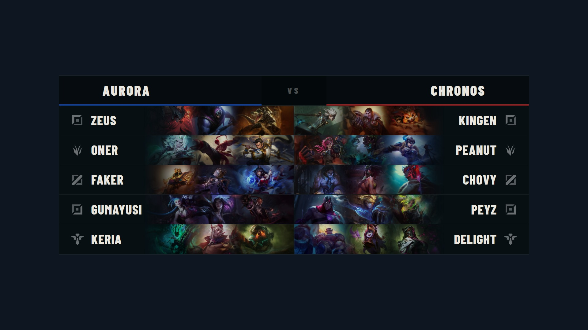
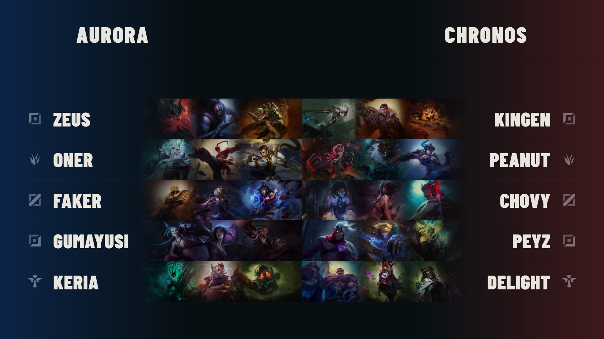
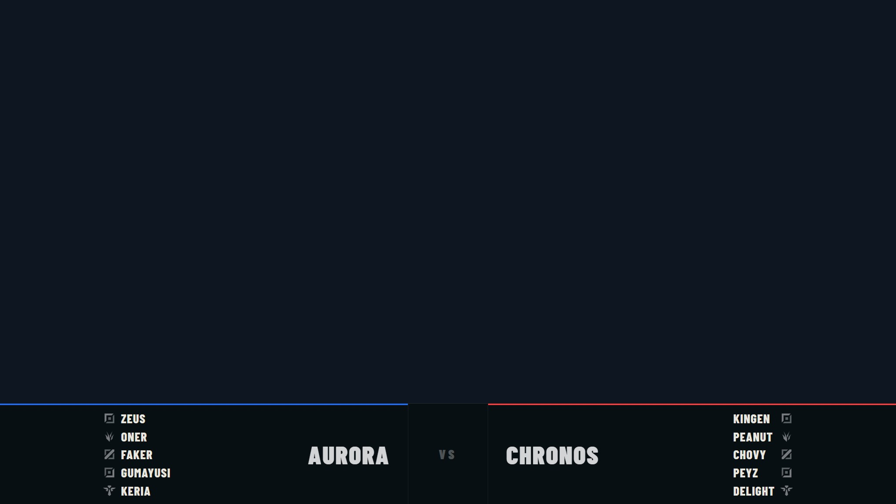

# Player Intro

A full-roster introduction for both teams — handles, roles, ranks and (optionally) each player's top-3 most-played champions — in one of three layouts. Driven from **Graphics → Player Intro**, output at `/graphics/player-intro/`.

It reads the two loaded teams and their rosters ([Match & draft control](match-and-draft.md)), so set those up first.

## Layouts

Pick a layout in the control tab. All three show the same data; choose the one that fits your scene.

### Panel

Both rosters side-by-side around a centre logo — the most complete read.

### Stack

A cleaner two-column stack of each team's five players.

### Bar

A compact lower bar — useful when you want the rosters without covering the scene.

## Controls

From the Player Intro ctrl-bar:

- **Show / hide** the graphic (entrance/exit animate).
- **Layout** — Panel · Stack · Bar.
- **Show logo / Show rank / Show champions** — toggle each data row. Ranks come from the Riot API ([Players / Rosters](match-and-draft.md#ranks-and-champion-pools)). **Champions** blends each player's **top 3 most-played** champions (from their op.gg pool) along their row as overlapping splash crops that fade toward the name and meet at the centre — players with no pool data fall back to a clean name. This is on by default for the **Panel** and **Team Stack** layouts; the **Bar** layout is always name-only.
- **Animation variant** — the entrance style (the layout picks a sensible default — *rise* for Panel, *split* for Stack, *slide* for Bar).
- **Background** — transparent by default; the centre logo can be overridden per broadcast.

## Notes

- The rosters and ranks are pulled from the loaded teams — if a player has no rank set, that row simply omits it.
- For a single-player highlight rather than the whole roster, use [Player Spotlight](player-spotlight.md).
- Like all overlays this is transparent — composite it over your scene (or the [BG Output](bg-output.md) layer).
