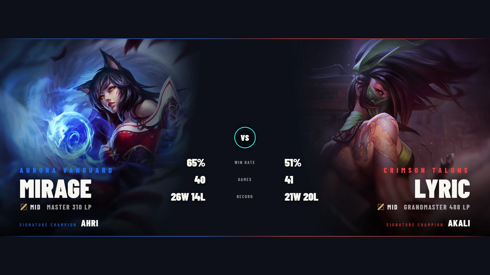
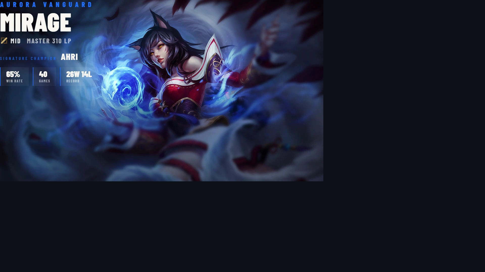
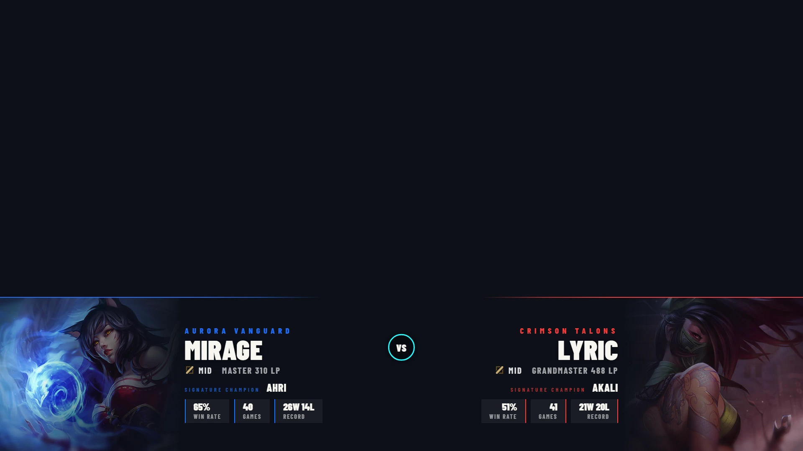
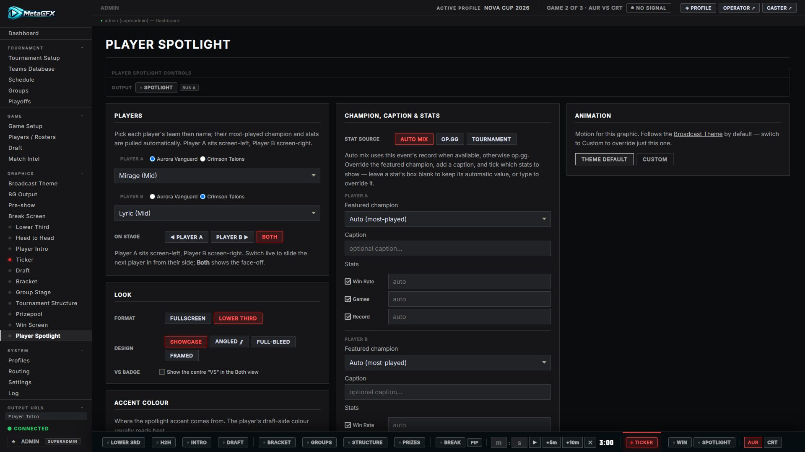
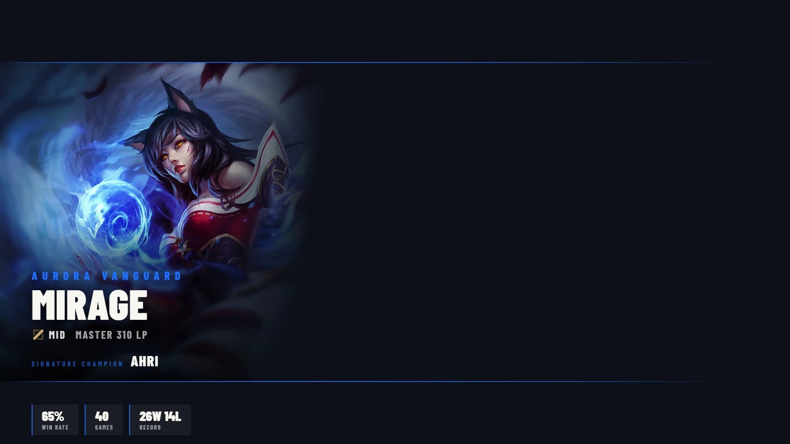
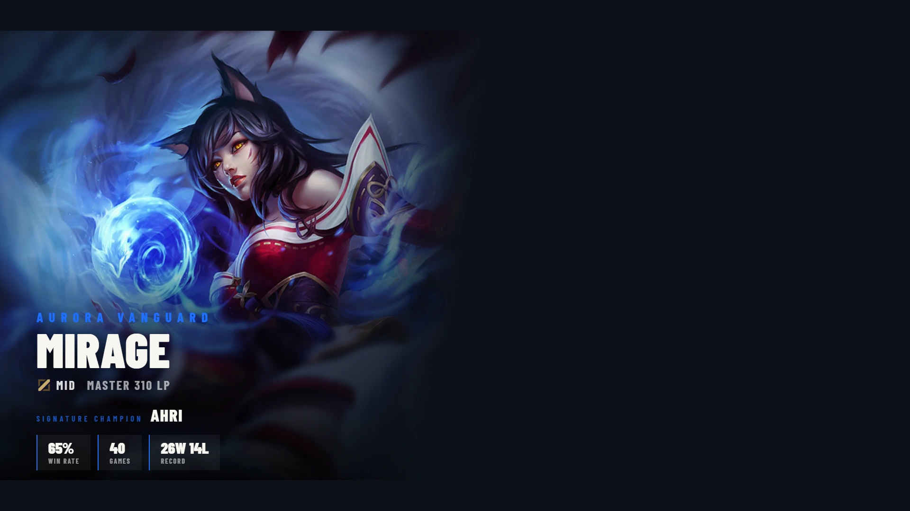
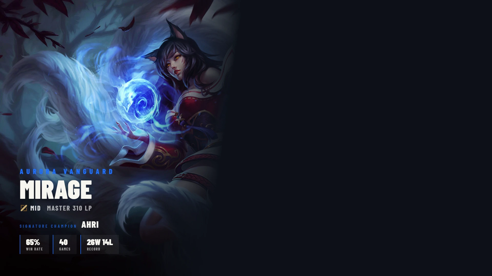
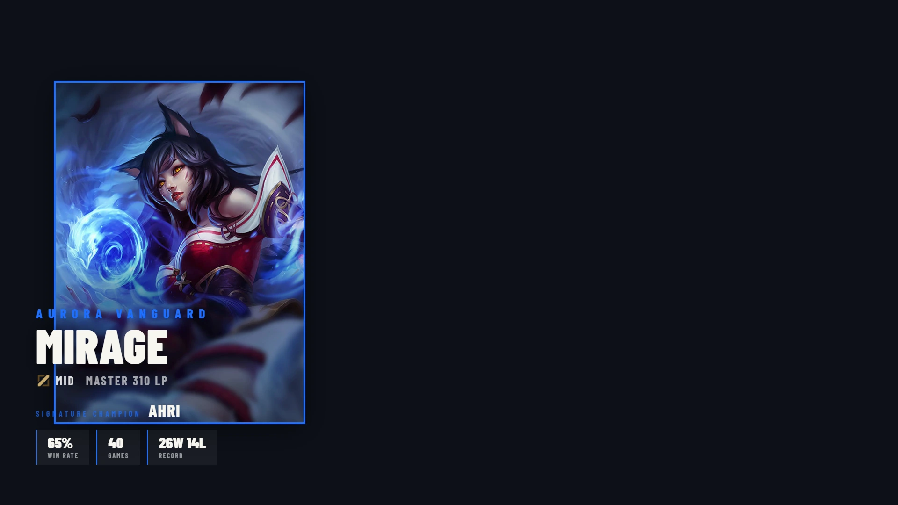

# Player Spotlight

A full-screen or lower-third graphic that highlights **one or two players**, built around their **signature champion**. Player **A is locked to screen-left**, Player **B to screen-right**; you bring each on stage live and they slide in from their own side. The two-player **Both** view is a face-off with the players meeting on a diagonal split, an optional centre **VS** badge, and a head-to-head stat comparison.

Champion art is the hero of the graphic — there are no player photos — so a player needs a **champion pool** (from rosters / op.gg) for the art and stats to appear. With no champion data the graphic still renders cleanly, just without the art and stat chips.

All controls live on the **Player Spotlight** tab in the control panel. Output URL: `/graphics/player-spotlight/?token=XXXX` (1920×1080, as with every graphic).

**Fullscreen, Both view** — a face-off with the centre head-to-head stat comparison:

**Lower-third** — a bottom band over the live feed; the champion sits at its own screen edge and fades in. Single player:

…or both players, each in their own corner with the centre VS badge:

## Picking the players

Each side has a **team** selector and a **player** dropdown:

- **Player A** → screen-left · **Player B** → screen-right.
- Choosing a player auto-selects their **most-played champion** and pulls its stats. You can override both (see [Champion, caption & stats](#champion-caption--stats)).

## On stage

The **On stage** control decides who is shown:

| Button | Shows |
|---|---|
| **◀ Player A** | Player A only (left) |
| **Player B ▶** | Player B only (right) |
| **Both** | Both players, meeting in the centre |

Switching live is a **directional slide** — each player always enters from / exits to their own side, so A↔B swaps cleanly and going to **Both** brings the missing player in. A staying player isn't re-animated.

**Single player (Player A)** — champion on their own side, info and stat chips alongside:

**VS badge** (checkbox) toggles the centre "VS" in the Both view. In Both, each player's corner stats converge into a centre **head-to-head comparison** (A value · label · B value).

## Look

- **Format** — **Fullscreen** or **Lower Third**.
  - *Fullscreen* fills the frame; the champion is composed around the player's info with accent cut-off lines.
  - *Lower Third* is a bottom band: the champion sits at its own screen edge and fades horizontally into the feed, with a blue/red accent line across the top of the band.
- **Design** (full-screen treatment of the champion art):
  | Design | Look |
  |---|---|
  | **Showcase** | Crisp centred champion between top/bottom accent cut-off lines |
  | **Angled ⫽** | Filled parallelogram with a drop shadow |
  | **Full-bleed** | Wide cinematic splash with a scrim |
  | **Framed** | Bordered portrait box |

  Each design works in the A / B / Both stages:

  <table>
  <tr>
  <td width="33%"> <b>Angled ⫽</b></td>
  <td width="33%"> <b>Full-bleed</b></td>
  <td width="33%"> <b>Framed</b></td>
  </tr>
  </table>

## Accent colour

Where the spotlight accent (lines, highlights, VS badge) comes from:

- **Player's side (blue / red)** — each player takes their current draft-side colour (recommended; reads best in the Both face-off).
- **Broadcast Primary** — the theme's primary colour.
- **Custom** — a colour picker.

## Champion, caption & stats

The **Stat source** toggle controls where each champion's win/loss numbers come from:

- **Auto mix** *(default)* — this event's tournament record when available, otherwise op.gg.
- **op.gg** — the player's solo-queue champion-pool stats.
- **Tournament** — only this event's recorded games for that champion (blank if they haven't played it on stage).

Per player you can then:

- **Featured champion** — override the auto-picked champion from a dropdown of that player's pool (or leave on **Auto** = most-played).
- **Caption** — an optional flavour line (e.g. *"Form of his life"*). Shows in solo and in the Both view.
- **Stats** — three chips (**Win Rate**, **Games**, **Record**). Tick which to show, and type in the box next to any chip to **override** its value manually (leave blank to keep the automatic value).

## Animation

Entrance / exit / move easing and speed can be tuned per-graphic from the **Animation** card on the tab, or theme-wide on the Broadcast Theme page — see [docs/theming.md](theming.md).

## Notes

- Graphics control is manual at all times; the graphic only reflects what you set on the tab.
- Champion art is sourced from the synced champion images (see **Champion asset sync** in the README). A champion with no synced art falls back gracefully.
- Like every graphic it can be routed through a [GFX bus](../README.md#gfx-bus-outputs).
