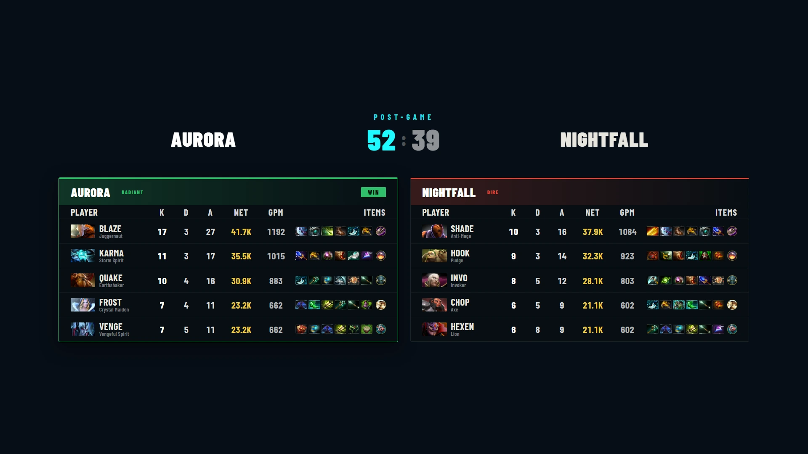

# Post-Game Scoreboard

The end-of-game stat board — both teams' players side by side with their final numbers, winner accented. It appears for games with live data connected (**CS2** and **Dota 2**) and fills itself from the feed; you just bring it on air when the game's done.

## Quick start

1. Connect live data for your game — [CS2 GSI / MatchZy](live-data.md) or [Dota 2 GSI](dota-live-data.md).
2. Play (or spectate) the map — stats accumulate automatically.
3. When it ends, show the board with the **POST-GAME SCOREBOARD** button — from its tab, the live bar, or the operator view.

## What's on it

**Dota 2** — per player: hero portrait, roster name, K/D/A, net worth, GPM, and the end-game items row; the kill score in the header and a **WIN** badge on the winning side. Names follow the [roster rule](dota-live-data.md#names-on-air--the-roster-rule) — set Steam IDs on the roster for exact matching.

**CS2** — per player: K/D/A (and ADR where MatchZy provides it) for the selected map, with the map score in the header. The control bar has a **Map** selector for which map of the series to show, and the Look card adds:

- **Show round-by-round tracker** — the wins-per-round strip (needs GSI).
- A **Confirm data** panel on the tab — a preview of exactly what will air, worth a glance before you go live.

> CS2 live data is currently in **beta** — see [Live Data (CS2)](live-data.md).

## Look options

| Option | What it does |
|---|---|
| **Title** | Header text (defaults to *POST-GAME*). |
| **Background** | **Dark** or **Transparent**. |
| **Show team logos** | Logos on/off. |
| **Show round-by-round tracker** | CS2 only — the round strip under the players. |

## Notes

- Map/series scores come from **Game Setup → Series Tracker** (they're recorded there whether or not live data fills them).
- Standard 1920×1080 browser source; URL under **Settings → Output URLs**, routable over the [GFX Bus](gfx-bus.md).
- For the full Dota analysis board (items, ranked net worth, the net-worth graph), see [Match Summary](match-summary.md) — the post-game board is the quick version, the summary is the deep one.
