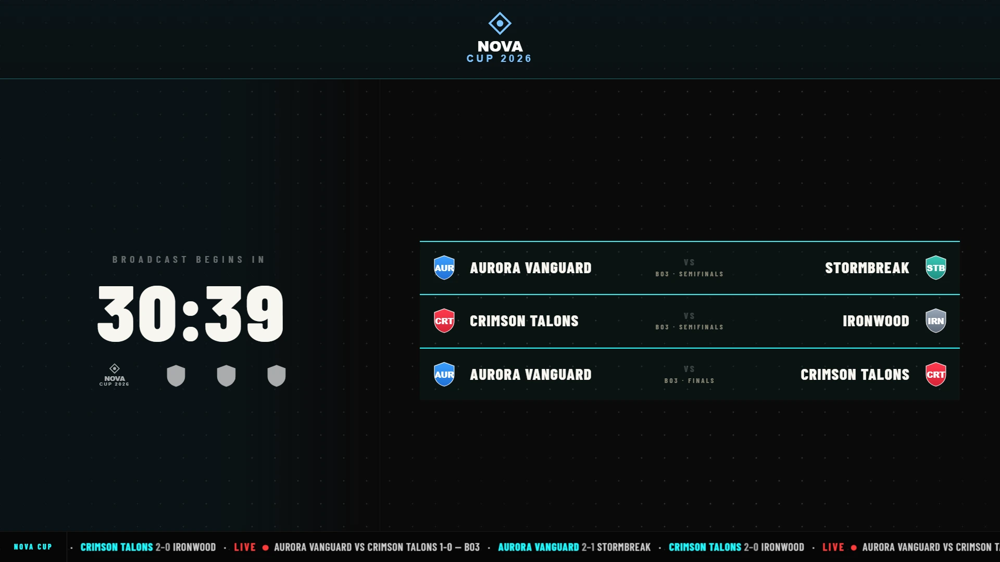
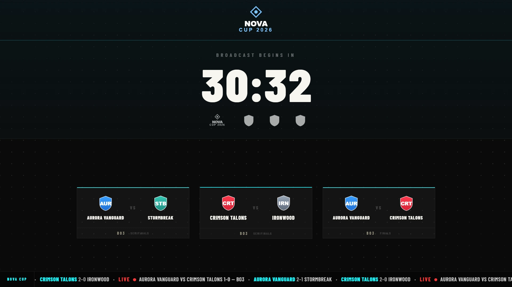
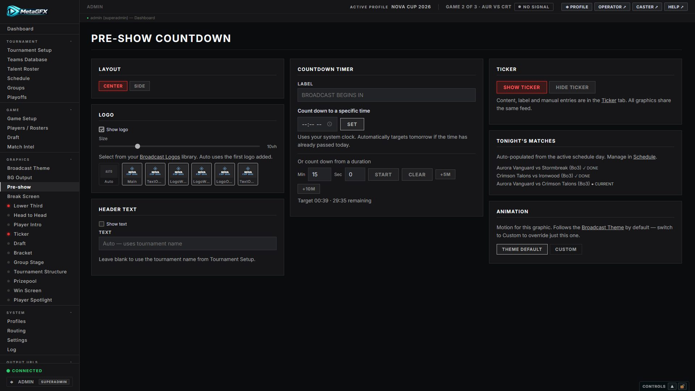

# Pre-show

The "stream starting soon" screen — a countdown to broadcast, the day's matchup, sponsors and a scrolling ticker. Driven from **Graphics → Pre-show**, output at `/graphics/pre-show/`.

*Side layout — the countdown sits beside the day's matchup list.*

*Centre layout — the countdown is centred above a row of matchup cards. Switch between the two with the **Layout** control.*

## Controls

From the Pre-show ctrl-bar:

- **Show / hide**.
- **Countdown** — set the target time; a large "broadcast begins in" timer counts down.
- **Header text** and **timer label** — optional copy above/around the countdown.
- **Layout** — side (countdown beside the matchup) or centre.
- **Logo** — the broadcast/tournament logo shown up top.

The **matchup card** and the **ticker** at the bottom are populated automatically from your [schedule](schedule.md) and current match, so they reflect the real card without re-entry. Sponsor logos come from [Tournament Setup → Sponsor Logos](tournament-setup.md#sponsor-logos).

## Notes

- The ticker shown here is the same content system as the standalone [Ticker](ticker.md) — auto mode summarises the schedule; you can also add manual items.
- Use this before the show starts; switch to the [Break Screen](break-screen.md) for mid-show breaks.
