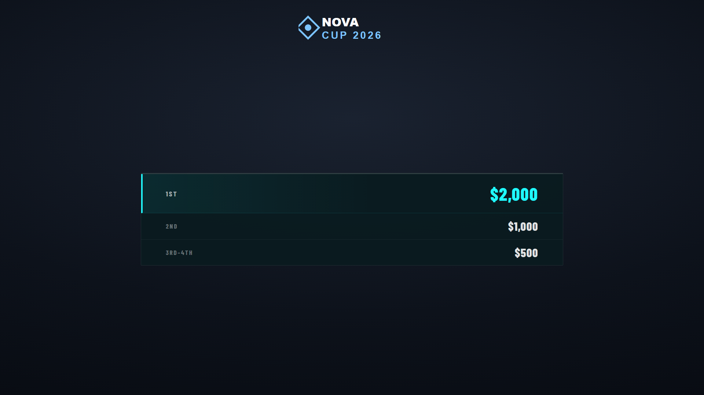

# Prizepool

A breakdown of the prize distribution — placements and amounts, with optional sponsor credit. Output at `/graphics/prizepool/`.

> **Scope:** the prize/sponsor tools are for crediting sponsors who contribute to a community/grassroots event's **prize pool** — not for selling commercial ad space. See the note in the [README](../README.md).

## Setup

1. In **[Tournament Setup → Prizepool](tournament-setup.md#prizepool)**, tick **This tournament has a prizepool**.
2. In the **Prizepool graphics tab**, add entries — each has a **label** (e.g. "1st", "3rd–4th"), a **value** (e.g. "$2,000"), an optional **highlight**, and optional **sponsor name/logo** or a prize image.

## Display options

From the Prizepool ctrl-bar:

- **Show / hide**.
- **Entries** — add/edit/reorder placements and amounts.
- Per-entry **highlight** (emphasise 1st place), **sponsor logo** and **prize image** with sizing.
- **Logo** — toggle and scale the broadcast/tournament logo.

## Notes

- Entries are free-form, so it works for placements, per-game bonuses, or "MVP" style awards.
- Sponsor logos here are managed per entry; broadcast-wide sponsors live in [Tournament Setup](tournament-setup.md#sponsor-logos).
