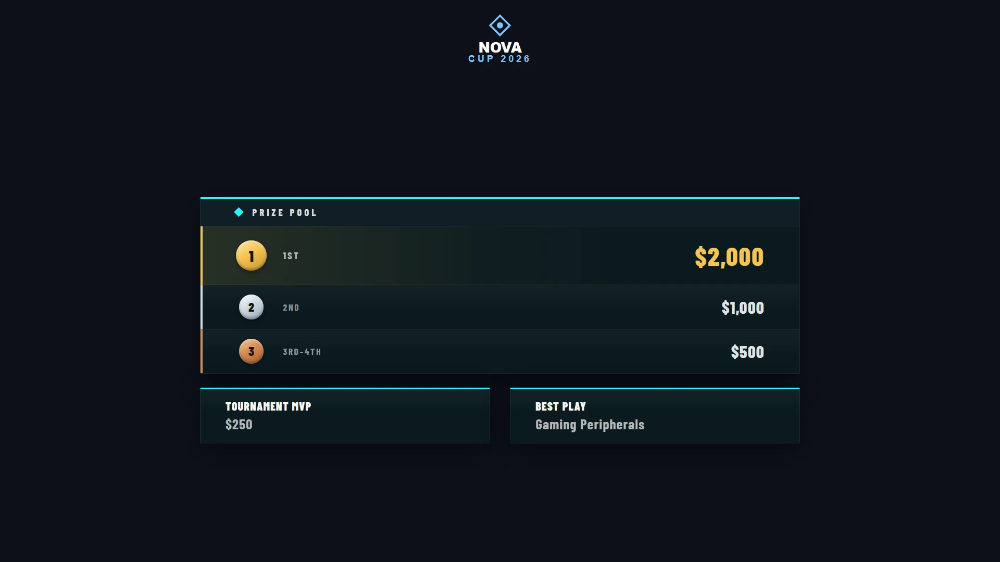
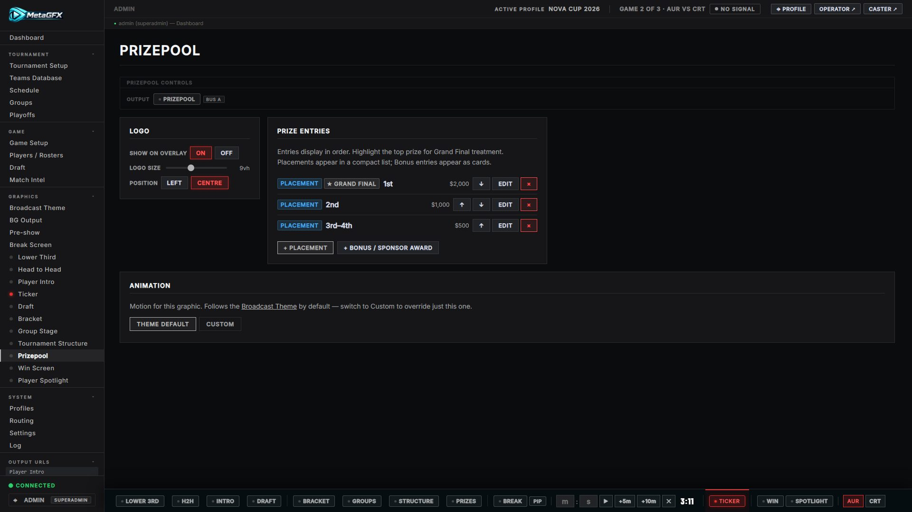

# Prizepool

A breakdown of the prize distribution — placements and amounts, with optional sponsor credit. Output at `/graphics/prizepool/`.

Placements stack in the main table; any **Bonus / Sponsor** awards (e.g. MVP, Best Play) sit as cards in a row beneath it:

> **Scope:** the prize/sponsor tools are for crediting sponsors who contribute to a community/grassroots event's **prize pool** — not for selling commercial ad space. See the note in the [README](../README.md).

## Setup

1. In **[Tournament Setup → Prizepool](tournament-setup.md#prizepool)**, tick **This tournament has a prizepool**.
2. In the **Prizepool graphics tab**, add entries. Each is either a **Placement** (a row in the main table) or a **Bonus / Sponsor** award (a card in the row below — for MVP / side prizes / sponsor-backed extras). Every entry has a **label** (e.g. "1st", "Tournament MVP"), a **value** (e.g. "$2,000", "Gaming Peripherals"), an optional **highlight**, and optional **sponsor name/logo** or a prize image.

## Display options

From the Prizepool ctrl-bar:

- **Show / hide**.
- **Entries** — add/edit/reorder placements and amounts.
- Per-entry **highlight** (emphasise 1st place), **sponsor logo** and **prize image** with sizing.
- **Logo** — show/hide, pick from [Broadcast Logos](theming.md#broadcast-logos) (**Auto** = the event logo), scale and position.

## Notes

- Entries are free-form, so it works for placements, per-game bonuses, or "MVP" style awards.
- Sponsor logos here are attached **per entry** (a one-off image on that card); broadcast-wide sponsors that play out on the Break Screen and Pre-show are set in [Tournament Setup](tournament-setup.md#sponsor-logos).
