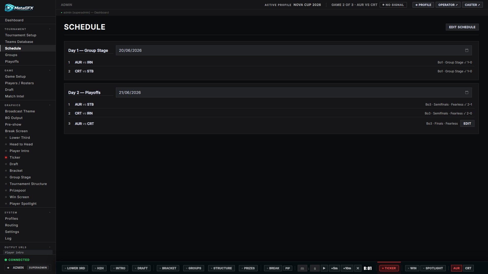

# Schedule

**Tournament → Schedule** lays out your **broadcast days** and the **matches** in each. The schedule is the spine of show day: every match you load to air ([Match & draft control](match-and-draft.md)) is picked from here, and matches linked to the bracket keep the [Bracket](bracket.md) graphic in sync automatically.

Teams come from the [Competing Teams pool](tournament-setup.md#competing-teams), so build that first.

## Edit mode

The Schedule tab is read-only until you click **Edit Schedule** (top right). In edit mode you can add days, add/edit/reorder/delete games, and clear results. Toggle it off when you're done so you don't fat-finger anything live.

## Broadcast days

In edit mode, **+ Add Broadcast Day** creates a day (e.g. *Day 1*). Each day has a **label** and an optional **date**. The date is used to auto-select "today" in Game Setup, so set it if you can.

Days hold an ordered list of **games** (matches).

## Adding a match

Add a game to a day and fill in:

| Field | Notes |
|---|---|
| **Stage** | Group Stage, or a specific bracket round (Round of 16, Semifinals, Finals…). The stage's default **Format** pre-fills from [Stage Formats](tournament-setup.md#stage-formats). |
| **Match** *(bracket stages only)* | Optionally link this game to a specific **bracket match** — see [Bracket linking](#bracket-linking). Lists every match in the round, including undecided ("TBD") ones. |
| **Team 1 / Team 2** | Picked from the competing-teams pool. |
| **Format** | Bo1 / Bo3 / Bo5. |
| **Fearless Draft** *(LoL)* | Marks the series as fearless (champions used can't be re-picked later in the series). |
| **Team 1 / 2 Label** | Optional display-name override for undecided slots — e.g. *"Winner of Semifinals 1"*. A picker next to the field inserts a bracket reference for you. |

### How a team name is resolved

For each slot the app shows the first of these that's available:

1. The **selected team** (from the pool), else
2. the **linked bracket match's** team name (once it's resolved), else
3. your **override label**, else
4. **TBD**.

This means you can schedule the Grand Final before you know who's in it — link it to the bracket match and/or give it a "Winner of…" label, and it fills in as the bracket resolves.

## Bracket linking

When a schedule game is linked to a bracket match (the **Match** dropdown), MetaGFX keeps the two in step:

- **Forward-fill** — once you assign teams to the schedule game, that matchup appears on the bracket (0–0) *before* it's played. It only fills slots that are still unresolved (TBD / "Winner of…") and never overwrites a team that advanced in or a recorded result.
- **Result push-back** — when the series **completes**, the score is written to the linked bracket match and it's marked complete. The app matches team names (handling reversed slot order), so the bracket shows the right winner.
- **Clearing a result** reverts the linked bracket match to 0–0, not-complete.

Only a **completed** series writes a bracket result; an in-progress series is saved as a snapshot but doesn't touch the bracket score.

> Editing the bracket directly still works — see [Playoffs / Bracket](bracket.md). Linking is a convenience so you don't have to enter results twice.

## Loading a match to air

You don't go live *from* the Schedule tab — you load a scheduled game in **[Game Setup](match-and-draft.md#loading-a-scheduled-match)**, which has a **Broadcast Day** picker and a per-game **Set Active / Resume / Restore** button. The Schedule tab is for planning; Game Setup is for going live.

A scheduled game also shows its live status there: `●` active, `⋯` in progress with the current series score, or `✓` completed with the final score.

## Draft history

Completed games store their per-game draft snapshots. In the Schedule tab a **▼ Draft** button appears on finished matches to expand the pick/ban history for each game in the series — handy for casters and for fearless tracking.

## See also

- [Tournament setup](tournament-setup.md) — teams pool, structure and stage formats feed the schedule.
- [Match & draft control](match-and-draft.md) — load and drive a scheduled match.
- [Bracket](bracket.md) — the bracket editor and overlay that linking keeps in sync.
