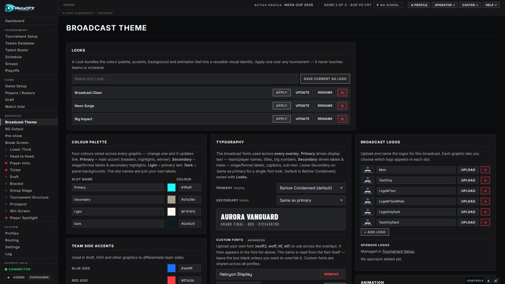
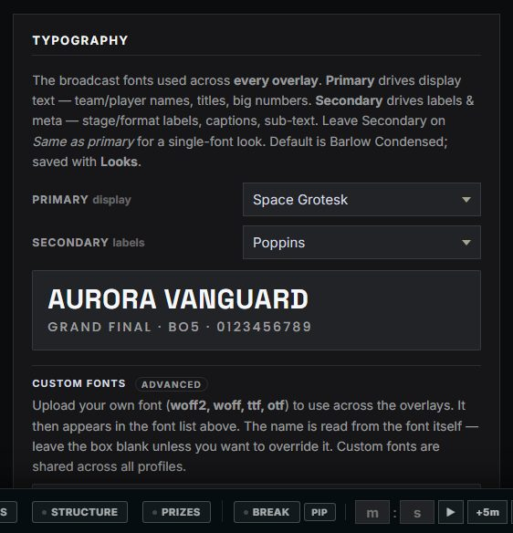
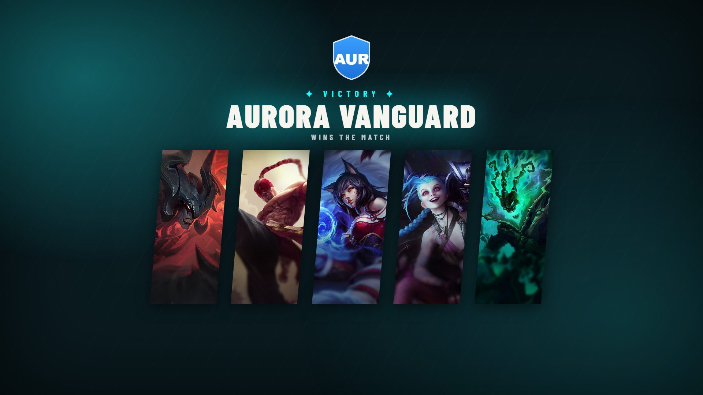
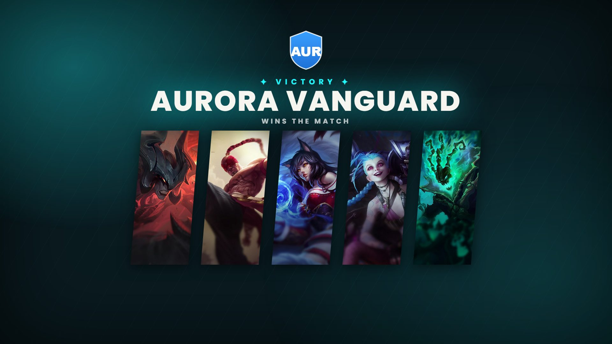
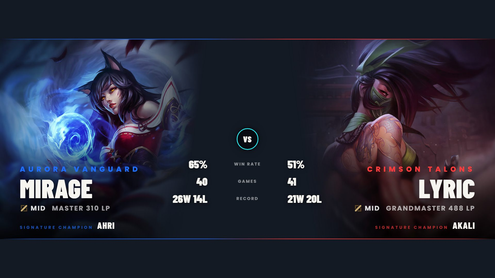
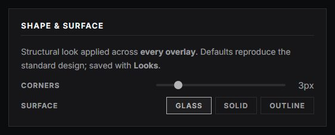
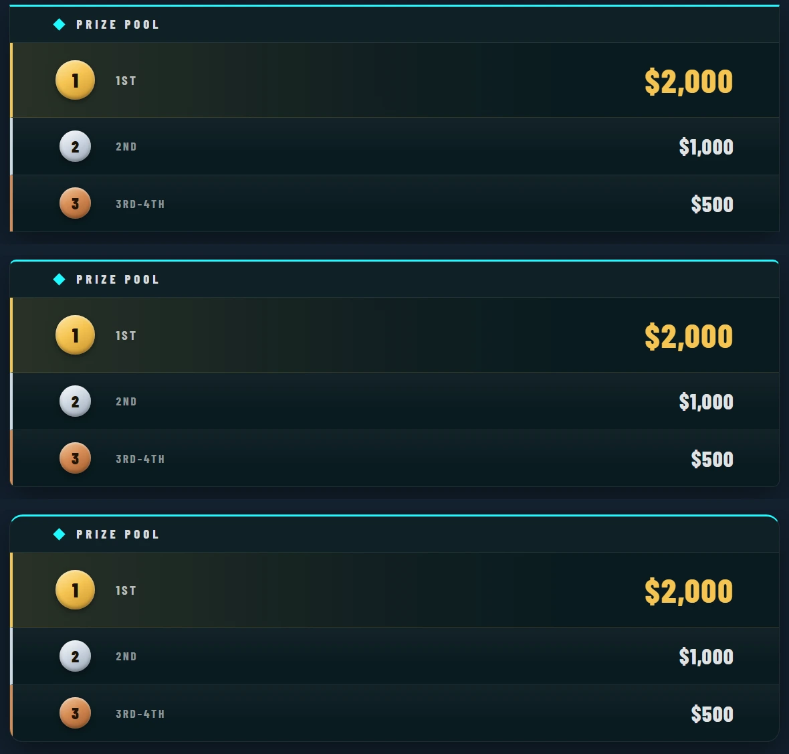
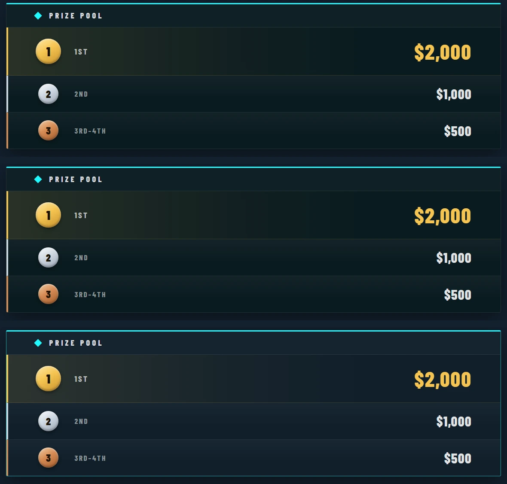

# Broadcast Theming & Animation

This is the whole broadcast's visual identity in one place — before styling any individual graphic, start here. Everything is configured under **Broadcast Theme** in the control panel and applies **live to every overlay at once**: palette, fonts, shape & surface, text case and animation. Theme settings are saved per tournament profile; reusable **Looks** let you carry a visual identity across profiles and events.

## Colour palette & accents

Four palette slots are wired across **every** overlay. Each has a role:

| Slot | Drives |
|---|---|
| **Primary** | main accent — headers, key highlights, winner accent, accent tints/gradients |
| **Secondary** | stage/format labels (Grand Final, "Advances to Playoffs", match format) & secondary highlights |
| **Light** | primary foreground text (muted/secondary text deliberately left neutral) |
| **Dark** | panel / card / bar backgrounds (kept translucent — the dark "glass" look) |

- **Team Side Accents** — Blue side / Red side colours, used to differentiate sides in Draft, Head-to-Head and Player Intro (team 1 = blue, team 2 = red). These are *side*-based, not per-team.
- **No per-team colours** — teams are differentiated by their logos and names, while a designed palette plus side accents avoid colour clashes. The Win Screen accent comes from the winning side, Primary, or a custom colour (see its **Accent Colour** control).

The default palette reproduces the standard look exactly, and changing a slot updates all graphics live. A wild palette can reduce legibility — the seeded **Looks** are safe starting points.

## Typography

The **Typography** card sets the **broadcast fonts** used across *every* overlay. There are two:

- **Primary (display)** — the big display text: team/player names, titles, big numbers/scores.
- **Secondary (labels)** — the supporting text: stage/format labels, ranks, captions, sub-text, stat labels, ticker copy.

Pick any bundled family for each from its dropdown and all graphics restyle live; a two-line preview shows both. Pairing a condensed display face with a rounder label face (or vice-versa) gives the broadcast typographic contrast. Leave **Secondary** on **Same as primary** for a single-font look — that's the default (both **Barlow Condensed**). Both choices are saved per profile and travel with [Looks](#looks).

Bundled families ship self-hosted (no external font CDN) with display weights (400–900), so headings and names stay crisp rather than faux-bold.

Changing the **primary** font restyles all display text — here the Win Screen with the default Barlow Condensed, then with Poppins:

Setting a different **secondary** font adds hierarchy — display text stays on the primary while labels/meta switch. Here the Player Spotlight keeps condensed names but renders its labels (team, stat labels, role, "signature champion") in a rounder secondary face:

### Custom fonts (advanced)

Upload your own typeface to use across the overlays:

- Supported formats: **woff2, woff, ttf, otf** (max 4 MB).
- The **name is read from the font file itself** (its built-in family name), so you don't have to retype a tidy name — leave the name box blank unless you want to override it. (WOFF2 is compressed, so those fall back to the filename.) It then appears in the Overlay font list (under **Custom**) and in the live preview.
- **Custom fonts are global** — shared across all profiles, not tied to one. Removing a font reverts any overlay using it to the default. An unset secondary always falls back to the primary, and an unset primary to the default family.

## Shape & surface

The **Shape & Surface** card restyles the panel-based graphics (prizepool, bracket, group stage, tournament structure, player intro) structurally — saved per profile and inside a [Look](#looks):

- **Corners** — a slider from **0** (sharp right-angles) up to **20 px** (maximum curve); the default of 3 px is the standard, near-sharp broadcast look. Circular elements (medal coins, role/seed badges) always stay round.
- **Surface** — **Glass** (the default translucent dark panels), **Solid** (opaque), or **Outline** (near-transparent fill with an accent border). The bespoke/dramatic graphics (win screen, draft, spotlight, pre-show, head-to-head) keep their own designed surface.

The same panel at corner-radius 0 (sharp), 10, and 20 (max curve):

The three surface styles over a colourful scene, where the difference shows — **Glass** lets the scene glow through the dark tint, **Solid** blocks it completely, **Outline** all but disappears, leaving an accent border:

## Text case

The **Text case** control (Typography card) sets how *all* overlay text reads:

- **UPPERCASE** *(default)* — the standard broadcast look.
- **Normal** — every name and label renders in its source case (e.g. "Aurora Vanguard" rather than "AURORA VANGUARD").

The defaults reproduce the standard broadcast design exactly, and each choice travels inside a [Look](#looks).

## Background

Graphic overlays are **always transparent** — composite them over your scene in OBS/vMix. For a coloured or animated backdrop, use the dedicated **BG Output** source (its own tab: background mode Transparent / Solid / Image / Animated, plus animation type, base colour, speed and an optional fog layer) as a separate layer underneath the overlays.

> This is a deliberate performance choice: an animated canvas *inside* every graphic source is far heavier than compositing two independent sources. The BG Output canvas is capped at ~60fps. Player Intro keeps its own optional solid **Dark** backing (cheap — a solid colour, never an animated canvas).

## Animation

The **Animation** card controls how graphics enter, exit, and react to data changes.

- **Editing target** — choose **All graphics (global default)** or a single graphic to override just that one.
- **Speed** — Instant / Fast / Medium / Slow (a global duration multiplier; overlays keep their own choreographed relative timings).
- **Easing** — separate **Entrance**, **Exit**, and **Data change** curves, chosen from a full library:
  - Sine, Quad, Cubic, Quart, Quint, Expo, Circ (In / Out / In-Out each)
  - Back (overshoot), Bounce, Elastic
- **Live preview** — replays the entrance easing at the chosen speed.
- **Per-graphic overrides** — when editing a specific graphic, each field offers **— Use global —** (inherit) plus a **Global** speed option; **Reset to global** clears that graphic's override. A note lists which graphics currently have custom overrides.

Two good-to-knows:

- **Bounce / Elastic** need a modern renderer; on older embedded browsers the nearest overshoot curve is substituted automatically, so nothing breaks.
- **Reduced motion** — if the viewing machine's OS/browser requests reduced motion, animations resolve instantly.

## Logos & image uploads

Wherever you upload an image in the control panel — broadcast/event logos, sponsor logos, team logos, prize-pool and pre-show artwork — the file is **automatically optimised on upload** so output stays light no matter what you drop in:

- **Re-encoded to WebP** (transparency and animated GIF/WebP frames are preserved).
- **Downscaled to fit 1920 px on the long edge** (never upscaled, so small logos stay crisp).

This keeps `uploads/` small and your OBS/vMix browser sources fast — a 7 MB 4000 px PNG typically lands well under 100 KB. Accepted formats are PNG, JPEG, GIF and WebP (SVG is intentionally not accepted); files larger than 16 MB are rejected before processing.

## Looks

A **Look** bundles the palette, accents, background, overlay font, **shape & surface, text case** and full animation config (including per-graphic overrides) into a named, reusable visual identity. Looks are theme-only — applying one never touches teams, schedule or other tournament data, and the logo library is intentionally excluded.

From the **Looks** card (top of Broadcast Theme):

- **Save current as Look** — snapshot the current theme + animation under a name
- **Apply** — replace the current theme/animation with the Look's
- **Update** — overwrite an existing Look with the current settings
- **Rename** / **Delete**
- **Export** / **Import** — download a Look as a portable `.metalook.json` file to carry a visual identity between events or installs, and import one a colleague shared (validated + sanitised on import).

Five example Looks (Broadcast Clean, Neon Surge, Big Impact, Minimal Mono, Soft Rounded) are seeded on first run — apply one to see how far the theme system reaches, then tweak from there.
