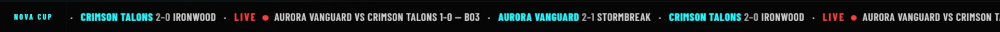
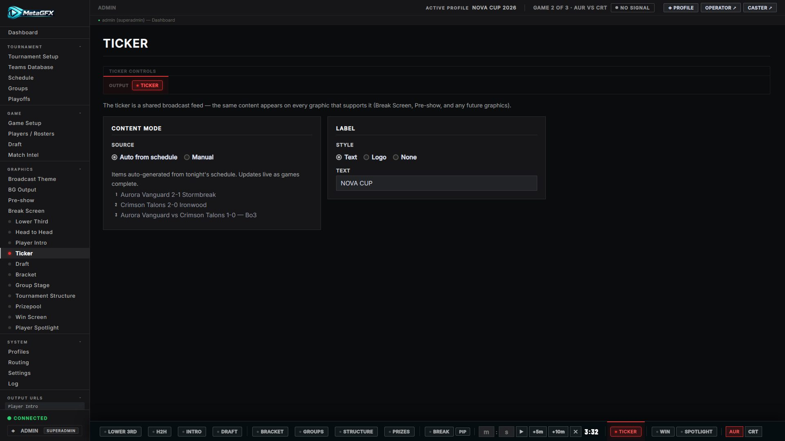

# Ticker

A scrolling information strip — scores, schedule, news — shown along the bottom of the **[Pre-show](pre-show.md)** and **[Break Screen](break-screen.md)**. It's a shared content system configured once in **Graphics → Ticker**, not a separate browser source.

The ticker is the strip running along the bottom here:

A closer look at the strip — a label badge followed by auto and manual items:

## Content

From the Ticker control tab:

- **Auto mode** — automatically summarises the day's [schedule](schedule.md) and the live match (e.g. "Aurora Vanguard vs Stormbreak 1-0 — Bo3"), kept up to date for you.
- **Manual items** — add your own lines (announcements, social handles, casts), each with optional link text.
- **Label** — the badge at the start of the ticker: a text label (e.g. "NOVA CUP") or a logo from [Broadcast Logos](theming.md#broadcast-logos) (**Auto** = the event logo).

Auto and manual items can run together.

## Notes

- Because it lives inside the Pre-show and Break Screen, you control *what* it says here and *when it's on screen* by showing those graphics.
- Edits apply live — change an item and the running ticker updates.
