# Tournament setup

Everything that describes the *event itself* — its name, the teams competing, the structure (groups and/or bracket), roster sizes and broadcast info — lives under **Tournament → Tournament Setup**. Set this up once and every graphic and picker downstream reads from it.

This page also covers the **[Teams Database](#teams-database)** (your reusable team store) and **[Profiles](#profiles)** (saving/swapping whole events).

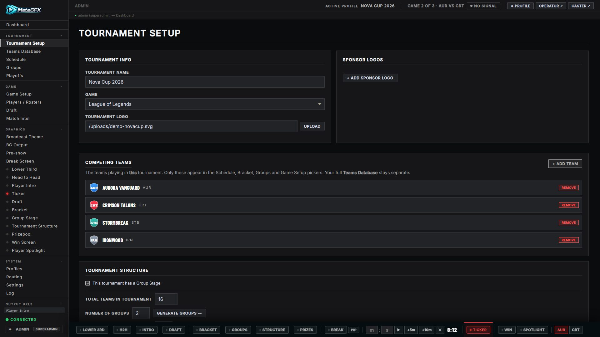

## Tournament Info

The first card. Sets the broad identity used across overlays:

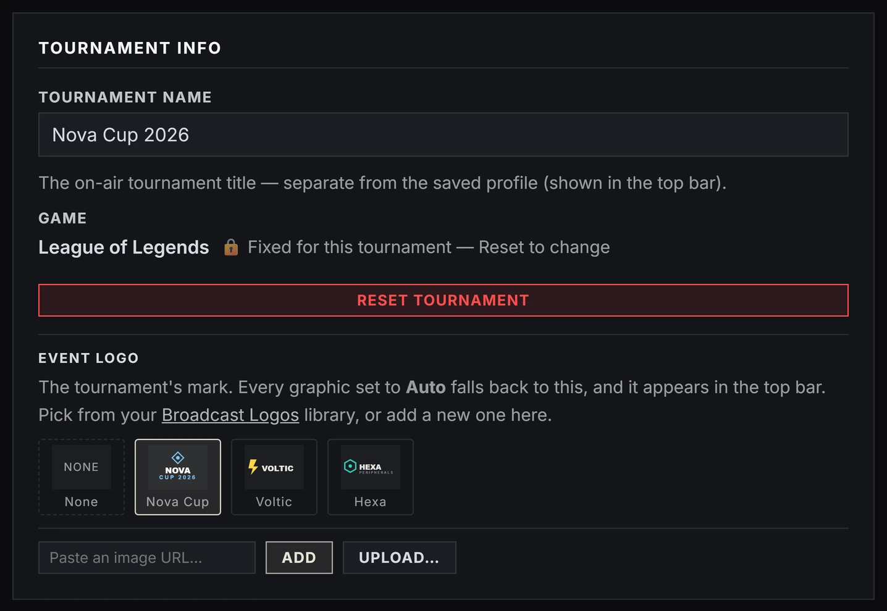

- **Tournament Name** — shown on structure/break/pre-show graphics.
- **Game** — League of Legends, CS2, Dota 2, VALORANT, Rainbow Six Siege or Generic. The choice tailors the whole control panel: LoL unlocks the draft board, champion art and op.gg/Riot features; CS2 the [map veto](map-veto.md) and [live data](live-data.md); Dota 2 the [hero draft](hero-draft.md) and its [live data](dota-live-data.md). Newer games carry an **alpha/beta badge** in the control room (never on air) so operators know how production-ready that game's support is. The game locks once the tournament is underway — Reset to change it.

## Event Logo

Every logo used on air lives in **one library** — [Broadcast Theme → Broadcast Logos](theming.md#broadcast-logos). This card is a *pointer* into it, not a second place to store files: pick which library logo is this tournament's mark, or add a new one (URL or upload) and it joins the library already flagged as the event logo.

The event logo is what every graphic's **Auto** setting falls back to, and it appears next to the profile name in the control panel's top bar.

- **None** clears it — graphics on Auto then show no logo.
- Swapping the event logo updates every graphic on Auto at once.

## Sponsor Logos

> **Scope:** sponsor tools are for crediting sponsors who contribute to the **prize pool** of a community/grassroots event — not for selling commercial ad space.

Which library logos play out as sponsors on the [Break Screen](break-screen.md) and [Pre-show](pre-show.md). Click a logo to add or remove it; the number on each tile is its **on-air order**, which you change with the ▲▼ arrows in [Broadcast Logos](theming.md#broadcast-logos).

Adding a logo here (URL or upload) puts it in the library tagged as a sponsor — the same file can later be reused anywhere else without uploading it twice.

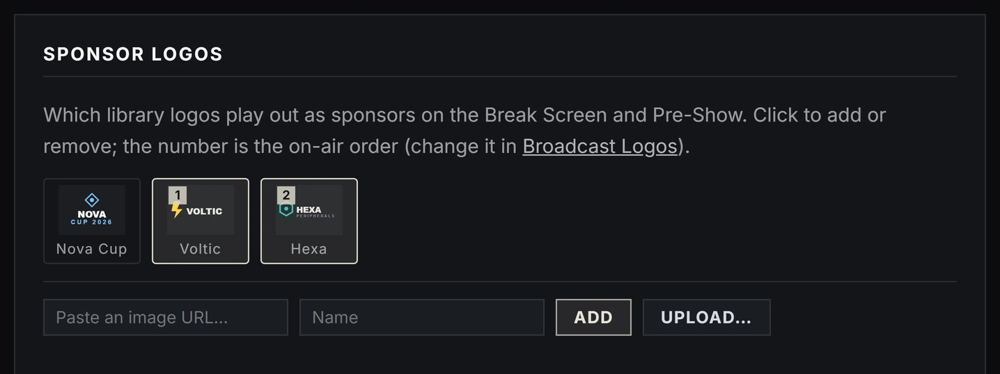

## Competing Teams

The teams playing in **this** tournament — a *pool* drawn from your [Teams Database](#teams-database).

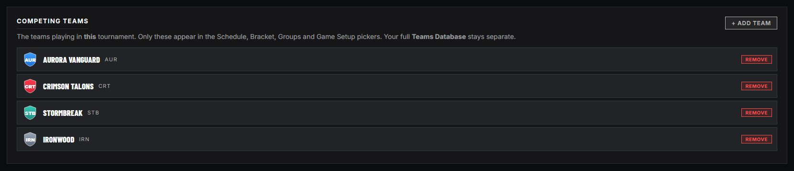

- **+ Add Team** lets you pick an existing team from the database or create a new one.
- Only teams in this pool appear in the **Schedule**, **Bracket**, **Groups** and **Game Setup** pickers — so the pickers stay short and relevant.
- Your full Teams Database stays separate and untouched; the pool is just "who's in this event".

## Map Pool (CS2)

For CS2 tournaments, a **Map Pool** card holds the maps this event plays on — it feeds the [Map Veto](map-veto.md) board and [Map Intro](map-intro.md). It ships with the current active-duty pool:

- **+ Add Map** / remove to match your event's pool (the active-duty pool rotates).
- **Load default pool** / **Set as default** — restore or save the default used for new CS2 tournaments.
- **Refresh images** — re-download and rebuild the map art (use if art is outdated or a map was updated). Each map can also carry an optional **Image URL** override and a **Video URL** for the veto's accordion view.

## Captains Mode Order (Dota 2)

For Dota 2 tournaments, the **Captains Mode Order** card holds the pick/ban sequence the [Hero Draft](hero-draft.md) runs. It ships with the current Captains Mode preset, so normally there's nothing to do here — edit it only if Valve re-tunes the order in a patch (then **Set as default** to keep it for future tournaments). Day-to-day draft controls, including who has **first pick**, live on the [Hero Draft page](hero-draft.md) itself.

## Tournament Structure

Defines how the event is shaped. The card adapts depending on whether you have a group stage.

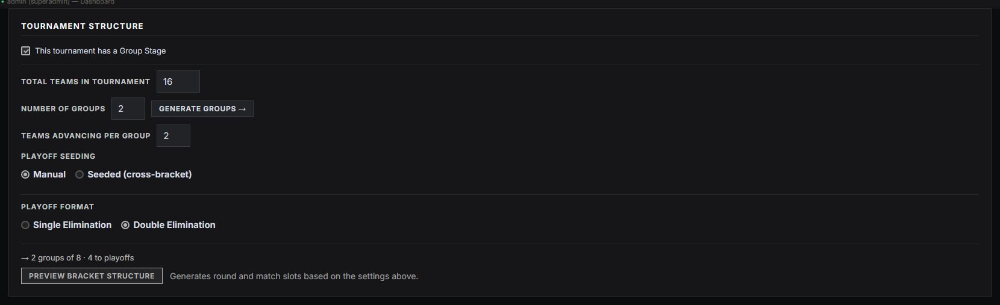

### Group stage (optional)

Tick **This tournament has a Group Stage** to reveal:

- **Total Teams in Tournament**
- **Number of Groups** — then **Generate Groups →** creates the group shells (populate them in **Tournament → Groups**).
- **Teams advancing per group** — how many qualify into the bracket.
- **Playoff Seeding** — **Manual** (you place teams into bracket slots yourself) or **Seeded (cross-bracket)** (the app cross-seeds group qualifiers).

If there's no group stage, you just set **Total Teams in Tournament** directly.

### Playoff format

- **Single** or **Double Elimination**.
- **Include 3rd / 4th place match** (single-elim option).

### Generating the bracket

1. Click **Preview Bracket Structure** — the app works out the round and match slots from your settings and shows a preview card.
2. Review it, then **Confirm & Apply to Playoffs →**. The rounds appear in **Tournament → Playoffs**, where you assign teams to slots and edit them.

See [Bracket](bracket.md) for the bracket *graphic*, and [Schedule](schedule.md#bracket-linking) for how match results flow back into the bracket automatically.

## Roster

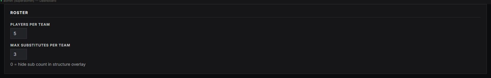

- **Players per team** — drives the roster editors and structure overlay.
- **Max substitutes per team** — `0` hides the sub count in the structure overlay.

## Broadcast Info

Optional fields shown on the [Tournament Structure](tournament-structure.md) overlay when you toggle them on in that graphic's tab: **Start/End Date**, **Region**, **Patch / Version**, **Tiebreaker Rule**, **Location**.

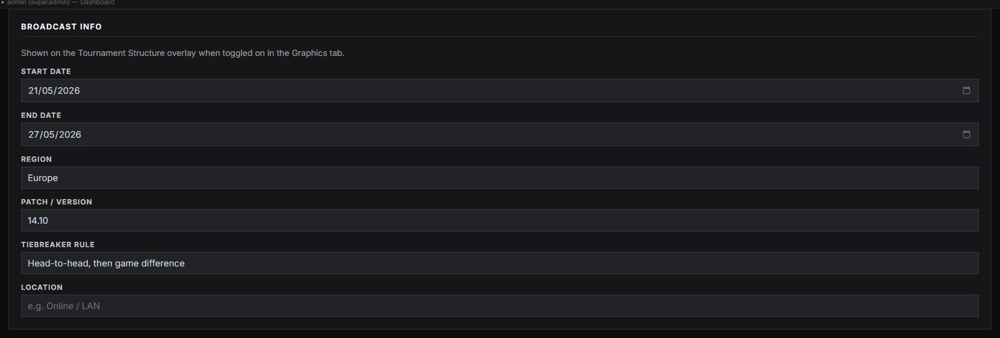

## Prizepool

Tick **This tournament has a prizepool** to flag the event as having one. The actual breakdown is entered and displayed via the dedicated [Prizepool](prizepool.md) graphic — this is just the on/off flag.

## Stage Formats

Per-stage default series formats (e.g. groups = Bo1, playoffs = Bo3, finals = Bo5). These pre-fill the **Format** when you build the [Schedule](schedule.md), so you're not setting Bo3/Bo5 on every match by hand.

---

## Teams Database

**Tournament → Teams Database** is your reusable, cross-tournament store of teams and their rosters. The [Competing Teams](#competing-teams) pool pulls from here; editing a team here doesn't disturb other events.

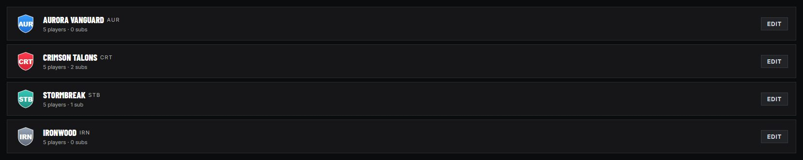

### Creating / editing a team

**+ New Team** (or click an existing team) opens the editor:

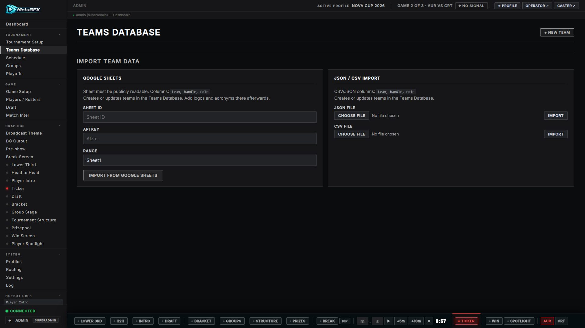

- **Team Name**, **Tag** (short acronym, max 6 chars), **Logo** (URL or upload — square ~200×200 recommended; overlays show it at ~34px).
- **Players** — one row per roster slot. Per player you can set the handle, **role**, **op.gg region** and **Riot ID** (`Name#TAG`). Riot ID + region power rank lookups and op.gg links; see [Match & draft control](match-and-draft.md#league-of-legends--ranks-and-champion-pools).
- **CS2 / Dota 2 teams** get a **Steam ID** field per player instead of the Riot fields — it's the precise key that matches [live-data](live-data.md) stats to the right player (CS2 also gets an optional **HLTV URL** link field). See [names on air](dota-live-data.md#names-on-air--the-roster-rule) for why the Steam ID matters for Dota broadcasts.

### Importing teams

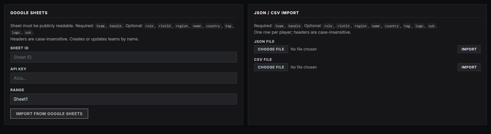

Two import paths sit at the bottom of the Teams tab. Both **create or update** teams (matched by name), one **row per player**.

- **Google Sheets** — the sheet must be publicly readable; supply **Sheet ID**, **API Key** and **Range** (default `Sheet1`).
- **JSON / CSV file** — choose a file and **Import**.

**Columns** (headers are case-insensitive; spaces/underscores ignored):

| Column | Required | Notes |
|---|---|---|
| `team` | ✓ | Team name — rows are grouped by it. |
| `handle` | ✓ | Player IGN. (`ign`, `player`, `summoner` also accepted.) |
| `role` | – | Top / Jungle / Mid / Bot / Support (`position`, `lane` accepted). Defaults by row order if blank. |
| `riotId` | – | Riot ID as `Name#TAG` — powers [rank lookups](match-and-draft.md#league-of-legends--ranks-and-champion-pools) and op.gg links. |
| `region` | – | op.gg region (e.g. `euw`, `na`, `oce`, `kr`). |
| `name` | – | Player's real name. |
| `country` | – | Country / nationality. |
| `tag` | – | Team acronym (team-level — taken from any of the team's rows). |
| `logo` | – | Team logo URL (team-level). |
| `sub` | – | Truthy (`yes`/`true`/`1`) marks the row as a **substitute**. (A 6th+ starter also rolls into subs.) |

Only `team` + `handle` are required; everything else is optional — a simple `team, handle, role` sheet works fine. The extra columns let you bring in Riot IDs, regions and team branding in one go instead of typing them in the [editor](#creating--editing-a-team) afterwards.

**Example CSV:**

```csv
team,tag,logo,handle,role,riotId,region
Aurora Vanguard,AUR,https://example.com/aur.png,Ardent,Top,Ardent#EUW,euw
Aurora Vanguard,AUR,,Quill,Jungle,Quill#EUW,euw
Crimson Talons,CRT,,Granite,Top,Granite#NA1,na
```

---

## Profiles

**System → Profiles** saves an entire event — tournament info, teams pool, structure, schedule and current state — as a named **profile**, so you can run several tournaments from one install and switch between them. Saved profiles live in `data/profiles.json`.

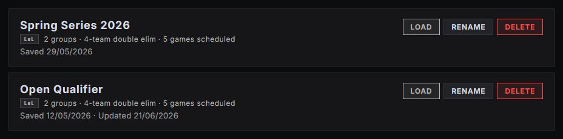

> Loading a profile resets live state (including the draft) to that profile's saved data, so don't switch profiles mid-match.

## See also

- [Schedule](schedule.md) — lay out the matches once teams and structure exist.
- [Match & draft control](match-and-draft.md) — drive a loaded match live.
- [Theming & Looks](theming.md) — the visual identity, kept separate from the tournament data.
