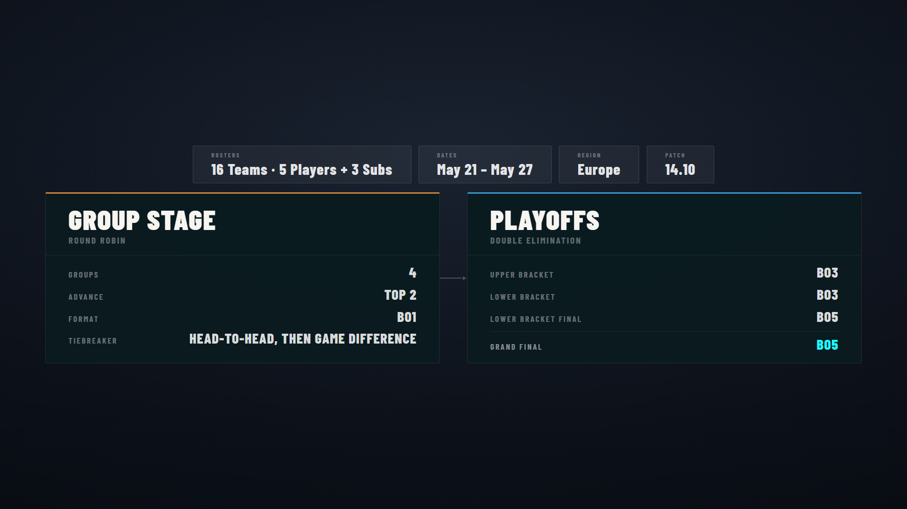

# Tournament Structure

A one-screen overview of the whole event's format — group stage and playoff shape, series formats, roster size, dates and key info. Output at `/graphics/tournament-structure/`.

## What it shows

Everything is drawn from **[Tournament Setup](tournament-setup.md)** — change it there and this overlay reflects it:

- **Group Stage** block — number of groups, teams advancing, series format, tiebreaker (when a group stage is enabled).
- **Playoffs** block — single/double elimination and the per-stage series formats (e.g. UB Bo3, Grand Final Bo5) from [Stage Formats](tournament-setup.md#stage-formats).
- **Header info** — total teams, roster size (players + subs), dates, region and patch, from [Broadcast Info](tournament-setup.md#broadcast-info).

## Display options

From the Tournament Structure graphics tab / ctrl-bar:

- **Show / hide**.
- **Title** — toggle and set a display title.
- **Logo** — toggle, scale and position.
- **Info bar** — alignment and which fields show (dates/region/patch are toggled in Broadcast Info).

## Notes

- This is a static overview — for live standings use [Group Stage](group-stage.md), for the live bracket use [Bracket](bracket.md).
