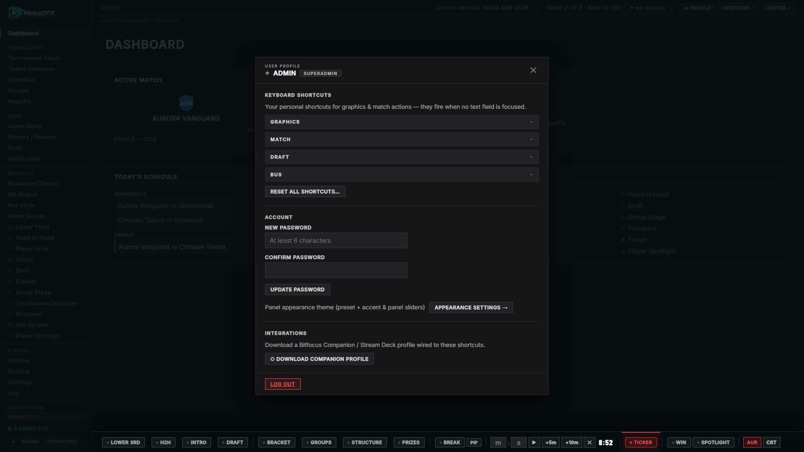

# User profile

Each signed-in user has a personal **Profile** modal — keyboard shortcuts, password, panel appearance, the Companion/Stream Deck download, and log out. Open it from the **user chip** at the bottom-left of the control-panel sidebar, or **◈ Profile** in the top bar. (In the operator view, the same per-user shortcuts are reachable via **⌨ Keybinds**.)

Everything here is **per-user** — different operators on the same install have their own shortcuts, password and appearance.

## Keyboard Shortcuts

Your personal hotkeys for graphics and match actions. They fire anywhere in the panel **when no text field is focused** (typing in an input never triggers a shortcut).

Shortcuts are grouped into **Graphics**, **Match**, **Draft** and **Bus**. Click a combo field, press the keys, and it records immediately; a conflict with an existing binding is flagged inline. Changes auto-save when you close the modal (or click **Save Keybinds**), and **Reset all shortcuts…** clears them.

The full setup flow, supported keys/modifiers and the list of bindable actions are in **[Companion / Stream Deck & Keybinds](companion.md#keybinds)**.

## Account

- **Change password** — set a new password (min 6 characters) for your own account. Admins manage *other* users in **Settings → Accounts** (see [roles](operator-and-multiuser.md#roles)).
- **Appearance settings →** jumps to the per-user control-surface theme (preset + accent/panel sliders) — see [Control-surface theming](ui-theming.md).

## Integrations

**⬡ Download Companion profile** generates `metagfx-companion.companionconfig` — a Bitfocus Companion / Stream Deck profile wired to the same actions as your keybinds. Import it into Companion to drive MetaGFX from physical buttons.

Full requirements, import steps, the generated pages and the underlying action API are in **[Companion / Stream Deck](companion.md#companion--stream-deck)**. Re-download it after changing your graphics token, adding/removing buses, or moving the server.

## Log Out

Ends your session and returns to the login page.

## Notes

- The personal **keybinds** and **Companion profile** are shared between the control panel and the operator view — set them once.
- Don't confuse this **User Profile** (your account) with tournament **[Profiles](tournament-setup.md#profiles)** (saved events) — different things despite the similar name.
