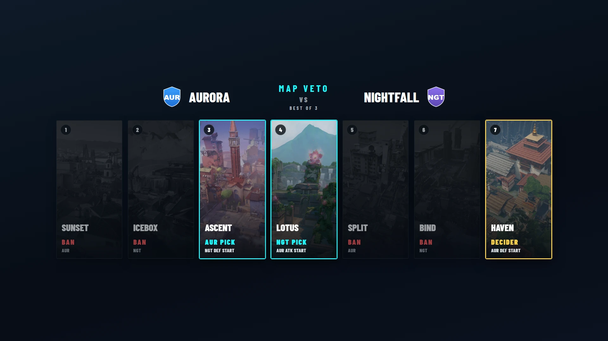
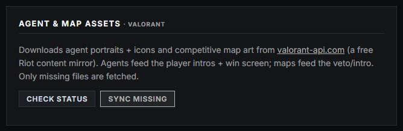
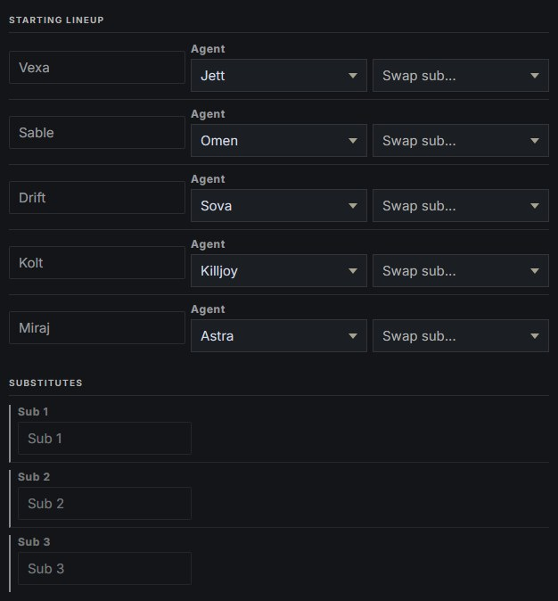
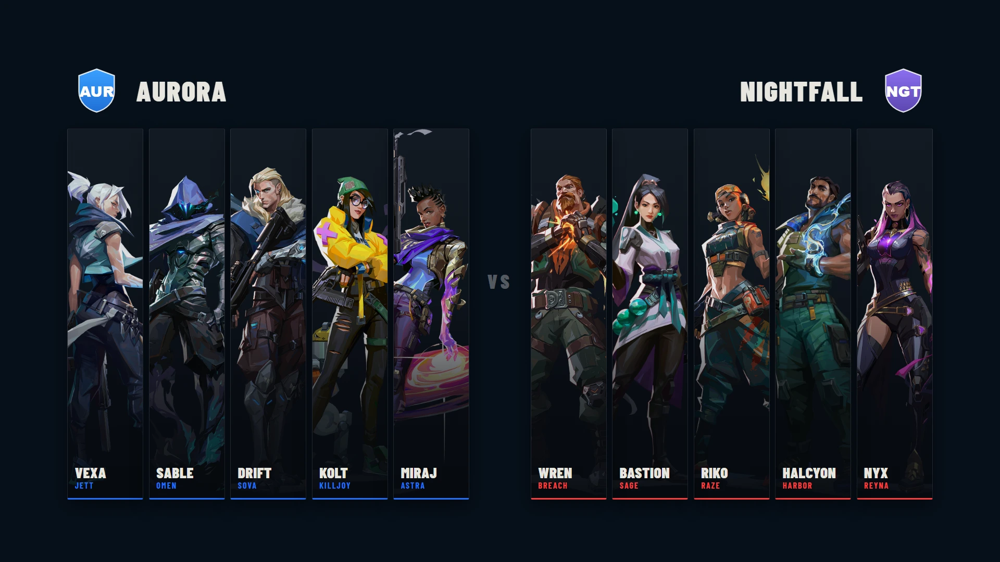
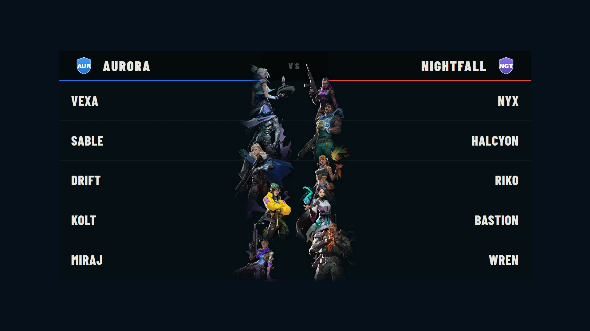
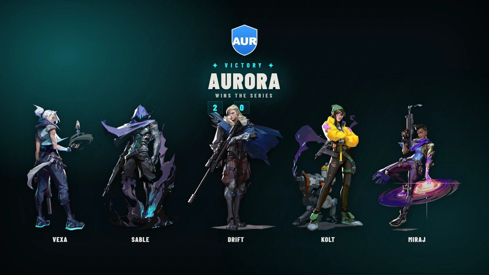
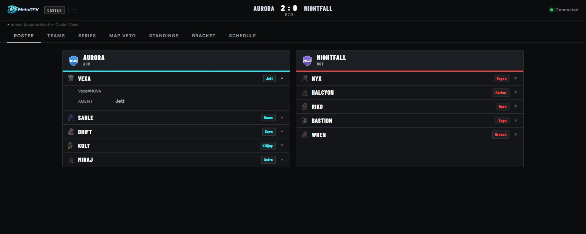

# VALORANT

How MetaGFX runs a VALORANT broadcast. VALORANT is a **map-veto game** — its pre-game is the ban/pick sequence over the competitive map pool, driven by the same [Map Veto](map-veto.md) and [Map Intro](map-intro.md) pipeline as CS2, plus VALORANT-specific agent treatments across the intro and win graphics.

> VALORANT support is **alpha** — the full graphics set works, but it hasn't been exercised in a live production yet.

## What's different from other games

- **No public draft** — agents lock hidden in-client, so there is no pick/ban board like LoL/Dota. Instead each player carries an **Agent** field on the roster (set it manually once agents are locked — or let a [post-map fetch](#post-map-data-beta) fill it), and the agent art flows into the Player Intro and Win Screen.
- **No live data feed** — VALORANT has no official real-time API, so nothing updates mid-map. Scores and stats can be entered manually (**Game Setup → Series Tracker**) or pulled **after each map** via the [post-map fetch](#post-map-data-beta).
- **Riot IDs** — rosters use the `Name#TAG` scheme, same as League.

## One-time setup: Agent & Map assets

Agent portraits/icons and competitive map art come from the free community mirror **valorant-api.com** (no key needed):

- **In-app:** **Settings → Broadcast Assets → Agent & Map Assets · VALORANT** — **Check status** shows what's missing, **Sync missing** downloads it with live progress.
- **CLI:** `node scripts/sync-valorant.js` (add `--check` for a dry run).

The sync fetches every playable agent (full portrait + icon, and derives the head-and-shoulders and full-body crops the graphics use) and splash art for the competitive maps into `public/agents/` and `public/valmaps/`. Without it, agent and map art is blank.

## Rosters & agents

Set up teams and rosters as usual ([Tournament setup](tournament-setup.md), [Match & draft control](match-and-draft.md)). On **Game Setup → Players / Rosters** each player row gains an **Agent** dropdown (populated from the synced agents):

- Set it manually per map once agents are locked — it's per-player broadcast state, not part of the Teams Database.
- The agent shows up in the [Player Intro](player-intro.md) (all layouts that show art), the [Win Screen](win-screen.md) winning-team showcase, and the [caster view](caster-view.md) roster.
- **Validate Riot IDs** (button at the top of the Players page) checks every roster `Name#TAG` against the official Riot Account API — catching typos before broadcast. It needs `RIOT_API_KEY` in your `.env` (the same standard key used for LoL ranks; no special VALORANT access required). Validation also stores each player's PUUID — the join key the post-map fetch and agent pools depend on.
- **Refresh Agent Pools** (same card) fetches each validated player's **most-played agents** with win rates — shown on the [caster view](caster-view.md) roster for prep talk. Needs `HENRIKDEV_API_KEY` (below).

## Post-map data (BETA)

Standard Riot keys have no VALORANT match access, so match records come from the community **[HenrikDev API](https://docs.henrikdev.xyz/)** (unofficial — a free "Basic" key from their Discord is plenty; our usage is a handful of requests per map, far under its 30/min cap). Put it in `.env` as `HENRIKDEV_API_KEY`.

After a map finishes, on **Game Setup → Post-Map Data**:

1. Pick the event **Region** (once), then **Fetch latest map** — one request pulls the most recent custom match containing your roster (matched by PUUID).
2. Review the suggestion: map, final score, winner, and both teams' per-player agent, K/D/A and ACS lines, plus how many roster players matched.
3. **Apply** it to a Series Tracker map slot. One click writes the score/winner, fills every roster player's **agent** (so the intro layouts and win screen are correct without touching them), and stores the stat lines for the Post-Game Scoreboard.

Like CS2's live data this is **data-only**: fetches land as suggestions the operator reviews — nothing airs automatically.

## Post-Game Scoreboard

Applying a post-map fetch revives the full **[Post-Game Scoreboard](post-game.md)** for VALORANT: per-player agent (icon + name), K/D/A, +/-, **ACS** and K/D, sorted by ACS, with the map score and winner in the header. Confirm the data on the Post-Game tab before going live, as with CS2.

## Map veto & map intro

The veto works exactly like CS2 — see [Map Veto](map-veto.md) — with VALORANT vocabulary:

- Starting sides are **DEF / ATK** (shown as e.g. "FNC DEF START" on the graphic).
- There is **no knife round** — for the decider you record **which team chose which starting side** directly on the veto sequence.
- The default competitive pool is seeded when the tournament is created; art comes from the asset sync above.

The [Map Intro](map-intro.md) card then introduces each map with its splash art and the veto story ("Picked by …" / starting side).

## Graphics rundown

Everything game-neutral works out of the box (pre-show, break, lower thirds, ticker, bracket, standings, prizepool, BG output…). VALORANT-specific:

| Graphic | VALORANT behaviour |
|---|---|
| [Map Veto](map-veto.md) | Ban/pick board with real map splash art, DEF/ATK sides, accordion reveal. |
| [Map Intro](map-intro.md) | Cinematic per-map intro with the veto story. |
| [Player Intro](player-intro.md) | Agent art in the player rows, plus the VALORANT-only **Agent Cards** layout — both teams' five agents as full-body portrait cards around a centre VS. |
| [Win Screen](win-screen.md) | The winning team's five **agents** as full-body portraits — the COMP style full-screen, or a compact row on the centred styles. |
| [Post-Game Scoreboard](post-game.md) | Agents + K/D/A + ACS per player, fed by the [post-map fetch](#post-map-data-beta) (BETA). |

The **Agent Cards** intro layout — the full matchup at a glance:

The standard intro layouts show each player's agent along their row instead of the LoL champion strip:

And the winning team's agents on the [Win Screen](win-screen.md) COMP style:

## Caster view

The [caster view](caster-view.md) adapts automatically: the roster shows each player's **agent** (icon + name), Riot ID, and — after a pools refresh — their **most-played agents with win rates**; the **Map Veto** tab mirrors the veto with sides and decider, and the Live tab is hidden (no feed).

## Notes

- The competitive map pool rotates between acts — edit the pool in **Tournament Setup → Map Pool** and re-run the asset sync to pick up new maps.
- The HenrikDev-backed features (post-map fetch, agent pools, Post-Game Scoreboard) are **BETA** and optional — without a key, everything still works with manual entry.
