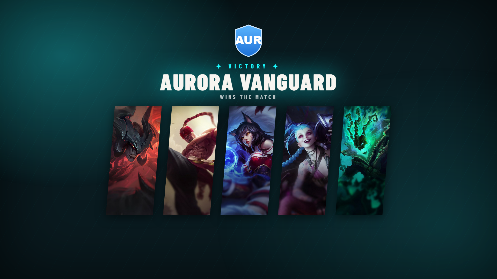

# Win Screen

Celebrate a game or series result with a winner reveal. Ten styles — from quick on-scene reveals to full-screen **stingers** that double as scene transitions, plus a League-specific **COMP** screen showing the winning draft. Driven from **Graphics → Win Screen**, output at `/graphics/win-screen/`.

## Choosing the winner

In the control tab pick the **winning team**, set the **message** (e.g. "WINS THE MATCH") and the **series score**. The accent colour follows the team side by default, or set a custom/primary accent.

## Styles

**Reveals** — animate in over your scene:

| Style | Feel |
|---|---|
| **Blade** | Diagonal band sweeps across. Fast and punchy. |
| **Burst** | Detonates from centre with shockwave rings. |
| **Slam** | Full-screen overlay — most coverage, great for a clean cut. |
| **Split** | Team colour floods one half, sharp centre divider. |
| **Spotlight** | Screen darkens, a light beam crowns the winner with sparkles. |
| **Wipe** | Cinematic letterbox bars close in, name slices through with a light streak. |

**Stingers** — fully opaque, made to cover a scene transition (show it, cut your scene behind it, hide it):

| Style | Feel |
|---|---|
| **Shutter** | Opaque panels drive in from top & bottom; winner snaps in on the seam. |
| **Flood** | A solid colour floods the frame on an angled wipe. |
| **Push Slab** | A full-screen slab pushes up from the bottom, holds, then pushes off. |

**League of Legends:**

- **COMP** — a full-screen showcase of the **winning team's champion picks and players** (pictured above). Needs a recorded game in the series so the picks are known. Options let you toggle the picks, choose their position, and pick the portrait shape and background treatment.

## Notes

- The **stingers** are designed as transitions: because they fully cover the frame, you can switch scenes in OBS/vMix while the stinger is up. See the Companion/Stream Deck integration for triggering them on a button.
- **COMP** reads the winning side's picks from the draft/series — run or commit the [draft](match-and-draft.md#draft) so they're populated, and sync [champion art](champion-assets.md).
- Series score and team data come from the [Game Setup](match-and-draft.md#game-setup) series tracker.
